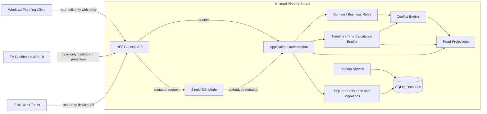
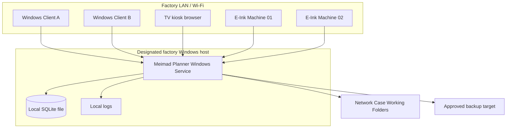
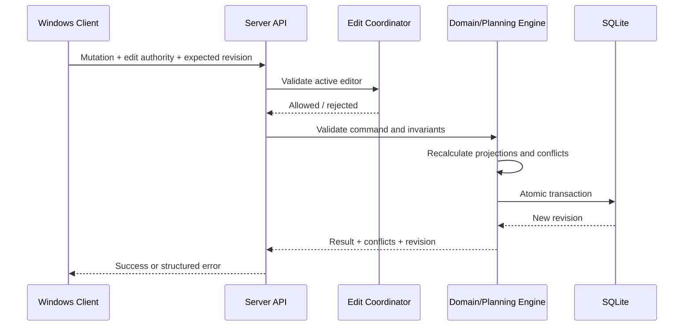
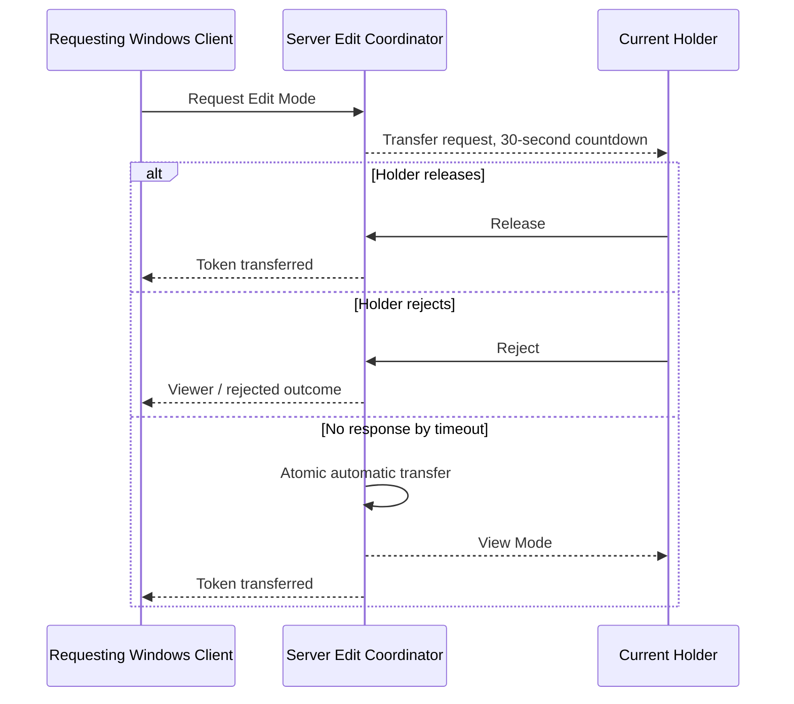
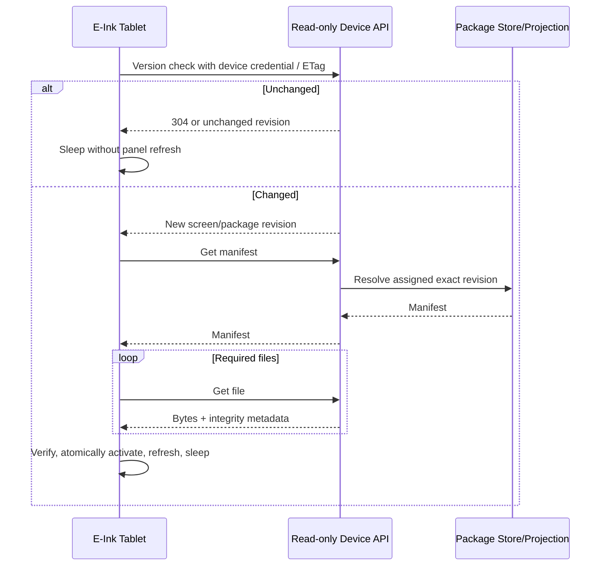

# Architecture

- **Status:** Target architecture; Server foundation through schema v24, Timeline API/embedded and separate-window Windows Timeline, read-only TV Dashboard, official job-package generation, E-Ink API/simulator, Single Edit Mode, verified backup, Windows Case/Operation/Order/Batch/Machine/Machine-Type/Calendar/Machine-Availability workspaces, and Case Operation graph validation implemented
- **Scope:** Factory-local MVP

## 1. Architectural drivers

- Keep one authoritative data owner.
- Eliminate direct multi-client access to a shared database file.
- Preserve fully manual planning while calculating consequences and explaining conflicts centrally.
- Support one full editing surface and multiple read-only operational surfaces.
- Keep the factory deployment independent of public Internet access.
- Support low-power devices that wake briefly, transfer only changed data, and retain a last-known-good display.
- Make backup and restore an owned server responsibility.

## 2. Current repository state

The repository contains an implemented .NET 10 Server host and server-owned SQLite schema version 24. Core planning-resource, Setup master-data, Single Edit Mode, verified SQLite backup, Timeline calculation/API, Windows WPF client, LAN-served TV Dashboard, weekly reporting, structured planning-event export, and E-Ink package-generation/API/simulator slices are available. Planning mode is assignment-owned state rather than a global Timeline view: each Machine Assignment stores `forward`, `backward`, or `manual`, while calculated dates remain transient. The Server preserves manual planning; cross-type assignment is an explicit warned exception with required reason and audit rather than scheduling or silent repair. Single Edit Mode invalidates stale generations, and every implemented planning mutation validates authority inside its SQLite write transaction. Backup creates and verifies a consistent online snapshot without replacing the active database.

The API-only Windows client has a compact connection/Edit Mode header and a dedicated Setup page for connection settings, recurring Working Calendar CRUD with usage tags/breaks/dated exceptions, one-window overnight support, and dedicated Setup Calendar selection, Machine management, reusable Machine Type management, Employee/Resource administration, Israeli holiday definitions, and report/email settings. Its operational surfaces cover Case/Operation/Order/Batch workflows, allocation-safe optimistic Order editing, a compact manual Machine Planning Board with explicit player-style Start/Pause/Finish/Reset controls and quantity/Order/time projections, and one read-only Timeline shared by the embedded tab and a separate closable window. Deletion is relationship-aware and never removes external files. TV and E-Ink device surfaces are read-only and have no Edit Mode integration. Full human authentication, route reordering, package approval UI/roles and retention, full conflict policy, combined/multiple overnight-window and Calendar archive policy, and physical device firmware remain incomplete.

## 3. System context


The Server is the authority. Case Working Folders remain external file storage; the database stores their paths and generated preview/cache references, not copies of original engineering files.

### 3.1 MVP boundary

The complete MVP runs on the factory network:

- One Meimad Planner Server process on a designated Windows host.
- One Server-owned local SQLite database.
- Windows Planning Clients using the local REST API for all reads and edits.
- Read-only TV Dashboard browsers using dashboard projections.
- Read-only E-Ink Work Tablets using device-scoped display/package endpoints.

The architecture has no Customer Portal, cloud service, public Internet endpoint, router forwarding, or native mobile application. Those are outside the MVP boundary and must not be provisioned as dormant components.

## 4. Component responsibilities

### 4.1 Required component map



Every box inside the Server is a logical component. They may initially ship in one Server process, but their boundaries must remain explicit in code and tests. SQLite and the Backup Service are inside the Server trust boundary; no client can reach the database file.

### 4.2 Meimad Planner Server

The implemented `server/` component is the sole authoritative runtime. It hosts the API and coordinates domain validation, manual-plan mutations, timeline calculation, conflict generation, read projections, Single Edit Mode, persistence, migrations, backup, and the LAN-served display simulators.

It may run as a console/executable during development. The production target is one Windows Service on a designated factory PC or local Server.

### 4.3 REST / local API

The API is the only client entry point. It provides versioned REST endpoints over the factory LAN or host loopback and owns:

- Request parsing, contract validation, authentication, and authorization once the identity model is approved.
- Edit-token and optimistic-concurrency checks for mutations.
- Command dispatch to application orchestration.
- Purpose-built read projections for Windows, TV, and E-Ink clients.
- Stable error codes, correlation IDs, health/readiness, and safe failure responses.

The API must not contain authoritative scheduling or domain rules. It delegates those rules to the Server layers below it. No public listener or Internet-facing gateway is part of the MVP.

### 4.4 Domain / business rules layer

This layer owns authoritative state transitions and invariants for Cases, Orders, Production Batches, allocations, Case and Batch Operations, Machines, assignments, calendars, and downtime.

It validates that Orders remain demand-only, only Batch Operations are assigned to Machines, allocations follow the approved balance equation, dependencies retain their defined meanings, Case timing summaries are derived from operation timing, Batch and linked Order statuses follow production facts, normal Machine/Machine-Type compatibility remains safe, cross-type exceptions require explicit confirmation and reason, Machine Type renames/deletes cannot strand Operation requirements, and original engineering files are not modified. It has no dependency on REST, UI, SQLite, filesystem implementation, or device firmware.

### 4.5 Timeline / time calculation engine

The read-only calculation uses one fixed dependency/backlog graph and one Machine-lane reservation set. Forward/manual assignments use earliest-feasible split-window placement; backward assignments use latest-feasible placement before a transient delivery cutoff. Waiting intervals identify Machine/setup/day-shift calendars, skilled setup/QA/regular resources, maintenance, breakdown, pause, and sequential predecessors. Assigned rows excluded from pure placement by missing input, pause, dependency failure, or horizon infeasibility remain operation-linked `blocked` waiting projections beginning after preceding calculated backlog work; every later stored row is blocked as well so it cannot visually leapfrog an earlier invalid or paused row.

The implemented pure Timeline Engine calculates projected setup, production, dependency-waiting, idle, downtime, and locked-group reservation intervals from immutable inputs. Its inputs are explicit Machine backlog order, already-resolved setup/production durations, explicit half-open UTC Machine/setup availability windows, planned downtime, a calculation horizon, and operation dependencies. Sequential edges delay only the calculated child; they never mutate manual backlog order. It has no SQLite, REST, clock, or UI dependency.

For each Machine, backlog adjacency is a hard precedence constraint. Sequential dependencies add precedence; Parallel-capable and Independent dependencies add none. Locked-simultaneous members use a common start and projected finish, with shorter Machines reserved through the longest member result. Setup work uses the intersection of Machine and setup availability; production uses Machine availability; downtime is subtracted. Work may split across availability windows. The mode on each assignment is mapped into the same calculation input: `forward` earliest-fits that node, `backward` reverse-traverses and latest-fits it before the earliest linked Order Work Finish Date, and `manual` preserves its planner-authored Machine/backlog placement while calculating a valid visible consequence. Mixed modes remain in one graph. All produce consequences only and never change assignment identity/Machine, backlog order, durations, calendars, downtime, dependencies, or stored dates.

The implemented application projection reads current persisted assignment IDs, modes, backlog positions and recorded cross-Machine transfer/pause timestamps, active Machines, Working Calendars, individual active employees with Machine-ID qualifications and exceptions, the dedicated Setup Calendar, planned/open/restored Machine downtime, immutable Batch timing/dependency snapshots, quantities, and allocated-Order priority facts in one SQLite read transaction, then calls the pure engine through `GET /api/v1/timeline`. It derives operation duration from setup, QA, load/unload, and `cycle time x Batch planned quantity`; no prefilled planned-start/planned-end fields participate. The earliest linked Order Work Finish Date becomes only a transient backward cutoff. Projection normalization emits exactly one identified current operation or blocked-waiting block per active assigned Operation ID and logs/folds/removes duplicate producer output; it does not add a hold/backward/manual layer. Ordinary waiting, downtime, and moved-history capacity intervals are anonymous, while their facts remain attached to canonical phases/detail; an infeasible assignment deliberately retains identity as lower-band blocked waiting. Each Machine separately exposes additive `nonWorkingWindows`, computed as the horizon complement of its authoritative expanded Working Calendar and kept outside the operation interval/identity pipeline. A final same-Machine overlap pass keeps actual/hold/history authoritative, demotes a conflicting forecast to blocked waiting, and returns `machine_operation_overlap` or `actual_backlog_overlap` without mutating assignment/backlog data. Its fixed-point propagation prevents a blocked forecast from being leapfrogged by later backlog rows, Sequential descendants, or locked-simultaneous forecast members; recorded actual facts are retained with blocking conflicts. Suspended elapsed actual work ends at the active pause start. If the assignment moves while suspended, anonymous prior-Machine occupancy remains visible and the current hold begins no earlier than the true cross-Machine move event, falling back to replacement-assignment creation after an unassign/reassign; same-Machine reorder and planning-mode edits do not shift it. Structured Server logs record source/assigned/usable/backlog/resource counts at Information level and per-assignment mode/timing inputs and calculated results at Debug level. Active breakdowns are clipped to the read horizon until an explicit Restore closes them; maintenance and breakdown reasons are retained in downtime intervals. Calendars expand deterministically with timezone/DST conversion, breaks, exceptions, and cached holidays. The engine reserves one eligible employee for each setup, QA, or worker-required load/unload phase and emits visible waiting when contention or a calendar gap delays that phase. Forward/manual contenders are compared by earliest Work Finish Date and then naturally smaller Order Number. Backward contenders use earlier Work Finish Date, shorter total duration, naturally smaller Order Number, and stable identity. Setup eligibility uses stable Machine-ID qualifications, with legacy textual tokens readable until the employee is resaved. These calculated reservations and priorities are not persisted and never reorder stored Machine backlogs. Persisted named-worker assignment, skill qualification expiry, plan revisions, rounding, and recalculation SLA remain TBD.

### 4.6 Conflict engine

The pure engine currently returns deterministic blocking input/calculation conflicts for invalid calendars/durations/references, duplicate placement, impossible locked groups, dependency/backlog cycles, failed predecessors, and insufficient horizon availability. The broader Conflict Engine remains responsible for stable production conflict policy such as capability, deadline risk, missing business timing, accepted warnings, and plan-revision-aware explanations.

Conflicts are projections, not silent repair commands. The engine may cause a structurally invalid command to be rejected according to the approved policy, but it must never mutate a valid manual plan to remove a warning.

### 4.7 Single Edit Mode

Single Edit Mode is a Server-owned coordination component. Its implemented caller states are Viewer, Editor, and RequestingEdit. It guarantees at most one active Windows editor generation and one pending transfer request while other Windows clients remain viewers. A competing requester receives `edit_request_pending` rather than being placed in an implicit queue. TV and E-Ink clients are architecturally prohibited from requesting or holding edit authority; credential-class enforcement awaits the authentication layer.

Every implemented planning mutation validates the active client ID and generation in the same immediate SQLite transaction as the write. Release transfers immediately, Reject retains the current holder and returns the requester to Viewer, no response transfers automatically after the configured timeout, and voluntary release transfers a pending requester or clears the token when none is pending. The default timeout remains 30 seconds; `EditMode:TransferTimeoutSeconds` accepts 1–3600 seconds. A server timeout worker materializes expired transfers, and all status/command/write transactions also process an expired request before checking authority, so an old generation cannot write after its deadline. Authentication, disconnect/crash policy, notifications, and audit remain TBD.

### 4.8 SQLite persistence and migrations

The persistence component translates approved application transactions to a Server-local SQLite database. Only this component opens the database for normal operation. It owns connection lifecycle, transactions, foreign-key enforcement, ordered migrations, optimistic revisions, and integrity checks.

The database file must not be placed on a network share. Clients receive data only through API contracts and cannot use a SQLite library or database path.

The implemented foundation records migration identity in `schema_migrations` and the active version in SQLite `user_version`; ordered migrations currently reach schema version 24. Schema v5 adds durable Edit Mode transfer requests and a partial unique index that permits only one pending request. Schema v6 adds immutable E-Ink package-revision/file metadata. Schema v7 adds immutable Machine/Case/Batch/Operation snapshots and package asset roles used by the generator; file bytes remain in a Server-owned package root and never enter SQLite. Schema v8 adds the optional Machine picture path; image bytes remain external and are streamed only by the Server. Schema v9 snapshots dependency type, predecessor source Case Operation ID, and simultaneous-group data into Batch Operations and normalizes derived Batch lifecycle values.

Schema v10 adds the reusable Machine Type catalog, Setup Calendar selection, and allocated-Order lifecycle. Schema v11-v14 add administrative resources, employee calendar exceptions, and cached holiday policy. Schema v15 adds immutable cross-type assignment-override audit snapshots. Schema v16-v18 add extended Operation timing, Machine downtime, and structured pause events. Schema v19 adds immutable E-Ink setup-worker/time/tool/checklist package metadata. Schema v20 adds weekly material-report scheduling and successful-delivery markers. Schema v21 adds employee planned/actual work measurements, employee-efficiency delivery markers, and a separate weekly efficiency schedule. Schema v22 adds an append-only structured event stream and filtered export API. Schema v23 adds authoritative operation actual start/end/Machine history. Schema v24 adds the checked, defaulted planning-mode column to `machine_assignments`. Planning-mode mutations and their structured before/after events commit atomically. Calculated Timeline conflicts and resource waits are system events deduplicated per detection day. Timeline dates and reservations remain read-only projection state. The Server refuses a database newer than its known migration set, and migration failure prevents readiness.

### 4.9 Backup Service

The implemented Backup Service is an internal Server component. It serializes backup operations and uses SQLite's online backup API against the live server-owned connection, producing a transactionally consistent snapshot while normal database activity may continue. SQLite writes the snapshot first to a unique server-local temporary work folder, never directly to a possibly remote backup share.

The service runs `PRAGMA integrity_check` and `PRAGMA foreign_key_check` on the local snapshot, durably copies it to a unique pending file in the configured destination, and renames that file to `meimad-planner-backup-<UTC timestamp>-<unique suffix>.db` within that destination. It verifies the published file again, restores it through SQLite into a separate unique local test database, and repeats both checks. Every restore-verification path is compared against the active database path and rejected if equal. Temporary verification databases are deleted; the active database is never a restore destination.

Retention is count-based, scoped only to managed backup filenames in the configured folder, and applied after successful restore verification. The current backup is always retained; the default keeps 14 and configuration accepts 1–3650. Unrelated files are untouched. A verified backup remains available if later retention cleanup fails, while an unverified newly published file is removed. Backup schedule, encryption, destination-access policy, authenticated operator trigger, full disaster-recovery replacement workflow, RPO, and RTO remain TBD.

### 4.10 Windows Planning Client

The implemented `client-windows/` application uses WPF on .NET 10 and establishes the API-only desktop boundary. It currently owns:

- a validated HTTP/HTTPS Server root setting;
- a simple local display name and stable client ID stored under Local AppData;
- a compact main header with a connection indicator/tooltip and one lock/unlock Edit Mode action;
- a dedicated Setup page for connection Save/Connect/Refresh, Working Calendar management and Setup Calendar selection, Machine management, reusable Machine Type management, Employee/Resource administration, Israeli holidays, and report/email settings;
- `/health` connectivity/version status;
- Viewer, Editor, and RequestingEdit presentation;
- Edit Mode request, voluntary release, transfer approval, and rejection interactions;
- bounded HTTP timeouts, safe error presentation, and five-second status refresh;
- a Case Pool with Server-side search, customer, and derived-active filters;
- Part Number/customer cards and unobstructed preview thumbnails fetched as bytes from the Server preview route, with text reserved for missing-preview/error state;
- a Case Details form saved only by the active editor with Edit Mode generation and Case ETag;
- editor-only Case Operation create/edit forms, optimistic Order create/edit, and explicitly allocated Production Batch creation forms;
- an Open Working Folder action whose path value originates in the Case API;
- a snapshot-consistent Server projection for the unassigned Batch Operation pool and Machine columns;
- drag/drop translation into exact assignment, reorder, cross-Machine move, and unassignment API commands;
- compact operation cards with planned quantity, allocated Order references, status text/icon, and Server-projected estimated time;
- assignment-owned `Schedule from delivery date`, `Schedule forward`, and `Set manual mode` context actions that PATCH the same assignment under Edit Mode and optimistic assignment ETag;
- explicit player-style Start, Pause/Suspend, resume, and Finish commands for an assigned operation, disabled when invalid or unauthorized and with no client-side lifecycle rules;
- explicit server rejection feedback without optimistic or automatic rearrangement;
- a compact read-only Timeline that renders each current assignment or sole completed/unassigned history in a primary operation band and Server-returned anonymous waiting, moved-history, reservation, and downtime facts without adding another operation identity. One composite assignment object paints only actual setup/QA/load-unload/production phase spans blue, leaves internal gaps transparent, and paints a locked reservation phase orange. Generic `idle` remains available in the API but is omitted from the canvas because blank row space already communicates free capacity. Per-Machine calendar closures render as gray background columns from the separate `nonWorkingWindows` collection, behind the grid, blocks, and arrows. Paused hold remains one identified purple object, with one-line Machine labels, one visible operation identity marker, and selected-Batch dependency arrows;
- a separate Timeline window sharing the same live read-only view model as the embedded tab; it is not a mode-specific layer, and closing it does not close the main client or mutate planning data;
- explained Server conflicts paired with severity text; and
- dependency edge display filtered to the selected Batch only.

The local name is an MVP development identity only; it is not authentication. The client derives a stable ASCII API user ID from the display name so Unicode local names are never placed directly in an HTTP header. If the Server is unavailable or returns an invalid contract, the client disables edit actions and explicitly reports that authority cannot be confirmed. Status color is always paired with text and a lock, wait, or warning symbol.

The client assembly has no SQLite reference and stores no planning data or database path. It does not open the preview path; the Server reads and streams supported preview image bytes. Operation, Order, Batch, Machine, Machine Type, and Working Calendar forms send typed commands with the active edit generation; optimistic Case Operation, Order, Machine, Machine Type, and Working Calendar edits send the selected resource version. The Case form presents read-only route timing sums and operation timing inputs as total-hours `HH:mm:ss`, converting only at the API boundary where seconds remain authoritative. Its required-Machine dropdown is the dynamic union of registered Machine process, axis, Machine capability, and linked Machine Type capability tokens, plus a blank Any option and the selected legacy token when necessary. Setup forms submit stable Calendar and Machine Type IDs; users do not type identifiers.

The Server owns timing aggregation, derived Order/Batch lifecycle, allocation-safe edit guards, compatibility, calendar usage/window/break/exception validation, one-window overnight expansion, timezone expansion, and reference-aware deletion. The board waits for the Server assignment/execution command, then reloads the authoritative projection; a rejected command leaves the board unchanged. Card estimated time is a read projection and never schedules a start or finish. Timeline timestamps and conflict semantics come from the Server. Future planning UI work adds route reorder, Batch update, combined overnight/overtime and Calendar archive policy, and downtime workflows. The client never opens SQLite, calculates an authoritative schedule, silently repairs a plan, or writes Case Working Folder source files.

### 4.11 TV Dashboard read-only web UI

The implemented `client-tv-dashboard/` component is a dependency-free, read-only fullscreen/kiosk web surface served by the Meimad Server at `/tv-dashboard/`. It consumes only `GET /api/v1/tv-dashboard`, conditionally refreshes using ETags, and retains the last rendered snapshot during a connection failure. Its viewport-fitted grid renders only Machine number, name, and status. A small green/yellow/red dot is the only visible connection state; Server/host text, operational detail strips, summaries, controls, and scrolling are absent.

It contains no forms, mutation workflow, or Edit Mode call. Static assets and the projection are hosted by the existing LAN-only Server, so no cloud or separate web runtime is introduced. Human/dashboard authentication, kiosk browser management, screen-resolution acceptance, offline-display telemetry, and plan-revision-consistent composition remain pending.

### 4.12 E-Ink Work Tablet read-only API

The implemented Server exposes device-scoped GET endpoints for a small version check, an assigned Machine screen, current and exact-revision package manifests/files, and work-window/polling configuration. A revocable bearer credential is stored only as a SHA-256 hash and restricts every request to the registered device's current Machine/package. Active Windows editors can create a registration, bind or unbind it, enable or revoke it, and rotate its credential; the plaintext token is returned only when created or rotated.

Official data flows Server-to-device only. An active Windows editor can generate a new official revision for an assigned Batch Operation; the Server copies approved Case-folder inputs and the selected setup-worker photo without modifying them, generates package-specific tool/offset/instruction assets, snapshots work metadata plus planned setup/worker/tool/checklist definitions, stages output, hashes every file, and publishes immutable database records only after a second Edit Mode/context check. A device credential is rejected outside the E-Ink GET surface, and there is no checklist/comment write-back, telemetry, package update, or delete endpoint. The manifest declares Wi-Fi transport, SD persistence, read-only access, no reverse synchronization, and no USB Mass Storage. The API exposes revision-qualified links, authorizes each file, confines storage paths to the configured Server-local package root, and re-verifies stored length and SHA-256 before returning bytes. Approval roles/UI, retention, signatures, and correction lifecycle beyond publishing a new revision remain open.

The dependency-free browser simulator is served by the Server at `/eink-simulator/`. It uses the version endpoint first, renders the structured Machine projection, conditionally polls with ETags, loads exact-revision manifests, verifies file SHA-256 in the browser, and keeps its last rendered screen when a request fails. Structured JSON is the implemented v1 baseline; a future pre-rendered panel representation would require an explicit compatible contract decision. Physical SD staging/atomic activation, deep sleep, and device-local annotations remain firmware responsibilities and are not claimed by the simulator.

### 4.13 ESP32 device project boundary

Hardware and firmware remain a separate project, started only after the E-Ink API stabilizes. Firmware owns provisioning, credential storage, work-window wake scheduling, deep sleep, battery measurement, version polling, staged download, checksum verification, atomic activation, last-known-good cache, panel rendering/display, physical-input state machine, and device-local annotations.

## 5. Deployment topology



- Development may run the Server as a console/executable.
- Production should run it as a Windows Service using a dedicated identity with least-privilege access to the database, approved Case Working Folders, logs, and backup destination.
- Only the Server host opens the SQLite file.
- The service binds only to the approved factory interface. No router forwarding or public endpoint is part of MVP.
- Host discovery, port, TLS, certificates, service account, installer/update method, and firewall policy are TBD.

## 6. Authoritative write flow



The server must never change assignments, ordering, or dependencies merely to remove a conflict. Recalculation produces derived consequences; the submitted manual plan remains intact unless validation rejects the command as structurally invalid.

## 7. Single Edit Mode



The implemented coordinator serializes transitions with immediate SQLite transactions. The token singleton and unique pending-request index preserve one editor and one requester under concurrent acquisition and decision races. Every ownership change increments the generation. The no-response timeout is server-controlled and configurable from 1–3600 seconds, with 30 seconds as the source-compatible default. Multiple-requester queueing is deliberately absent in MVP; a client may retry after the active request finishes. Human identity, heartbeat/disconnect behavior, unsaved client state, notification transport, request cancellation, history retention, and audit remain open decisions.

## 8. Read-model flow

Windows, TV, and E-Ink views should consume purpose-built read projections rather than reconstructing schedule semantics independently.

- **Windows board projection:** pool, Machine backlogs, assignments, planned quantity, allocated Order references, input-derived estimated time, conflicts, and edit state.
- **Timeline projection:** operations and reservations on a normalized time axis with dependency/conflict annotations.
- **TV projection:** concise Machine current/next and factory summary.
- **E-Ink projection:** small version token, Machine screen, current package manifest/files, and work-window configuration.

Projection generation may initially be synchronous. Caching/background workers should be added only when measured scale requires them and must not create a second authority.

## 9. E-Ink synchronization flow



If Wi-Fi, server, storage, transfer, or verification fails, the device retains the prior verified package and shows an offline/stale/error indication. Local annotations are stored separately and never participate in the server flow.

## 10. Persistence and file boundaries

- SQLite is local to the Server process and changes only through server-owned migrations and transactions.
- Backup uses SQLite's online backup API, direct and restored-copy integrity/foreign-key checks, and count-based retention. Restore verification is always isolated from the active database.
- Case Working Folders are external. Original contents are read-only from Meimad Planner's perspective.
- Generated previews/cache may be stored only in `_MeimadPlanner` under the Case folder.
- Schema v7 package snapshot/file metadata is immutable after publication; the implemented correction mechanism is a distinct new revision for the same Batch Operation.
- Device package activation should be staged and atomic so partial downloads cannot replace last-known-good content.

The Server-local package root and file/count/text limits are configurable, and generation/read paths cannot escape their authorized roots. Package approval UI/roles, retention, signatures, network-path credentials, backup inclusion, schedule/encryption/access, and active-database disaster-recovery procedure are TBD.

## 11. Security model

Minimum boundaries are:

- Factory-LAN-only service exposure.
- No direct client database access.
- Human identity and Edit Mode checked for every planning mutation.
- Separate read-only credentials/scopes for TV and E-Ink; the E-Ink bearer boundary is implemented while TV/human authentication remains TBD.
- Per-device E-Ink credentials restricted to the assigned Machine/package, stored only as hashes.
- Implemented E-Ink revocation/rotation and spare-device reassignment; production administrative authorization/audit and device-side secret storage remain TBD.
- No E-Ink official-data write-back and no CNC write path.
- No unrelated confidential files in tablet packages.
- Secrets, SQLite files, backups, logs, and generated packages excluded from source control.

TLS, Windows identity/SSO versus application accounts, human/TV credentials, E-Ink token lifetime/device-side storage, administrative authorization, audit, encryption at rest, secure boot, and backup access are TBD and must be threat-modeled before production deployment.

## 12. Reliability and observability

The Server foundation should expose a health endpoint that distinguishes process health, database readiness, migration state, and critical dependency failures without leaking secrets. Logging should use structured events and correlation IDs once a format is selected.

Required operational scenarios include service restart, database migration failure, concurrent edit requests, network partition, Case-folder unavailability, backup failure, restore verification, stale TV data, revoked device, partial E-Ink download, and corrupt SD media.

Scale, response-time targets, recalculation SLA, uptime, recovery time, recovery point, time-based backup retention, log retention, and offline thresholds remain TBD.

## 13. Dependency direction

```text
Clients -> versioned API contracts -> server application/domain -> persistence and external files
```

Infrastructure may depend on domain/application abstractions; domain logic must not depend on UI, transport, SQLite, filesystem, or device details. Contract DTOs should not become the persistence schema by accident.

## 14. Architectural decisions still required

The blocking choices are tracked in [Implementation plan](implementation-plan.md#open-decisions). No implementation should freeze the technology stack, identity model, scheduling semantics, allocation equation, route versioning, E-Ink rendering strategy, or telemetry behavior without recording the decision and updating this document.
