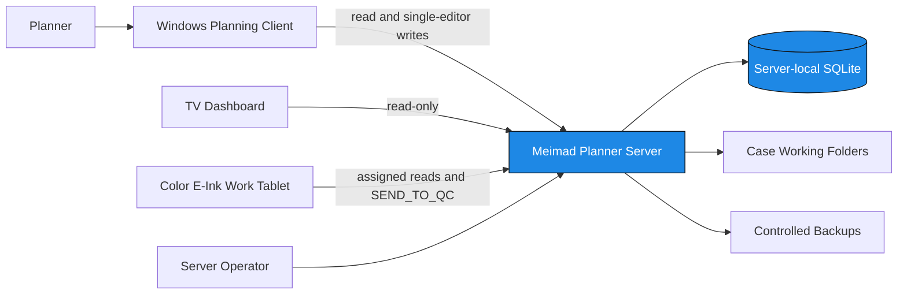
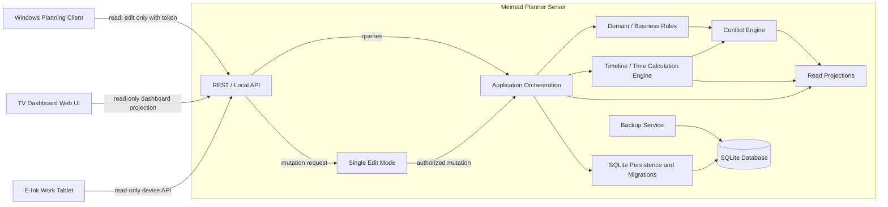
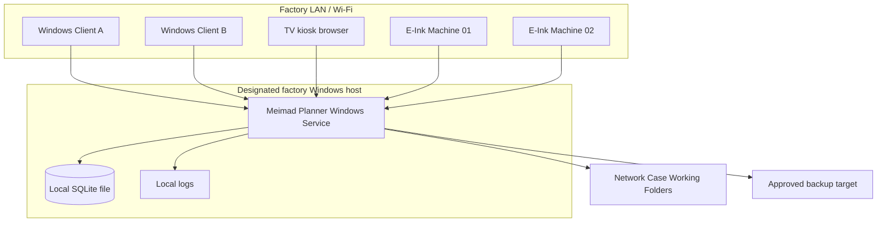
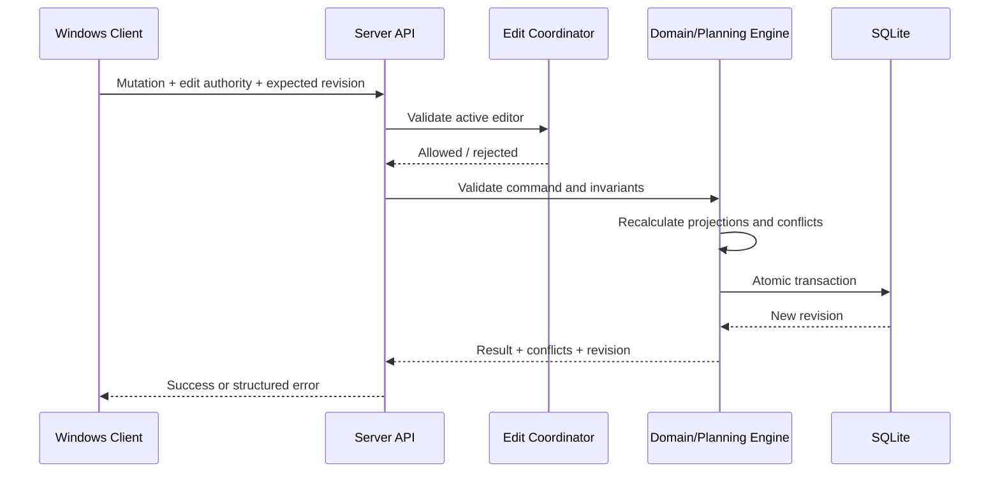
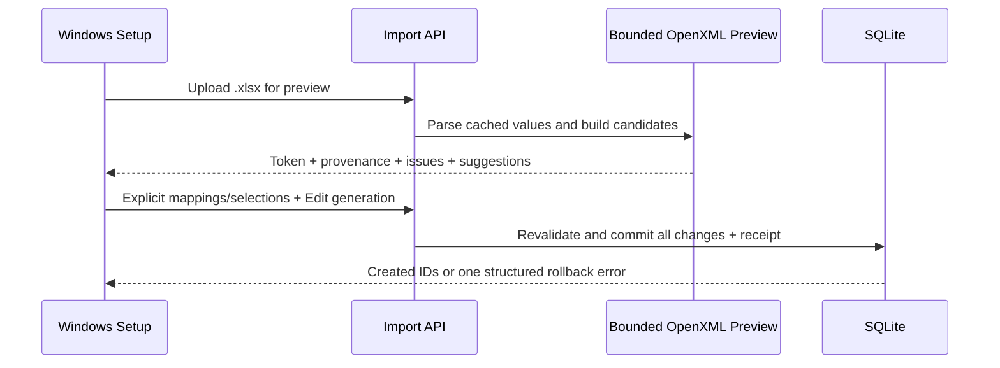
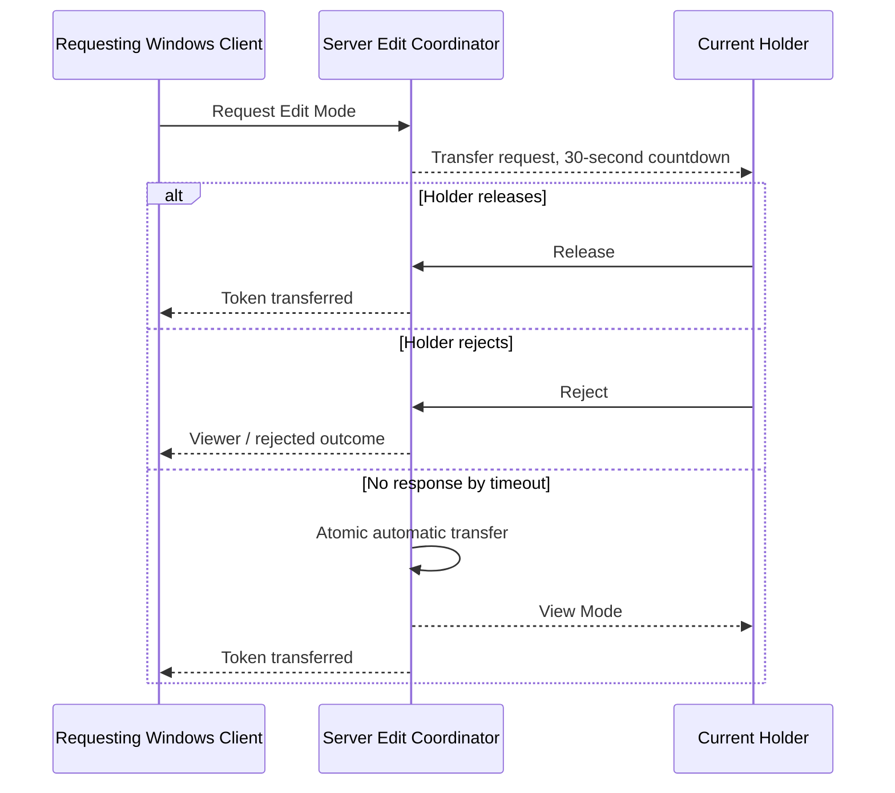
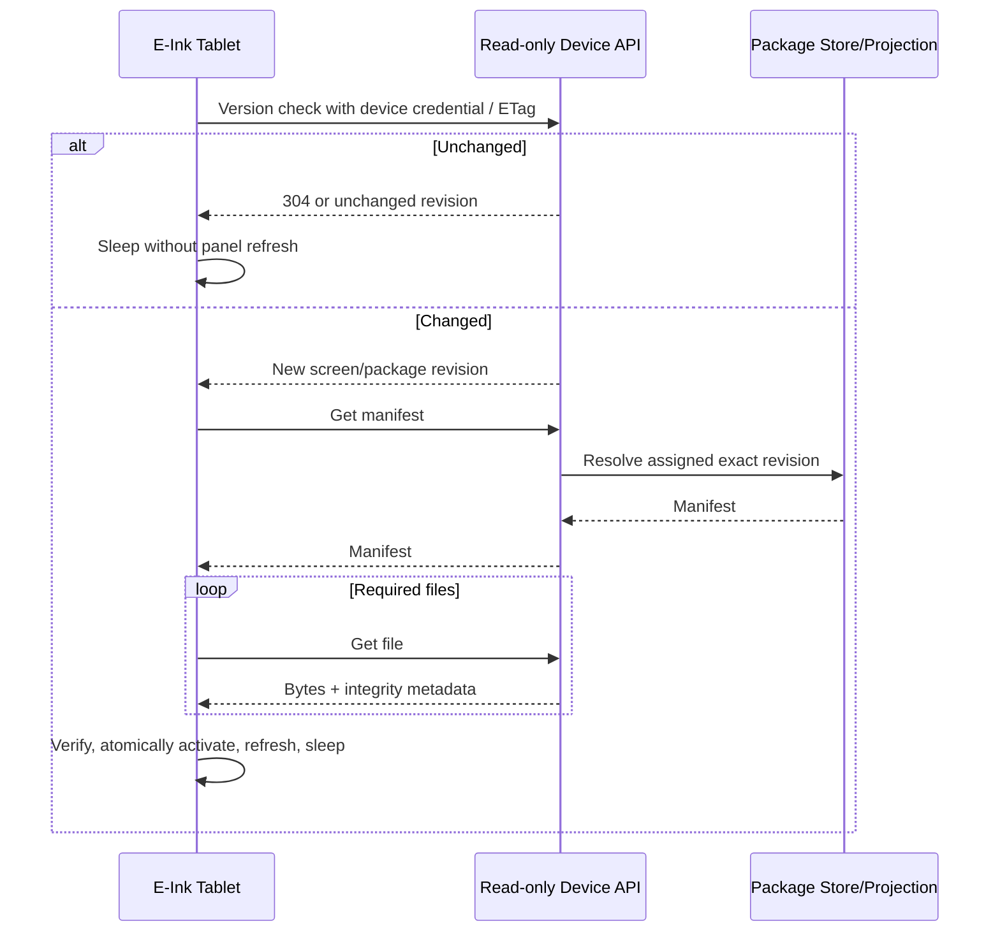

# Architecture

- **Status:** Target architecture; Server foundation through schema v39, staged legacy Excel import, Timeline API/embedded and separate-window Windows Timeline, read-only TV Dashboard, official job-package generation, contextual production readiness, local material reconciliation, and NC cycle estimation over released G-code/process/tool-table history, E-Ink API/simulator, Single Edit Mode, verified backup, Windows Case/Operation/Order/Batch/Machine/Machine-Type/Postprocessor/Calendar/Machine-Availability workspaces, and Case Operation graph validation implemented
- **Scope:** Factory-local MVP

## 1. Architectural drivers

- Keep one authoritative data owner.
- Eliminate direct multi-client access to a shared database file.
- Preserve fully manual planning while calculating consequences and explaining conflicts centrally.
- Support one full planning-editing surface, read-only displays, and one narrowly scoped tablet operational command.
- Keep the factory deployment independent of public Internet access.
- Support low-power devices that wake briefly, transfer only changed data, and retain a last-known-good display.
- Make backup and restore an owned server responsibility.

## 2. Current repository state

The repository contains an implemented .NET 10 Server host and server-owned SQLite schema version 39. Schema v34 adds explicit Machine execution/capacity/timing and Postprocessor compatibility; v35 adds process/tool-table/G-code releases and production pins; v36 adds immutable normalized required-tool rows/count; v37 adds assignment release selection and contextual offset confirmation; v38 adds NC analysis/estimates; and v39 adds locally verified material receipts and explicit Batch reservations feeding centralized readiness. The Server owns a localhost-only Kitaron connector whose SQL client always uses `ApplicationIntent=ReadOnly`; connection testing runs `SELECT TOP (0)`, while synchronization reads the mapped planning view plus canonical `TSubOrder` order state and direct `TTreeNodes` BOM edges. Credentials remain encrypted and absent from API responses. A Ready mapping drives periodic/manual synchronization that atomically applies the unified Case pool, parent Orders, child routes, and every valid direct Case Component edge returned by Kitaron, including BOM-only roots absent from the planning view and a fresh Planner database. Duplicate source edges reuse one parent/child relationship. Stale connector links whose targets were deleted are repaired during the transaction. Parent Operations are skipped; a legacy parent route skips only its conflicting component edges with warnings instead of aborting unrelated imports. `StopProduction = 1` maps to cancelled. The connector itself creates no Batch, material receipt/reservation, allocation, assignment, backlog, or Timeline state.

The API-only Windows client has a compact connection/Edit Mode header and a dedicated Setup page plus the existing operational workspaces. The Planning Board shows computed readiness summaries/component explanations and disables first Start for managed not-ready work without disabling drag/drop. Timeline keeps the same forecast and adds a labelled red outline/tooltip to planned not-ready intervals. The Server remains authoritative and rechecks readiness on Start. No automatic tool/program/Machine workaround occurs. Deletion is relationship-aware and never removes external files. TV is read-only. E-Ink package/planning access remains read-only, with an approved future `SEND_TO_QC` operational command that has no Edit Mode integration. A separate ESP32 prototype compiles a bounded status client and first text-only production layout, but official tool-package binding, physical paging input, and shop-floor validation remain incomplete. Full human/release-manager authentication, detailed Machine tool identity/life and offset-value inventory, authoritative ERP material reconciliation, route reordering, package approval UI/roles and retention, full conflict policy, combined/multiple overnight-window and Calendar archive policy, and the tablet event endpoint/storage also remain incomplete.

The Case workspace contains a client-local STEP presentation boundary. `OCCSharp` dynamically invokes OpenCascade to read the selected B-rep and tessellate its faces under explicit file/vertex/triangle limits; WPF `Viewport3D` owns depth-buffered display and PNG capture. The same unscaled mesh, center-of-gravity target, orthographic camera width, and uniform screen projection serve three presentation-only modes: Shaded, Visible edges (boundary/crease/silhouette overlay), and Wireframe (unique tessellation edges with faces hidden). Initial load fits the camera exactly once; orbit and resize rerender without recalculating the fit, wheel zoom changes only the stored camera width, and explicit Fit recalculates it. The 2D edge/bounding overlays project the original mesh coordinates through that same camera basis and center, preventing the former rotated-bounds centering offset. Shaded is the load default, with edges and bounding box off until requested. No STEP bytes, mesh, display mode, camera state, or measurement is sent to the Server or stored in SQLite. Fit uses only tessellated body vertices, excluding STEP coordinate-system entities. Closed consistently oriented meshes use a signed-volume center of gravity as their orbit target; open/non-solid geometry falls back to its geometry-vertex centroid. If OpenCascade cannot produce faces, the UI labels and displays the bounded legacy edge/point fallback rather than fabricating a solid.

The STEP renderer layers a depth-sorted WPF `DrawingVisual` triangle surface with the depth-buffered `Viewport3D`. Both consume the same tessellation, center, camera orientation, and fitted width; the software surface guarantees a visible shaded model when the workstation's WPF/GPU 3D path yields a blank frame.

## 3. System context



The Server is the authority. Case Working Folders remain external file storage; the database stores their paths and generated preview/cache references, not copies of original engineering files.

### 3.1 MVP boundary

The complete MVP runs on the factory network:

- One Meimad Planner Server process on a designated Windows host.
- One Server-owned local SQLite database.
- Windows Planning Clients using the local REST API for all reads and edits.
- Read-only TV Dashboard browsers using dashboard projections.
- E-Ink Work Tablets using device-scoped display/package reads and the single `SEND_TO_QC` operational command.

The architecture has no Customer Portal, cloud service, public Internet endpoint, router forwarding, or native mobile application. Those are outside the MVP boundary and must not be provisioned as dormant components.

## 4. Component responsibilities

### 4.1 Required component map



Every box inside the Server is a logical component. They may initially ship in one Server process, but their boundaries must remain explicit in code and tests. SQLite and the Backup Service are inside the Server trust boundary; no client can reach the database file.

### 4.2 Meimad Planner Server

The implemented `server/` component is the sole authoritative runtime. It hosts the API and coordinates domain validation, manual-plan mutations, timeline calculation, conflict generation, read projections, Single Edit Mode, persistence, migrations, backup, and the LAN-served display simulators.

It may run as a console/executable during development. The production target is one Windows Service on a designated factory PC or local Server.

### 4.3 REST / local API

The API is the only client entry point. It provides versioned REST endpoints over the factory LAN or host loopback and owns:

- Request parsing, contract validation, authentication, and authorization once the identity model is approved.
- Edit-token and optimistic-concurrency checks for mutations.
- Command dispatch to application orchestration.
- Purpose-built read projections for Windows, TV, and E-Ink clients.
- Stable error codes, correlation IDs, health/readiness, and safe failure responses.

The API must not contain authoritative scheduling or domain rules. It delegates those rules to the Server layers below it. No public listener or Internet-facing gateway is part of the MVP.

The legacy import boundary remains staged and read-only until Commit. The temporary Windows tool now submits one authoritative fixed Case/Order mapping, displays the resulting rows, and commits only valid Case and Order selections. Part Number is the Case key and Case + Order Number is the Order key; invalid rows are explained skips and existing manual data is not silently overwritten. The former Batch/Machine wizard is bypassed by the current client, which sends no planning rows, Machine mappings, allocations, assignments, backlog, Timeline, or mode changes. The bounded preview endpoint and durable receipts remain as compatibility infrastructure until Kitaron replaces Excel import. Schema v27 permits a later fixed Case/Order-only pass for the same workbook to receive a separate receipt, so an earlier partial approval does not strand remaining rows. Exact approvals replay, ordinary Case/Order uniqueness remains authoritative, and any changed approval containing planning content remains rejected. The repository checks Edit authority and commits each selected canonical Case/Order pass in one immediate transaction. The source `.xlsx` remains external and read-only.

### 4.4 Domain / business rules layer

This layer owns authoritative state transitions and invariants for Cases, Orders, Production Batches, allocations, Case and Batch Operations, Machines, assignments, calendars, and downtime.

Material reconciliation follows the same Server-authority boundary. The Windows editor records Case-scoped physically verified receipts and explicitly replaces a Batch's receipt reservations. SQLite v39 stores those facts and the readiness context reader derives one Batch-level material result for all of its Operations. Kitaron sync never writes these local verification/reservation tables, and no client opens or calculates against SQLite.

It validates that Orders remain demand-only, only Batch Operations are assigned to Machines, allocations follow the approved balance equation, dependencies retain their defined meanings, Case timing summaries are derived from operation timing, Batch and linked Order statuses follow production facts, normal Machine/Machine-Type compatibility remains safe, cross-type exceptions require explicit confirmation and reason, Machine Type renames/deletes cannot strand Operation requirements, and original engineering files are not modified. It has no dependency on REST, UI, SQLite, filesystem implementation, or device firmware.

### 4.5 Timeline / time calculation engine

The read-only calculation uses one fixed dependency/backlog graph and one Machine-lane reservation set. Not-started Forward/Manual assignments use earliest-feasible split-window placement at or after the Server snapshot cursor; Backward assignments use latest-feasible placement before a transient delivery cutoff while that intended start remains future. Waiting intervals identify Machine/setup/day-shift calendars, skilled setup/QA/regular resources, maintenance, breakdown, pause, and sequential predecessors. Assigned rows excluded from pure placement by missing input, pause, dependency failure, or horizon infeasibility remain operation-linked `blocked` waiting projections beginning at or after the later of the cursor and preceding calculated backlog work; every later stored row is blocked as well so it cannot visually leapfrog an earlier invalid or paused row.

The implemented pure Timeline Engine calculates projected setup, QA, repeated load/unload, production, dependency-waiting, idle, downtime, and locked-group reservation intervals from immutable inputs. Its inputs are explicit Machine backlog order, per-event load and cycle/cadence inputs, explicit half-open UTC Machine/setup availability windows, planned downtime, a calculation horizon, and operation dependencies. Manual work expands to an initial load followed by one cycle per part. Automatic work with N expands to an initial/repeated load followed by up-to-N-cycle production groups; automatic work without N has no load events and one production run. Before materializing phases, the engine returns blocking structured conflict `load_unload_occurrence_limit_exceeded` when any operation would require more than 10,000 non-zero-duration load/unload occurrences. Its message directs the planner to increase an automatic every-N cadence or split the Batch; a manual operation can instead be split or switched to an approved automatic cadence. This fixed reversible guard is calculation safety, not a quantity/allocation mutation, pending broader configurable-cap policy. Sequential edges delay only the calculated child; they never mutate manual backlog order. It has no SQLite, REST, clock, or UI dependency.

For each Machine, backlog adjacency is a hard precedence constraint. Sequential dependencies add precedence; Parallel-capable and Independent dependencies add none. Locked-simultaneous members use a common start and projected finish, with shorter Machines reserved through the longest member result. Setup work uses the intersection of Machine and setup availability; production uses Machine availability; downtime is subtracted. Work may split across availability windows. Each worker-required load event is independently constrained by and reserves a regular-worker calendar. The mode on each assignment is mapped into the same calculation input: a not-started `forward` or `manual` node earliest-fits at or after the Server cursor, `backward` reverse-traverses and latest-fits the same phase segments before the earliest linked Order Work Finish Date while future, returning them chronologically, and `manual` preserves its planner-authored Machine/backlog placement while calculating that visible consequence. A missed Backward start falls forward transiently without changing its persisted mode/backlog, then applies normal backlog/dependency propagation. Mixed modes remain in one graph. All produce consequences only and never change assignment identity/Machine, backlog order, durations, calendars, downtime, dependencies, or stored dates.

The implemented application projection reads current persisted assignment IDs, modes, backlog positions and recorded cross-Machine transfer/pause timestamps, active Machines, Working Calendars, individual active employees with Machine-ID qualifications and exceptions, the dedicated Setup Calendar, planned/open/restored Machine downtime, immutable Batch timing/dependency snapshots, quantities, and allocated-Order priority facts in one SQLite read transaction, then calls the pure engine through `GET /api/v1/timeline`. It derives operation duration from setup, QA, existing per-event load/unload inputs, and `cycle time x Batch planned quantity`; no prefilled planned-start/planned-end fields participate. Manual loading expands to an initial load then one cycle per part. Automatic loading with N expands to an initial/repeated load before each production group of up to N cycles, while automatic loading without N has no load events and one production run. The total duration is unchanged; only the read-only phase placement is segmented. The normal calculation cursor is the Server snapshot time clamped to the requested half-open horizon; not-started forward/manual work and identified blocked fallbacks cannot begin before that cursor, and an elapsed horizon returns end-boundary blocked markers rather than historical forecasts. The earliest linked Order Work Finish Date becomes only a transient backward cutoff. A baseline pass preserves backward latest-fit placement while it remains future; when its start has passed without a recorded Start, a deterministic transient reclassification recalculates that assignment and any newly infeasible downstream backward nodes forward from the cursor. All-backward locked groups reclassify together, while genuinely mixed persisted group modes remain invalid. The projection reserves `backward_start_missed` for operations whose own calculated baseline start actually passed; downstream/unavailable transient reclassifications use `backward_fallback_required`, with separate deadline-risk or no-future-fit conflicts as applicable. Projection normalization emits exactly one identified current operation or blocked-waiting block per active assigned Operation ID and logs/folds/removes duplicate producer output; it does not add a hold/backward/manual layer. Ordinary waiting, downtime, and moved-history capacity intervals are anonymous, while their facts remain attached to canonical phases/detail; an infeasible assignment deliberately retains identity as lower-band blocked waiting. Each Machine separately exposes additive `nonWorkingWindows`, computed as the horizon complement of its authoritative expanded Working Calendar and kept outside the operation interval/identity pipeline. A final same-Machine overlap pass keeps actual/hold/history authoritative, demotes a conflicting forecast to blocked waiting, and returns `machine_operation_overlap` or `actual_backlog_overlap` without mutating assignment/backlog data. Its fixed-point propagation prevents a blocked forecast from being leapfrogged by later backlog rows, Sequential descendants, or locked-simultaneous forecast members; recorded actual facts are retained with blocking conflicts. Suspended elapsed actual work ends at the active pause start. If the assignment moves while suspended, anonymous prior-Machine occupancy remains visible and the current hold begins no earlier than the true cross-Machine move event, falling back to replacement-assignment creation after an unassign/reassign; same-Machine reorder and planning-mode edits do not shift it. Structured Server logs record source/assigned/usable/backlog/resource counts at Information level and per-assignment mode/timing inputs and calculated results at Debug level. Active breakdowns are clipped to the read horizon until an explicit Restore closes them; maintenance and breakdown reasons are retained in downtime intervals. Calendars expand deterministically with timezone/DST conversion, breaks, exceptions, and cached holidays. The engine reserves one eligible employee for each setup, QA, or worker-required load/unload event and emits visible waiting when contention or a calendar gap delays that phase. Forward/manual contenders are compared by earliest Work Finish Date and then naturally smaller Order Number. Backward contenders use earlier Work Finish Date, shorter total duration, naturally smaller Order Number, and stable identity. Setup eligibility uses stable Machine-ID qualifications, with legacy textual tokens readable until the employee is resaved. These calculated reservations and priorities are not persisted and never reorder stored Machine backlogs. Persisted named-worker assignment, skill qualification expiry, plan revisions, rounding, and recalculation SLA remain TBD.

Schema v38 adds a parse-once/evaluate-per-Machine NC timing pipeline. Immutable release analysis is separate from append-only Machine calculations. For not-started work, the Timeline source selects a valid effective-release NC cycle before the preserved manual cycle snapshot; running and historical work stay on the snapshot source. Parser warnings or estimate unavailability do not alter readiness or mutate the plan.

The Windows Setup screen owns Machine/Postprocessor/timing configuration, the Case workspace owns immutable release/history plus Batch material reconciliation, and the Planning Board owns assignment plus a Server-backed Production Readiness dialog. Releases, process/tool activation, verified material receipts/reservations, contextual offset confirmations, readiness transitions, explicit compatibility/capacity failures, and estimate recalculations append to the schema-v22 structured event stream in the same transaction as their source change. The client displays component reasons and submits explicit facts but never calculates readiness.

### 4.6 Conflict engine

The pure engine currently returns deterministic blocking input/calculation conflicts for invalid calendars/durations/references, duplicate placement, impossible locked groups, dependency/backlog cycles, failed predecessors, and insufficient horizon availability. The broader Conflict Engine remains responsible for stable production conflict policy such as capability, deadline risk, missing business timing, accepted warnings, and plan-revision-aware explanations.

Conflicts are projections, not silent repair commands. The engine may cause a structurally invalid command to be rejected according to the approved policy, but it must never mutate a valid manual plan to remove a warning.

### 4.7 Single Edit Mode

Single Edit Mode is a Server-owned coordination component. Its implemented caller states are Viewer, Editor, and RequestingEdit. It guarantees at most one active Windows editor generation and one pending transfer request while other Windows clients remain viewers. A competing requester receives `edit_request_pending` rather than being placed in an implicit queue. TV and E-Ink clients are architecturally prohibited from requesting or holding edit authority; credential-class enforcement awaits the authentication layer.

Every implemented planning mutation validates the active client ID and generation in the same immediate SQLite transaction as the write. Release transfers immediately, Reject retains the current holder and returns the requester to Viewer, no response transfers automatically after the configured timeout, and voluntary release transfers a pending requester or clears the token when none is pending. The default timeout remains 30 seconds; `EditMode:TransferTimeoutSeconds` accepts 1–3600 seconds. A server timeout worker materializes expired transfers, and all status/command/write transactions also process an expired request before checking authority, so an old generation cannot write after its deadline. Authentication, disconnect/crash policy, notifications, and audit remain TBD.

### 4.8 SQLite persistence and migrations

The persistence component translates approved application transactions to a Server-local SQLite database. Only this component opens the database for normal operation. It owns connection lifecycle, transactions, foreign-key enforcement, ordered migrations, optimistic revisions, and integrity checks.

The database file must not be placed on a network share. Clients receive data only through API contracts and cannot use a SQLite library or database path.

The implemented foundation records migration identity in `schema_migrations` and the active version in SQLite `user_version`; ordered migrations currently reach schema version 45. Schema v42 adds immutable NC header metadata and Haas execution state, v43 adds protocol-independent CNC connections and normalized telemetry, v44 adds the Haas DPRNT port, and v45 generalizes managed process history into reusable Manufacturing Programs with immutable revision-output recipes. Earlier migration behavior remains unchanged.

### 4.12 Haas NGC Server integration

The Haas connector runs only on Meimad Server. Each Haas connection explicitly selects one read provider. Typed TCP MDC reads Q500, the configured Q600 macro, and the configured parts counter. Read-only MTConnect fetches unfiltered root `/probe` and `/current`, filters the namespace-aware XML locally, selects exactly one device, and maps standard state/program/counter observations plus the configured Haas macro only when the probe's `Source` proves its numeric range. A separate read-only DPRNT TCP subscriber remains connected to the configured port (default `8080`) and accepts only complete, part-number-shaped lines emitted by the active NC program; that direct control-authored PartName is preferred for monitoring and Bench matching. A read-only Local Net Share adapter uses a verified active O-number only as a locator, reads a bounded machine-file header, and fails closed unless exactly one file matches. The same `INcHeaderParser` parses server releases and machine headers; MTConnect `PROGRAM`, filenames, and O-numbers never become Part identity. After a configurable consecutive-poll debounce, a unique assigned Batch Operation with the parsed Case Part starts a Bench session in SETUP. Only a persisted binary macro transition `0 -> 1` opens PRODUCTION and enables counter attribution. MTConnect cannot write; the audited zero/write/read-back workflow is available only when MDC is explicitly selected. Physical share-path behavior remains gated by [the VF-3 technical spike](haas-active-program-header.md).

### 4.13 Protocol-independent CNC connection platform

All CNC networking is server-side: `CNC Machine -> protocol provider(s) -> ICncMachineAdapter -> CncConnectionManager -> normalized MachineSnapshot -> BenchAutomationService/API/WebSocket -> client`. Browser and Windows clients never open MDC, SMB, MTConnect, OPC UA, or vendor TCP connections. The Server/CNC Worker must have an approved network route to the machine VLAN; frontend computers do not need that route.

`MachineConnection.adapterType` is independent of Machine model/type. The registry exposes `HAAS_NGC` as implemented and the separate generic `MTCONNECT`, `OPCUA`, and `CUSTOM` adapters as unsupported future choices. `HAAS_NGC.telemetryProvider=MTCONNECT` is an implemented Haas sub-provider and does not select the generic adapter. Enabling an unsupported adapter is rejected. One primary connection per Machine is enforced for MVP, while connection IDs preserve a later path to multiple connections.

The singleton connection manager reconciles configuration changes and owns one isolated worker per enabled Machine. A failed/completed lease is restarted on reconciliation and cannot terminate another. A configuration/provider change cancels and joins the old worker before its replacement starts, preventing a late old-provider snapshot from overwriting the new provider. Workers use bounded 1/2/5/10/30-second reconnect backoff, persist one efficient current snapshot, retain raw diagnostics for the configured 1-90 day window, and publish only meaningful normalized changes. Haas is a composite adapter: the explicitly selected MDC or MTConnect provider supplies normalized observations, while optional `INcProgramFileProvider` access supplies a bounded header. Full MTConnect XML is bounded during parsing but is not persisted every poll; diagnostics retain a compact selected-observation/sequence payload. Agent `creationTime` remains diagnostic evidence, while Server receipt time owns persistence, retention, and automation timestamps. Failure of an optional capability yields `DEGRADED` without discarding other fresh provider data.

### 4.13 Manufacturing Program and Production Run target architecture

[Production Run and multi-output Manufacturing Program architecture](production-run-architecture.md) is the accepted decision record. Schema v45 and the program-centric API implement immutable reusable Manufacturing Programs and release history. Schemas v46–v47 implement Production Run assignment, allocation, execution pins, and idempotent CNC cycle history. Production Run is the Machine backlog and continuous occupancy unit; Batch Operations remain quantity/dependency obligations connected through explicit outputs. Legacy assignment APIs atomically wrap one operation in a one-program, one-output run.

`BenchAutomationService` consumes only `MachineSnapshot`; it has no Q500/Q600/SMB knowledge. Automation requires a current, non-stale, exactly binary production variable with a read timestamp and never substitutes the previous value. Part attribution likewise accepts only a current, non-stale counter; unavailable current inputs produce no mutation. `/api/v1/machines/live` accepts an explicit Machine-ID subscription and sends normalized `MachineSnapshotUpdated`, `MachineConnectionChanged`, and `BenchStateChanged` messages. Screens first fetch current HTTP state, then apply live notifications. Browser WebSocket reconnect never requests a CNC reconnect.

Schema v10 adds the reusable Machine Type catalog, Setup Calendar selection, and allocated-Order lifecycle. Schema v11-v14 add administrative resources, employee calendar exceptions, and cached holiday policy. Schema v15 adds immutable cross-type assignment-override audit snapshots. Schema v16-v18 add extended Operation timing, Machine downtime, and structured pause events. Schema v19 adds immutable E-Ink setup-worker/time/tool/checklist package metadata. Schema v20 adds weekly material-report scheduling and successful-delivery markers. Schema v21 adds employee planned/actual work measurements, employee-efficiency delivery markers, and a separate weekly efficiency schedule. Schema v22 adds an append-only structured event stream and filtered export API. Schema v23 adds authoritative operation actual start/end/Machine history. Schema v24 adds the checked, defaulted planning-mode column to `machine_assignments`. Schema v25 adds the first workbook import receipt without workbook bytes; schema v27 preserves it while changing receipt identity to workbook plus approved request for guarded Case/Order-only continuation. Planning-mode and import mutations and their structured events commit atomically. Calculated Timeline conflicts and resource waits are system events deduplicated per detection day. Timeline dates and reservations remain read-only projection state. The Server refuses a database newer than its known migration set, and migration failure prevents readiness.

### 4.9 Backup Service

The implemented Backup Service is an internal Server component. It serializes backup operations and uses SQLite's online backup API against the live server-owned connection, producing a transactionally consistent snapshot while normal database activity may continue. SQLite writes the snapshot first to a unique server-local temporary work folder, never directly to a possibly remote backup share.

The service runs `PRAGMA integrity_check` and `PRAGMA foreign_key_check` on the local snapshot, durably copies it to a unique pending file in the configured destination, and renames that file to `meimad-planner-backup-<UTC timestamp>-<unique suffix>.db` within that destination. It verifies the published file again, restores it through SQLite into a separate unique local test database, and repeats both checks. Every restore-verification path is compared against the active database path and rejected if equal. Temporary verification databases are deleted; the active database is never a restore destination.

Retention is count-based, scoped only to managed backup filenames in the configured folder, and applied after successful restore verification. The current backup is always retained; the default keeps 14 and configuration accepts 1–3650. Unrelated files are untouched. A verified backup remains available if later retention cleanup fails, while an unverified newly published file is removed. Backup schedule, encryption, destination-access policy, authenticated operator trigger, full disaster-recovery replacement workflow, RPO, and RTO remain TBD.

### 4.10 Windows Planning Client

The implemented `client-windows/` application uses WPF on .NET 10 and establishes the API-only desktop boundary. It currently owns:

- a validated HTTP/HTTPS Server root setting;
- a simple local display name and stable client ID stored under Local AppData;
- a compact main header with a connection indicator/tooltip and one lock/unlock Edit Mode action;
- a dedicated Setup page for connection Save/Connect/Refresh, Working Calendar management and Setup Calendar selection, Machine management, reusable Machine Type management, Employee/Resource administration, Israeli holidays, report/email settings, and staged legacy Excel preview/mapping/automatic-draft/review/commit;
- `/health` connectivity/version status;
- Viewer, Editor, and RequestingEdit presentation;
- Edit Mode request, voluntary release, transfer approval, and rejection interactions;
- bounded HTTP timeouts, safe error presentation, and five-second status refresh;
- a Case Pool with Server-side search, customer, and derived-active filters plus deterministic Part Number, closest-current-Order-delivery, and Customer ordering;
- Part Number/customer cards and unobstructed preview thumbnails fetched as bytes from the Server preview route, with text reserved for missing-preview/error state;
- a Case Details form saved only by the active editor with Edit Mode generation and Case ETag;
- editor-only Case Operation create/edit forms, optimistic Order create/edit, and explicitly allocated Production Batch create/edit forms; Batch editing preserves the instantiated route, while confirmed deletion cascades only through the selected Batch-owned database graph and compacts affected backlogs;
- an Open Working Folder action whose path value originates in the Case API;
- a snapshot-consistent Server projection for the unassigned Batch Operation pool and Machine columns;
- drag/drop translation into exact assignment, reorder, cross-Machine move, and unassignment API commands;
- compact operation cards with planned quantity, allocated Order references, status text/icon, and Server-projected estimated time;
- assignment-owned `Schedule from delivery date`, `Schedule forward`, and `Set manual mode` context actions that PATCH the same assignment under Edit Mode and optimistic assignment ETag;
- explicit player-style Start, Pause/Suspend, resume, and Finish commands for an assigned operation, disabled when invalid or unauthorized and with no client-side lifecycle rules;
- explicit server rejection feedback without optimistic or automatic rearrangement;
- a compact read-only Timeline that renders each current assignment or sole completed/unassigned history in a primary operation band without adding another operation identity. One composite assignment object paints `PRODUCTION` blue (`#1E88E5`), `SETUP` yellow (`#FBC02D`), `QC` green (`#43A047`), and every repeated `PART RELOAD` phase purple (`#7B1FA2`), plus a locked reservation phase orange; internal gaps stay transparent. Generic `idle` and ordinary anonymous `waiting` capacity intervals remain API/calculation data but are omitted from the default canvas because blank row space communicates waiting/idle. Assignment-owned `BLOCKED`, paused hold, downtime, actual history, and the conflict panel remain visible. Per-Machine calendar closures render as gray background columns from the separate `nonWorkingWindows` collection, behind the grid, blocks, and arrows. Paused hold remains one identified purple object, with one-line Machine labels, one visible operation identity marker, and selected-Batch dependency arrows;
- a separate Timeline window sharing the same live read-only view model as the embedded tab; it is not a mode-specific layer, and closing it does not close the main client or mutate planning data;
- explained Server conflicts paired with severity text; and
- dependency edge display filtered to the selected Batch only.

The Timeline projection also carries additive `displayTimeZoneId`, `dayStartsAtLocal`, and `dayEndsAtLocal` display metadata. The factory-local WPF view uses them for a two-row hour ruler with header-only DAY/DARK bands. They describe the configured Timeline day window, not astronomical daylight, and are intentionally outside calculation, calendars, intervals, block identity, and Machine-row layout; older clients can ignore them. The Server owns both forecast placement and the snapshot `readAt` calculation cursor. The WPF layer estimates `NOW` as that `readAt` plus elapsed local time, labels it in the configured factory timezone, and uses one shared 30-second refresh only while assigned `not_started` forecast or blocked work exists. Embedded and separate Timeline surfaces share this refresh rather than poll independently. The client never calculates slots, persists forecasts, or mutates planning data.

The local name is an MVP development identity only; it is not authentication. The client derives a stable ASCII API user ID from the display name so Unicode local names are never placed directly in an HTTP header. If the Server is unavailable or returns an invalid contract, the client disables edit actions and explicitly reports that authority cannot be confirmed. Status color is always paired with text and a lock, wait, or warning symbol.

The client assembly has no SQLite reference and stores no planning data or database path. It does not open the preview path; the Server reads and streams supported preview image bytes. The order-driven Excel path is normalized by the Server into unique Case, Order, and Part+Batch groups. The client turns those reviewed groups into ordinary selections: missing Cases receive only A/O/F/D values plus a system working-folder path; active Orders use B/L/E/N; Batches use P and explicit related-Order allocations summing H. This is preview-only state until Commit. The Server remains authoritative for candidates, route versions, allocations, Machines, and the one atomic mutation. Neither side invents Case Operations or timing, so new Cases stay in the Case Pool until a planner defines their route.

Operation, Order, Batch, Machine, Machine Type, and Working Calendar forms send typed commands with the active edit generation; optimistic Case Operation, Order, Machine, Machine Type, and Working Calendar edits send the selected resource version. The Case form presents read-only route timing sums and operation timing inputs as total-hours `HH:mm:ss`, converting only at the API boundary where seconds remain authoritative. Its required-Machine dropdown is the dynamic union of registered Machine process, axis, Machine capability, and linked Machine Type capability tokens, plus a blank Any option and the selected legacy token when necessary. Setup forms submit stable Calendar and Machine Type IDs; users do not type identifiers.

The Server owns timing aggregation, derived Order/Batch lifecycle, allocation-safe edit guards, compatibility, calendar usage/window/break/exception validation, one-window overnight expansion, timezone expansion, and reference-aware deletion. The board waits for the Server assignment/execution command, then reloads the authoritative projection; a rejected command leaves the board unchanged. Card estimated time is a read projection and never schedules a start or finish. Timeline timestamps and conflict semantics come from the Server. Future planning UI work adds route reorder, Batch update, combined overnight/overtime and Calendar archive policy, and downtime workflows. The client never opens SQLite, calculates an authoritative schedule, silently repairs a plan, or writes Case Working Folder source files.

### 4.11 TV Dashboard read-only web UI

The implemented `client-tv-dashboard/` component is a dependency-free, read-only fullscreen/kiosk web surface served by the Meimad Server at `/tv-dashboard/`. It consumes only `GET /api/v1/tv-dashboard`, conditionally refreshes using ETags, and retains the last rendered snapshot during a connection failure. Its viewport-fitted grid renders each Machine's connection state, latest normalized telemetry machine state (including MTConnect state such as `ACTIVE`), current Operation, picture, execution state, and setup or Batch completion. Conflicts and queued Operations are omitted from the TV surface. Server/host text, summaries, controls, and scrolling are absent.

It contains no forms, mutation workflow, or Edit Mode call. Static assets and the projection are hosted by the existing LAN-only Server, so no cloud or separate web runtime is introduced. Human/dashboard authentication, kiosk browser management, screen-resolution acceptance, offline-display telemetry, and plan-revision-consistent composition remain pending.

### 4.12 E-Ink Work Tablet scoped API

The implemented Server exposes device-scoped GET endpoints for a small version check, an assigned Machine screen, current and exact-revision package manifests/files, and work-window/polling configuration. A revocable bearer credential is stored only as a SHA-256 hash and restricts every request to the registered device's current Machine/package. Active Windows editors can create a registration, bind or unbind it, enable or revoke it, and rotate its credential; the plaintext token is returned only when created or rotated.

Official planning/package data flows Server-to-device only. An active Windows editor can generate a new official revision for an assigned Batch Operation; the Server copies approved Case-folder inputs and the selected setup-worker photo without modifying them, generates package-specific tool/offset/instruction assets, snapshots work metadata plus planned setup/worker/tool/checklist definitions, stages output, hashes every file, and publishes immutable database records only after a second Edit Mode/context check. The one approved device-originated exception is `SEND_TO_QC`: the Server authenticates the device, resolves its bound Machine and active Production Run, timestamps and records one idempotent operational event, changes only the tablet workflow projection to `IN_QC`, and advances its status revision. It takes no client-supplied target or timestamp, does not require Edit Mode, and cannot mutate planning assignments, order, quantities, execution counts, or package data. The Server endpoint and persistence are target design, not implemented behavior. Device credentials remain rejected outside assigned E-Ink reads and this future event route; there is no checklist/comment write-back, telemetry, package update, or delete endpoint. The manifest declares Wi-Fi transport, SD persistence, read-only package access, no reverse synchronization of local annotations, and no USB Mass Storage. The API exposes revision-qualified links, authorizes each file, confines storage paths to the configured Server-local package root, and re-verifies stored length and SHA-256 before returning bytes. Approval roles/UI, retention, signatures, and correction lifecycle beyond publishing a new revision remain open.

The dependency-free browser simulator is served by the Server at `/eink-simulator/`. It uses the version endpoint first, renders the structured Machine projection, conditionally polls with ETags, loads exact-revision manifests, verifies file SHA-256 in the browser, and keeps its last rendered screen when a request fails. Structured JSON is the implemented v1 baseline; a future pre-rendered panel representation would require an explicit compatible contract decision. Physical SD staging/atomic activation, deep sleep, and device-local annotations remain firmware responsibilities and are not claimed by the simulator.

### 4.13 ESP32 device project boundary

Hardware and firmware remain a separate project boundary. The prototype now owns a bounded status adapter and first direct-rendered text production layout with fixed tool pages; it does not yet consume official package tools or bind page navigation. It persists the last successfully displayed status revision and tablet identity in NVS, skips same-revision refreshes, forces changed/reassigned refreshes, and preserves the same-tablet retained panel during status failures. Firmware also owns provisioning, credential storage, work-window wake scheduling, deep sleep, battery measurement, version polling, staged download, checksum verification, atomic activation, broader last-known-good package caching, physical-input state machine including confirmed `SEND_TO_QC`, and device-local annotations. Those remaining behaviors and physical acceptance are not implied by the compiled layout/revision gate.

## 5. Deployment topology



- Development may run the Server as a console/executable.
- Production should run it as a Windows Service using a dedicated identity with least-privilege access to the database, approved Case Working Folders, logs, and backup destination.
- The implemented Server MSI installs self-contained binaries under Program Files, registers the automatic `Meimad Planner Server` service, and passes explicit `%ProgramData%\MeimadPlanner\Server` database/backup/E-Ink paths. Relative mutable paths also resolve against that ProgramData tree whenever the executable runs from Program Files, preventing direct or service-hosted startup from writing below the immutable installation directory. MSI upgrades and uninstall leave this mutable data tree intact. The current package uses LocalSystem as an installation baseline; production must replace or explicitly approve that identity according to required file/network access.
- The separate client MSI installs the self-contained WPF payload and an all-users Start Menu shortcut. Its ordinary per-user settings remain under LocalAppData and are not managed as authoritative data by the installer.
- Only the Server host opens the SQLite file.
- The service binds only to the approved factory interface. No router forwarding or public endpoint is part of MVP.
- Host discovery, port, TLS, certificates, final service account, code signing, managed rollout, and firewall policy are TBD.

## 6. Authoritative write flow



The server must never change assignments, ordering, or dependencies merely to remove a conflict. Recalculation produces derived consequences; the submitted manual plan remains intact unless validation rejects the command as structurally invalid.

Legacy import uses the same write boundary with an earlier read-only preview:



The preview token is staging, not authority. Commit does not trust suggestions, and every non-skip selection is explicit. Existing backlog rows keep their positions; imported assignments append in workbook source order. A failed row rolls back the entire approved import.

## 7. Single Edit Mode



The implemented coordinator serializes transitions with immediate SQLite transactions. The token singleton and unique pending-request index preserve one editor and one requester under concurrent acquisition and decision races. Every ownership change increments the generation. The no-response timeout is server-controlled and configurable from 1–3600 seconds, with 30 seconds as the source-compatible default. Multiple-requester queueing is deliberately absent in MVP; a client may retry after the active request finishes. Human identity, heartbeat/disconnect behavior, unsaved client state, notification transport, request cancellation, history retention, and audit remain open decisions.

## 8. Read-model flow

Windows, TV, and E-Ink views should consume purpose-built read projections rather than reconstructing schedule semantics independently.

- **Windows board projection:** pool, Machine backlogs, assignments, planned quantity, allocated Order references, input-derived estimated time, conflicts, and edit state.
- **Timeline projection:** operations and reservations on a normalized time axis with dependency/conflict annotations.
- **TV projection:** current-operation identity, preview, execution state, and calculated setup/Batch progress per Machine.
- **E-Ink projection:** small version token, Machine screen, current package manifest/files, and work-window configuration.

Projection generation may initially be synchronous. Caching/background workers should be added only when measured scale requires them and must not create a second authority.

## 9. E-Ink synchronization flow



If Wi-Fi, server, storage, transfer, or verification fails, the device retains the prior verified package and shows an offline/stale/error indication. Local annotations are stored separately and never participate in the server flow.

## 10. Persistence and file boundaries

- SQLite is local to the Server process and changes only through server-owned migrations and transactions.
- Backup uses SQLite's online backup API, direct and restored-copy integrity/foreign-key checks, and count-based retention. Restore verification is always isolated from the active database.
- Case Working Folders are external. Original contents are read-only from Meimad Planner's perspective.
- Generated previews/cache may be stored only in `_MeimadPlanner` under the Case folder.
- Schema v7 package snapshot/file metadata is immutable after publication; the implemented correction mechanism is a distinct new revision for the same Batch Operation.
- Schema v35 process, released G-code, and physical tool-table metadata is Server-owned. Bytes live beneath configured `GCode:ReleaseRoot` in stable-ID directories after staged atomic publication; database update/delete triggers and unique paths prevent overwrite. Startup recovery removes only recognisable incomplete or marker-owned orphan publications, and every download re-verifies size and SHA-256.
- The first Start of managed work transactionally pins exact process/G-code/tool-table IDs and hashes on the existing Batch Operation. CNC applicability is derived only from the release Postprocessor and the assigned Machine's explicit supported-Postprocessor relation. Planning remains possible while incomplete, and later releases never switch running work.
- Device package activation should be staged and atomic so partial downloads cannot replace last-known-good content.

The Server-local package and G-code roots and file/count/text limits are configurable, and generation/read paths cannot escape their authorized roots. Database backups must be coordinated with both physical artifact roots. Package approval UI/roles, release-manager authorization beyond Edit Mode, retention, signatures, network-path credentials, backup schedule/encryption/access, and active-database disaster-recovery procedure are TBD.

## 11. Security model

Minimum boundaries are:

- Factory-LAN-only service exposure.
- No direct client database access.
- Human identity and Edit Mode checked for every planning mutation.
- Separate read-only credentials/scopes for TV and E-Ink; the E-Ink bearer boundary is implemented while TV/human authentication remains TBD.
- Per-device E-Ink credentials restricted to the assigned Machine/package, stored only as hashes.
- Implemented E-Ink revocation/rotation and spare-device reassignment; production administrative authorization/audit and device-side secret storage remain TBD.
- No E-Ink planning/package write-back beyond the separately scoped `SEND_TO_QC` tablet workflow event, and no CNC write path.
- No unrelated confidential files in tablet packages.
- Secrets, SQLite files, backups, logs, and generated packages excluded from source control.

TLS, Windows identity/SSO versus application accounts, human/TV credentials, E-Ink token lifetime/device-side storage, administrative authorization, audit, encryption at rest, secure boot, and backup access are TBD and must be threat-modeled before production deployment.

## 12. Reliability and observability

The Server foundation should expose a health endpoint that distinguishes process health, database readiness, migration state, and critical dependency failures without leaking secrets. Logging should use structured events and correlation IDs once a format is selected.

Required operational scenarios include service restart, database migration failure, concurrent edit requests, network partition, Case-folder unavailability, backup failure, restore verification, stale TV data, revoked device, partial E-Ink download, and corrupt SD media.

Scale, response-time targets, recalculation SLA, uptime, recovery time, recovery point, time-based backup retention, log retention, and offline thresholds remain TBD.

## 13. Dependency direction

```text
Clients -> versioned API contracts -> server application/domain -> persistence and external files
```

Infrastructure may depend on domain/application abstractions; domain logic must not depend on UI, transport, SQLite, filesystem, or device details. Contract DTOs should not become the persistence schema by accident.

## 14. Architectural decisions still required

The blocking choices are tracked in [Implementation plan](implementation-plan.md#open-decisions). No implementation should freeze the technology stack, identity model, scheduling semantics, allocation equation, route versioning, E-Ink rendering strategy, or telemetry behavior without recording the decision and updating this document.
