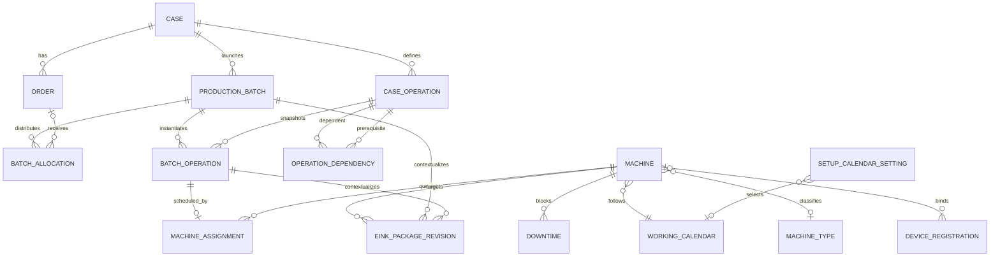

# Data Model

- **Status:** Logical model plus SQLite schema version 31; implemented Kitaron state includes encrypted connection settings, reviewed mapping, one-way sync status, ownership-aware source links, and Case Component/BOM storage
- **Authority:** Server-owned SQLite in MVP

This document separates source-required concepts from proposed implementation fields. Logical names use English `camelCase`; implemented SQL names are recorded separately and do not freeze future API JSON.

## 1. Modeling principles

- In the implemented schema, a Case is part master data, an Order is demand, a Production Batch is a production launch, and a Batch Operation is the schedulable unit.
- In the proposed Production Run target, Batch Operation remains the route/quantity/dependency obligation and only Production Runs are assigned to Machines.
- Batch allocation is explicit; warehouse balance stays outside Meimad Planner.
- Route templates and concrete batch work are distinct.
- Planner input and derived schedule/conflict projections are distinct.
- SQLite, migration metadata, and transactions are owned exclusively by the Server.
- External engineering files are not database blobs. Store only the Case Working Folder path and controlled generated-cache references.
- E-Ink local checklist/notes are not server planning entities.

## 2. Conceptual relationships

Each Production Batch has one required Case and may allocate only Orders belonging to that same Case. SQLite cannot express this cross-table equality with a simple foreign key, so the Batch repository validates it inside the atomic creation transaction before inserting any row. A device may be unassigned while held as a spare; package access is derived from its current Machine binding and package authorization, not package ownership by the device.

## 3. Shared technical fields

The source does not specify IDs, concurrency, timestamps, or audit. Schema v1 implements opaque IDs, positive `version`, and UTC-text `created_at` / `updated_at` fields on every entity table. Case, Order, Machine, Machine Type, Working Calendar, and Case Operation services increment `version` through optimistic updates; Batch creation initializes the Batch, allocations, and operation snapshots at version 1. Operation execution advances the affected operation version and atomically advances the Batch and linked Order versions when their derived lifecycle statuses change. Equivalent update behavior for other entities remains unimplemented. Actor and archive fields remain proposed:

| Field | Purpose |
|---|---|
| `id` | Implemented: stable text identifier, except the singleton Edit Token and keyed Application Setting. |
| `version` | Implemented storage field; optimistic concurrency is implemented for mutable Case, Order, Machine, and Case Operation resources. |
| `createdAt`, `updatedAt` | Implemented as `created_at` / `updated_at` UTC text with creation defaults. |
| `createdBy`, `updatedBy` | Authenticated actor identifiers if human identity is approved. |
| `archivedAt` | Optional non-destructive retirement marker where lifecycle requires it. |

Whether a formal append-only audit log is required is TBD. Hard-delete/archive behavior beyond the current restrictive foreign-key baseline remains TBD before domain mutation APIs are implemented.

### 3.1 Implemented schema table map

| Entity | SQLite table | Key relationships / constraints in v1 |
|---|---|---|
| Case | `cases` | Root part master; stores an external Working Folder path. |
| Case Component | `case_components` | Parent Case to child Case BOM edge; positive quantity per parent, stable sort order, active flag, restrictive Case foreign keys, and unique parent/child pair. |
| Order | `orders` | Required Case; positive quantity. |
| Case Operation | `case_operations` | Required Case; unique route position/operation number per Case; optional self-referenced predecessor. |
| Production Batch | `production_batches` | Required Case; positive planned quantity. |
| Verified Material Receipt | `verified_material_receipts` | Required Case; positive whole-piece quantity; explicit local verifier and timestamp; source fixed to `LOCAL_VERIFIED`. |
| Batch Material Reservation | `batch_material_reservations` | Required verified receipt and Production Batch of the same Case; positive whole-piece quantity; unique receipt/Batch pair. |
| Batch Allocation | `batch_allocations` | Required Batch; `order`, `stock`, or `scrap_allowance`; only Order allocations carry an Order ID. |
| Batch Operation | `batch_operations` | Required Batch and source Case Operation; unique route position/operation number per Batch. |
| Working Calendar | `working_calendars` | Calendar/time-zone storage envelope. |
| Setup Calendar Setting | `setup_calendar_settings` | Singleton row `id = 1`; optional selected Working Calendar used for setup availability/timezone. |
| Employee Resource | `employee_resources` | Administrative employee/resource catalog with normalized role, Machine qualification IDs in `skills_json`, optional photo/notes, and a restrictive assigned Working Calendar reference; active, calendar-assigned rows provide individual capacity to the read-only Timeline calculation. Legacy textual skill tokens remain readable and are normalized to Machine IDs on the next Setup save. |
| Employee Calendar Exception | `employee_calendar_exceptions` | Employee-owned dated vacation, sick-day, personal-day, unavailable, or custom-note interval; full-day or same-day local partial interval, cascade-deleted only with its employee. |
| Israeli Holiday | `israeli_holidays` | Local cached/manual dated availability policy, optionally applied by Working Calendars. |
| Report Email Setting | `report_email_settings` | Singleton sender/recipient/SMTP plus separate weekly material and employee-efficiency schedules. No SMTP password is stored. |
| Employee Work Measurement | `employee_work_measurements` | Employee/date planned and actual seconds, optional source reference/notes, recorder identity, and timestamp. Reporting input only; not payroll. |
| Structured Event | `structured_event_log` | Append-only planning decision/detection stream with event type/time/user, related IDs, reason/comment, and optional before/after JSON. |
| Weekly Material Report Delivery | `weekly_material_report_deliveries` | Successful automatic-send marker keyed by target week, preventing repeat scheduled mail. Manual sends are not markers. |
| Machine Type | `machine_types` | Reusable unique name and normalized capability-token catalog. |
| Machine | `machines` | Required Working Calendar; unique machine number. |
| Machine Assignment | `machine_assignments` | Required Batch Operation and Machine; one assignment per Batch Operation and one backlog position per Machine. Schema v24 adds required `planning_mode` constrained to `forward`, `backward`, or `manual`. |
| Machine Assignment Override | `machine_assignment_overrides` | Immutable audit snapshot for an explicitly confirmed cross-type assignment; deliberately retains textual IDs/types if later planning records are deleted. |
| Legacy Working-Plan Import | `legacy_working_plan_imports` | Durable receipts keyed by workbook SHA-256 plus approved-request SHA-256: replay response, committing client/user, and timestamp. The workbook and preview rows are not stored. Multiple receipts for one workbook are accepted only by the application for incremental Case/Order-only passes. |
| Downtime | `downtimes` | Required Machine; end must sort after start. |
| Edit Token | `edit_tokens` | Singleton row `id = 1`; one nullable holder and monotonically increasing generation. |
| Edit Transfer Request | `edit_requests` | Durable request/outcome; a partial unique index permits only one `pending` row. |
| Application Setting | `application_settings` | Text key/value storage envelope. |
| Device Registry | `device_registry` | `eink` or `tv`, always `read_only`; optional Machine binding and credential hash. |
| E-Ink Package Revision | `eink_package_revisions` | Required Batch Operation; unique revision per Operation; immutable Machine/Case/Batch/Operation snapshot after publication. |
| E-Ink Package File | `eink_package_files` | Required package revision; asset role, stable file ID, safe logical/storage-relative paths, length, media type, order, and SHA-256; no bytes/BLOB. |

All planning relationships use SQLite foreign keys and restrictive deletion; deleting a Machine clears an optional device binding. Schema v1 adds relationship and backlog indexes. Case, Order, Batch, Machine, Machine Type, Working Calendar, Machine Assignment, Single Edit Mode, E-Ink device/package generation/read, and isolated administrative Setup repositories/services/APIs are implemented. Schema v14 extends cached holiday policy, schema v15 adds immutable cross-type assignment override snapshots, schema v16 adds extended Case/Batch Operation timing and worker/day-shift policy, schema v17 adds planned-maintenance/breakdown lifecycle with open-ended active breakdowns, schema v23 separates actual operation history from forecasts, schema v24 owns planning mode on the Machine Assignment, schema v25 adds the legacy-import receipt, schema v26 adds external-delay, master-calendar, and criticality inputs, and schema v27 changes receipt uniqueness from workbook-only to workbook-plus-approved-request for guarded incremental Case/Order passes. Automatic scheduling, package approval/retention, recurrence/cancellation for downtime, and planning-record cascade-delete behavior are not implemented.

Schema v2 adds Case-specific `customer`, `material_type`, `material_specification`, `raw_material_form`, `raw_material_dimensions`, and `notes` columns. Existing v1 `material` and `raw_stock` values are copied into the new specification/dimensions columns during upgrade. `preview_reference` stores only the optional Preview path; `working_folder_path` stores only the required external Case Working Folder path. The Case repository stores no file bytes and the table contains no BLOB column.

Schema v3 adds nullable Order `notes`. The original v1 physical `order_reference` column now backs logical/API `orderNumber`; the unused nullable `customer_reference` column is retained for migration compatibility and is not exposed by the implemented Order slice. A future approved rebuild may normalize these physical names, but an applied migration is never rewritten.

Schema v4 adds explicit Machine `axis_type`, `is_active`, and `display_enabled` columns and enforces at most one E-Ink device binding per Machine. The earlier `machine_type` physical column backs logical `processType`; `capabilities_json` stores the normalized string array. The legacy `status` column mirrors active/inactive for compatibility.

Schema v5 adds `edit_requests`. Final outcomes are retained as `transferred`, `rejected`, or `auto_transferred`; a partial unique index enforces at most one `pending` request. The request records the holder generation it was raised against, its deadline, decision time, and any granted generation. The token's `lease_expires_at` mirrors the pending decision deadline and is cleared on every final outcome.

Schema v6 adds `eink_package_revisions` and `eink_package_files`. Triggers reject update/delete after insertion, making the metadata an immutable published-read baseline. Package files remain under the configured Server-local package root; SQLite stores only normalized relative paths, byte lengths, media types, ordering, timestamps, and lowercase SHA-256 values. There is intentionally no BLOB column. The installed schema has no device write-back table; the approved future Tablet QC Event record is defined separately and must arrive through a new ordered migration.

Schema v7 adds the package's publication-time Machine ID/number/name, Case/part identity/revision/customer, Production Batch/quantity, and Batch Operation number/name snapshots plus a constrained asset role (`preview`, `tool_table`, `nc`, `text`, `offsets`, `instructions`, or `other`). New packages populate all snapshot fields. Nullable columns preserve read compatibility with schema-v6 packages; those legacy rows expose `metadata: null`.

Schema v8 adds the optional Machine `picture_reference` path. The path remains external Server-readable metadata and SQLite stores no image bytes.

Schema v9 adds immutable dependency snapshots to `batch_operations`: dependency type, optional predecessor source Case Operation ID, and optional simultaneous-group key. Existing rows are backfilled from their source Case Operation relationships. New Batches copy these fields atomically with the existing scalar snapshots; the Timeline resolves the predecessor source ID to the corresponding operation inside that same Batch. The migration also normalizes legacy Production Batch lifecycle values into `waiting`, `in_production`, or `complete` from their related Batch Operation statuses; a Batch with no operations is `waiting`.

Schema v23 adds nullable `actual_start`, `actual_end`, and `actual_machine_id` to `batch_operations`. Start writes the actual start and Machine once, Resume preserves them, Finish writes the actual end, and Reset clears all three. Timeline reads never mutate these fields. Upgrade leaves legacy execution history null because `updated_at` is not authoritative shop-floor time.

Schema v24 adds `machine_assignments.planning_mode TEXT NOT NULL DEFAULT 'manual'` with a database CHECK permitting exactly `forward`, `backward`, or `manual`. Migration preserves assignment IDs, Machines, backlog positions, versions, and timestamps while defaulting existing rows to `manual`. New assignments also start in `manual`; an explicit mode change updates only the selected assignment's mode, version, and timestamp. Moving/reordering or resetting an operation preserves its planning mode. There are deliberately no persisted planned-start, planned-end, alternate-view, hold-layer, or mode-specific assignment records.

Schema v25 adds `legacy_working_plan_imports`; schema v27 rebuilds it with unique `(workbook_sha256, approved_request_sha256)` identity while preserving every v25 receipt. The receipt stores the successful response JSON, committing client/user IDs, and UTC commit time. An exact hash pair replays. The application may append another receipt for the same workbook only when the new request has no planning sheet, planning selection, Machine mapping, Batch, Operation, assignment, or compatibility action and contains at least one Case/Order creation. Normal Case Part Number and Case + Order Number uniqueness and transactional validation still apply. A changed approval with planning content remains rejected. Preview tokens, parsed cells, candidate lists, workbook bytes, wizard step/outcome state, pattern scope, and Batch-number templates remain bounded client/Server staging only and disappear on expiry, eviction, or Server restart. Imported Cases, Orders, Batches, Batch Operation route snapshots, and optional Machine Assignments are ordinary canonical records created in the same immediate transaction as the receipt and structured import event. A `create_batch_to_pool` outcome inserts the full immutable route snapshot without Machine Assignment rows; `create_batch_and_assign` inserts the same route and assigns only the explicitly selected snapshot. No Excel BLOB, calculated date, invented route, source-file path, or pattern rule is persisted by the importer.

The supplied order-driven workbook is normalized before selection: one Case candidate per Part Number, one Order candidate per Part Number+Order Number, and one Batch candidate per Part Number+source Batch Number. Repeated Order rows contribute summed ordered quantity; Batch planned quantity is the sum of related positive remaining quantities and is persisted through ordinary explicit `batch_allocations`, never as an inferred warehouse-stock balance.

Schema v16's existing timing fields remain the persisted/API contract: `loadUnloadTimeSeconds` is per load event, with `loadUnloadRequiresWorker`, `automaticLoading`, and nullable `loadUnloadEveryNParts` defining its cadence. With a positive per-event duration, manual work has one initial load followed by one cycle per part. Automatic work with an every-N value has one initial load followed by up to N cycles and repeats that pair for `ceil(plannedQuantity / loadUnloadEveryNParts)` load events; automatic work with null frequency has zero load events and one production run. Zero per-event duration creates no materialized load event or worker reservation. Before phase materialization, Timeline returns blocking structured conflict `load_unload_occurrence_limit_exceeded` when any operation would require more than 10,000 non-zero-duration load/unload occurrences. The message directs the planner to increase an automatic every-N cadence or split the Batch; a manual operation can instead be split or switched to an approved automatic cadence. This fixed guard is reversible calculation safety only, not a quantity/allocation mutation, pending a broader configurable-cap policy. The persisted fields do not record calculated segment timestamps or event instances. Batch creation snapshots these values, and Timeline reads expand them transiently into repeated load/unload and production phases.

Schema v10 adds `machine_types`, links `machines.machine_type_id` to it with restrictive deletion, and creates one catalog entry for each case-insensitive legacy `machines.machine_type` value during upgrade. The legacy physical value remains as the compatibility/process-type token; a linked Machine Type rename updates it for linked Machines. The new `setup_calendar_settings` singleton stores the optional dedicated Setup Calendar ID with a restrictive foreign key to `working_calendars`. Schema v10 also normalizes allocated Order statuses to `active`, `in_production`, or `complete` from allocation and Batch Operation facts while preserving legacy `cancelled` rows during migration. A linked Order becomes complete only when allocated quantity covers its demand, every allocated Batch has operations, and every such operation is completed.

## 4. Core master and demand entities

### 4.1 Case

| Logical field | Requirement status | Notes |
|---|---|---|
| `caseId` | Implemented | Server-generated stable opaque ID. |
| `partNumber` | Required by product/prototypes | Permanent part identity. Uniqueness scope is TBD. |
| `revision` | Shown in prototype; semantics TBD | Clarify whether Case is per part or per part revision. |
| `name` | Implemented, required | Technical display name. |
| `customer` | Implemented, optional | Human/customer name. |
| `customerReference` | Implemented, optional | External/customer reference; exact semantics remain TBD. |
| `previewPath` | Implemented, optional | Absolute filesystem path only; no image bytes in SQLite. |
| `workingFolderPath` | Implemented, required | Absolute external filesystem path only. Existence is not required and the Server does not create it. |
| `materialType` | Implemented, optional | Broad material family/type. |
| `materialSpecification` | Implemented, optional | Grade/specification such as `7075-T6`. |
| `rawMaterialForm` | Implemented, optional | Form such as plate, bar, or casting. |
| `rawMaterialDimensions` | Implemented, optional | Descriptive dimensions. |
| `currentSetupTimeSeconds` | Implemented, read-only derived | Non-negative integer-second sum of all Case Operation setup values; null operation values contribute zero and an empty route returns `0`. |
| `currentCycleTimePerPartSeconds` | Implemented, read-only derived | Non-negative integer-second sum of all Case Operation cycle-per-part values; null operation values contribute zero and an empty route returns `0`. It is not projected elapsed duration. |
| `notes` | Implemented, optional | Plain text; maximum 8,000 characters. |

Derived `isActive` is not stored or editable. It is true when the Case has at least one Order with status `active` or `in_production`, or one Production Batch with status `waiting` or `in_production`.

A Case may be created and persisted with no Orders or Operations. The Case service trims text, rejects missing Part Number/Name/Working Folder, requires absolute filesystem paths, and deliberately does not call the filesystem to prove a path exists. Original engineering files and external folders are never written by Case create/update. Legacy physical Case timing columns are retained for migration compatibility but are no longer mutation inputs or the source of the read projection.

Case Pool closest-delivery ordering derives `MIN(orders.work_finish_date)` over the Case's `active` and `in_production` Orders at query time. It is not a stored Case planning date; a Case without current Order demand sorts after dated Cases.

### 4.2 Order

| Logical field | Requirement status | Notes |
|---|---|---|
| `orderId` | Implemented | Server-generated stable opaque ID. |
| `caseId` | Implemented, required | Immutable parent Case; a missing parent is rejected. |
| `orderNumber` | Implemented, required | Trimmed human Order number, maximum 200 characters. Uniqueness scope remains TBD. |
| `quantity` | Implemented, required | Positive 32-bit integer demand quantity; unit remains TBD. |
| `workFinishDate` | Implemented, required | ISO `YYYY-MM-DD` calendar date with no time or zone. Planning cutoff semantics remain TBD. |
| `status` | Implemented, conditionally Server-derived | Exact tokens `active`, `in_production`, `complete`, or legacy/manual `cancelled`; `active` and `in_production` contribute active demand. New/unallocated demand accepts only `active` or `cancelled`; production tokens are Server-owned once allocations exist. |
| `notes` | Implemented, optional | Plain text; maximum 8,000 characters. |
| `version`, `createdAt`, `updatedAt` | Implemented | Optimistic positive version and locale-independent UTC timestamps. |

An Order is demand, not production. It has no Machine or Machine Assignment field and is never assigned to a Machine. Only a later Batch Operation can be scheduled. Order create/update requires the current Edit Mode generation inside the same SQLite write transaction; PATCH is optimistic. The parent cannot be changed by PATCH.

For a non-cancelled or explicitly resumed allocated Order, status is calculated from all Batch Allocations and operations related to that Order:

- `complete` requires allocated quantity greater than or equal to Order quantity, at least one allocation, at least one Batch Operation in every allocated Batch, and every operation in every allocated Batch `completed`;
- otherwise `in_production` requires at least one allocated Batch Operation whose status is not `not_started`;
- otherwise the status is `active`.

Batch creation, safe Batch deletion, and Start/Suspend/Finish/Reset recompute all affected Orders in the same write transaction. An Order split across Batches and a Batch combining Orders therefore use the same aggregate rule. Create/PATCH reject manual `in_production` or `complete` for unallocated demand (`order_status_server_owned`). Optimistic PATCH also rejects a quantity below the already allocated total (`order_quantity_below_allocated`) and rejects an explicitly submitted linked status inconsistent with calculated production facts (`order_status_derived`). Batch creation rejects allocation to a cancelled Order (`cancelled_order`). Legacy already-linked `cancelled` remains readable and preserved by automatic recomputation until an explicit matching status assertion resumes derivation; the fuller cancellation/reallocation policy remains open.

## 5. Production entities

### 5.1 Production Batch

| Logical field | Requirement status | Notes |
|---|---|---|
| `batchId` | Implemented | Server-generated stable opaque ID. |
| `caseId` | Implemented, required | One immutable route/part Case; every allocated Order must have this Case. |
| `batchNumber` | Implemented, required | Trimmed human identifier, unique within a Case, maximum 200 characters. |
| `status` | Implemented, Server-owned | Exact tokens `waiting`, `in_production`, or `complete`; derived and persisted from related Batch Operation statuses, never directly edited. |
| `plannedQuantity` | Implemented | Positive total Batch quantity; exactly equals Order allocations + stock + scrap allowance. |
| `routeRevision` | Present but currently `null` | No authoritative aggregate Case-route revision exists yet. |

A Batch may fulfill one Order, part of an Order, multiple same-Case Orders, stock, or stock only, and may include scrap allowance. It cannot span Cases. Creation is atomic with allocation rows and Case Operation scalar/dependency snapshots. Optimistic Batch edit replaces Batch Number, planned quantity, and the complete allocation collection while retaining the Batch ID and every instantiated Operation/route/execution/assignment fact; linked Orders are recomputed atomically. A confirmed Batch delete removes its owned planning/execution/package database graph, compacts affected Machine backlogs, and recomputes linked Orders. A new Batch is `waiting`. A zero-operation Batch remains `waiting`; a non-empty Batch is `complete` only when all its operations are completed; otherwise it is `in_production` once any operation is in progress, suspended, or completed. Each operation execution change recomputes status in the same transaction; the Batch status/version changes only when that derived token changes.

### 5.2 Batch Allocation

| Logical field | Requirement status | Notes |
|---|---|---|
| `allocationId` | Implemented | Stable server-generated row ID. |
| `batchId` | Implemented, required | Parent Production Batch. |
| `allocationType` | Implemented | Exact API tokens `order`, `stock`, or `scrapAllowance`. |
| `orderId` | Implemented, conditional | Required only for `order`, forbidden otherwise, and must belong to the Batch Case. |
| `quantity` | Implemented | Positive 32-bit integer; omit zero-valued rows. Unit remains TBD. |

The implemented invariant is `plannedQuantity = sum(order allocations) + stock + scrapAllowance`. There must be at least one Order or stock row; scrap alone is invalid. Each Order appears at most once, with at most one stock row and one scrapAllowance row. Wide arithmetic prevents integer overflow from satisfying the equation accidentally. Allocation relative to an Order may be partial. Complete allocation replacement is implemented through the version-checked Batch PATCH; cross-Batch over-allocation, completion, and cancellation policy remain open.

## 6. Route and operation entities

### 6.1 Case Operation

| Logical field | Requirement status | Notes |
|---|---|---|
| `caseOperationId` | Implemented domain/create field | Stable Server-generated ID that does not change when route order changes. |
| `caseId` | Implemented domain/create field | Parent Case; every graph member must match the graph Case. |
| `operationNumber` | Implemented domain/create field | Positive and unique within a graph. |
| `routePosition` | Implemented immutable edit field | New operations append at `max + 1`; PATCH cannot change position and reordering remains TBD. |
| `name` | Implemented domain field | Required operation description. |
| `requiredMachineType` | Implemented optional field | Structural assignment matches Machine process type, axis type, or capability case-insensitively; conflict severity remains TBD. |
| `setupTimeSeconds` | Implemented optional field | Non-negative current operation-owned value; null contributes zero to the Case summary. |
| `cycleTimePerPartSeconds` | Implemented optional field | Non-negative current operation-owned value; null contributes zero to the Case summary; Timeline production-duration formula remains provisional. |
| `qaTimeAfterSetupSeconds` | Implemented field | Non-negative QA phase duration; defaults to zero. |
| `loadUnloadTimeSeconds` | Implemented field | Non-negative duration of one load event; defaults to zero. |
| `loadUnloadRequiresWorker` | Implemented field | When true, each calculated load event independently reserves a regular worker. |
| `automaticLoading` | Implemented field | Selects automatic cadence rather than manual one-cycle-per-part cadence. |
| `loadUnloadEveryNParts` | Implemented nullable field | Positive automatic group size. With a value, Timeline schedules an initial/repeated load before each group of up to N cycles; null automatic loading has no load events. |
| `dayShiftOnly` | Implemented field | Restricts production to the configured day-shift calendar; defaults to false. |
| `version`, timestamps | Implemented domain/edit fields | Positive optimistic version and non-decreasing Created/Updated instants. |

### 6.2 Operation Dependency

A separate dependency record is implemented in the domain because it expresses multiple links and simultaneous groups more safely than a single predecessor field.

| Logical field | Notes |
|---|---|
| `dependencyId` | Required stable ID, unique within the graph. |
| `fromCaseOperationId` | For `SEQUENTIAL`, the prerequisite; otherwise one member of the relationship. |
| `toCaseOperationId` | For `SEQUENTIAL`, the dependent; otherwise the other member. |
| `type` | `SEQUENTIAL`, `PARALLEL_CAPABLE`, `INDEPENDENT`, or `LOCKED_SIMULTANEOUS`. |
| `simultaneousGroupKey` | Required only for `LOCKED_SIMULTANEOUS`. |

Sequential edges create the only ordering graph. Parallel-capable and independent records impose no order; absence of a record also means no relationship. Locked-simultaneous records group members transitively, require equal start and finish, use the longest future member duration, and reserve shorter resources until group finish. The validator collapses each locked group before detecting sequential cycles, but performs no scheduling or duration calculation.

The implemented repository uses the schema-v1 `case_operations` dependency columns as a limited MVP shape: an operation has at most one referenced prior operation, and contract tokens are mapped to lowercase storage tokens. Create and optimistic PATCH rehydrate every stored row into the domain graph and validate operation uniqueness, references, dependency meanings, locked groups, and sequential acyclicity inside the same immediate transaction as the write. PATCH may change operation number, name, required Machine type, setup/cycle values, and the one-link dependency fields, but never `caseOperationId`, `caseId`, `routePosition`, or creation time. Existing Batch Operations remain unchanged because schema v9 stores their scalar and dependency snapshots. This does **not** implement arbitrary fan-in/out dependency persistence or route reordering.

### 6.3 Batch Operation

| Logical field | Requirement status | Notes |
|---|---|---|
| `batchOperationId` | Implemented on Batch creation | Stable schedulable ID. |
| `batchId` | Implemented, required | Parent Production Batch. |
| `sourceCaseOperationId` | Implemented | Trace to the snapshotted CaseOperation. |
| `sourceRouteRevision` | Proposed | Identifies copied definition. |
| `operationNumber`, `routePosition`, `name` | Implemented snapshots | Later CaseOperation edits do not propagate. |
| `requiredMachineType` | Implemented snapshot | Future assignment checks may consume it. |
| `setupTimeSeconds`, `cycleTimePerPartSeconds` | Implemented snapshots | Nullable route values used by the Timeline mapper; missing values produce a conflict. |
| `qaTimeAfterSetupSeconds`, `loadUnloadTimeSeconds`, `loadUnloadRequiresWorker`, `automaticLoading`, `loadUnloadEveryNParts`, `dayShiftOnly` | Implemented snapshots | Immutable copies of the corresponding Case Operation timing/cadence values. `loadUnloadTimeSeconds` remains per event; Timeline expands it into its transient manual or automatic load/production cadence. |
| `dependencyType` | Implemented schema-v9 snapshot | One of the four dependency tokens copied from the source Case Operation at Batch creation. |
| `predecessorSourceCaseOperationId` | Implemented schema-v9 snapshot | Optional immutable predecessor source ID; the Timeline resolves it to the corresponding operation within the same Batch. |
| `simultaneousGroupKey` | Implemented schema-v9 snapshot | Optional Locked-simultaneous group key copied at Batch creation. |
| `status` | Implemented lifecycle | `not_started` → `in_progress` → `suspended`/`completed`; `suspended` may return to `in_progress`. |

Implemented Batch Operation scalar and dependency snapshots do not change when the source Case Operation changes. Start, Suspend, Finish, and Reset are explicit active-editor commands. Only an assigned first-backlog operation may start or resume, and a Machine may have at most one `in_progress` operation. An in-progress assignment cannot move, be removed, or be reset until it is suspended. Suspend preserves assignment and position and keeps the parent Batch `in_production`. Reset is allowed only from `suspended`; it returns the operation to `not_started`, closes the active pause event, retains assignment/position, and recomputes Batch and linked Order lifecycle. Finish is allowed only from `in_progress`; it sets `completed`, deletes the active Machine Assignment, atomically compacts the remaining backlog, and performs the same lifecycle recomputation. The Batch version advances if the derived status changes. Completed operations are excluded from the active board and cannot be reassigned. No start/finish timestamps or plan-versus-actual duration history are stored in this MVP slice. Aggregate `routeRevision` and arbitrary fan-in/out dependency persistence remain open.

## 7. Resource and schedule-input entities

### 7.1 Machine

| Logical field | Implementation status and notes |
|---|---|
| `machineId` | Implemented stable server-generated ID. |
| `number` | Implemented required human number; globally unique, maximum 200 characters. |
| `name` | Implemented required display name. |
| `processType` | Implemented required broad process token; physically `machine_type`. |
| `machineTypeId` | Implemented optional schema-v10 reference to a reusable Machine Type. Existing Machines are linked during migration. A linked type name is mirrored into `processType` for compatibility. |
| `axisType` | Implemented optional axis/capability token. |
| `capabilities` | Implemented normalized unique Machine-specific string list, maximum 100 entries. Linked Machine Type capabilities also participate in compatibility. |
| `workingCalendarId` | Implemented required reference to an existing Working Calendar created/listed through the Server API. |
| `isActive` | Implemented boolean. Inactive Machines reject new/moved assignments. |
| `displayEnabled` | Implemented boolean controlling whether operational displays should include the Machine. |
| `picturePath` | Implemented optional absolute external path in schema v8 (`picture_reference`). SQLite stores no image bytes; the Server streams PNG/JPEG/BMP/GIF content to the Windows client. |
| `deviceId` | Implemented read projection from the optional enabled E-Ink device binding. Active-editor binding/revocation/rotation is implemented through the device-registration API. |
| `backlogCount` | Implemented derived count, never manually stored. |
| `executionMode` | Implemented schema-v34 token: `CNC_GCODE` or `MANUAL`. Existing rows migrate to `MANUAL`; no Machine characteristics are inferred. |
| `supportedPostprocessorIds` | Implemented projection of explicit rows in `machine_supported_postprocessors`; an empty list means no configured G-code compatibility. |
| `usableToolPositions` | Implemented optional positive integer capacity representing positions actually available to an operation. |
| `rapidRateMillimetersPerMinute` | Implemented optional positive Machine-level rate; units are millimeters per minute. |
| `toolChangeTimeSeconds` | Implemented optional non-negative Machine-level duration in seconds. |
| `machineTimeFactor` | Implemented positive Machine-level estimator factor; defaults to neutral `1.0`. |

### 7.2 Machine Type

| Logical field | Implementation status and notes |
|---|---|
| `machineTypeId` | Implemented stable Server-generated ID. |
| `name` | Implemented required case-insensitively unique display/compatibility name. |
| `capabilities` | Implemented normalized unique reusable string list, maximum 100 entries. |
| `version`, timestamps | Implemented optimistic version and UTC timestamps. |

Machine Type create/read/list/optimistic update/guarded delete are Server-owned. A rename propagates the new name to the legacy `machines.machine_type` compatibility token on linked Machines. Before changing a type's name or capabilities, the repository verifies that every currently assigned Batch Operation on each linked Machine remains compatible; an unsafe change is rejected atomically. A rename is also blocked while a Case Operation or unfinished Batch Operation directly requires the old type name, because those immutable snapshots otherwise could become unassignable. Deletion is blocked while any Machine, Case Operation, or Batch Operation references the type.

### 7.2a Postprocessor compatibility

`postprocessors` stores `id`, required case-insensitively unique `name`, optional `description`, `is_active`, optimistic `version`, and UTC timestamps. `machine_supported_postprocessors` stores the unique `(machine_id, postprocessor_id)` pair and timestamps with restrictive foreign keys. This relation is the sole G-code dialect applicability mapping; Machine Type, brand, controller, model, axis count, and timing values do not imply support. A Postprocessor referenced by any Machine cannot be deactivated or deleted. Release history restricts deletion but remains readable after deactivation.

### 7.2b Process and G-code releases

Schema v35 adds immutable released-production history without duplicating `CaseOperation`, `BatchOperation`, Machine, or assignment entities.

| Table | Key fields and invariants |
|---|---|
| `tool_table_releases` | Stable ID, Case Operation, positive operation-local revision, original filename, unique server-relative path, positive size, 64-character SHA-256, release user/time/comment, timestamps. Unique `(case_operation_id, revision_number)`; update/delete triggers reject mutation. |
| `manufacturing_programs` | Schema-v45 stable reusable program identity, name, optional deterministic default Case Operation link, version/timestamps. A default program ID is `case-operation:{caseOperationId}`. |
| `process_revisions` | Preserved stable revision ID, compatibility owner Case Operation, Manufacturing Program, positive revision, active flag, exact tool-table release, creator/time, required change description, version/timestamps. A partial unique index permits one active revision per Manufacturing Program. Historical rows remain referenced and are not renumbered. |
| `manufacturing_program_revision_outputs` | Immutable stable output ID, process/program revision, Case Operation, positive integer quantity per NC cycle, unique stable display order, immutable JSON execution metadata, and creation time. Composition changes require another revision. |
| `gcode_releases` | Stable ID, Case Operation, exact process/Postprocessor/tool-table IDs, positive Postprocessor-specific revision, immutable file metadata/hash, release audit/comment, and `LOCAL_POST_REVISION` or `NEW_PROCESS_REVISION`. Unique `(process_revision_id, postprocessor_id, post_specific_revision)`; update/delete triggers reject mutation. No Draft/status column exists. |
| `gcode_release_verification_hooks` | Schema-v51 optional one-to-one immutable metadata for a G-code release: hook version, `G65` or `CUSTOM_GCODE` invocation and number, globally unique six-digit NC identity, source line, and timestamps. New publications require the row; migrated historical releases deliberately have none. Update/delete triggers reject mutation. |

The current G-code is derived as the greatest Postprocessor-specific revision for the active process and Postprocessor; an earlier record is never edited to become non-current. A release has no Machine foreign key. Machine applicability is evaluated only by joining its Postprocessor ID to `machine_supported_postprocessors`.

Schema v35 also adds nullable `production_process_revision_id`, `production_gcode_release_id`, `production_tool_table_release_id`, `production_gcode_file_hash`, and `production_tool_table_file_hash` to `batch_operations`. The first Start pins this exact context; subsequent releases do not update it. Reset clears the production pins. Null preserves backward compatibility for work that has not entered managed release history.

Schema v36 adds nullable `tool_table_releases.required_tool_count` and immutable `tool_table_release_tools`. Each row has a stable ID, parent release, positive row number, tool identifier/description, `is_required`, `requires_magazine_position`, `is_active`, optional position label, and timestamps. New rows may be parsed from structured CSV/JSON or a Cimatron MHT CAM export; MHT tool Number/Name map to identifier/description without inventing a missing pocket value. Row update/delete and post-publication insertion are rejected by triggers. A process-publication trigger verifies that the stored count equals `COUNT(DISTINCT lower(trim(tool_identifier)))` over active, required, magazine-consuming rows. Null count is reserved for pre-v36 release history whose raw file cannot be reinterpreted safely; such a process is not reported tool-capacity-ready until a new supported tool table is released.

Schema v37 adds nullable `machine_assignments.selected_gcode_release_id`, `batch_operation_material_readiness`, and append-only `tool_offset_readiness_records`. Selection belongs to the assignment and must reference a release for the Batch Operation's source Case Operation. Material status is `UNVERIFIED`, `MISSING`, or `READY`, with confirmation audit/comment/version. An offset record identifies the exact Batch Operation, Machine, process revision, and nullable G-code release (null for MANUAL execution), plus status and confirmation audit. Old offset records remain history and evaluate `OUTDATED` when the current Machine/process/release tuple changes. Overall readiness and component states are projections and are never persisted as an Operation boolean.

Schema v38 adds `gcode_release_analyses` keyed by G-code release and parser version, plus append-only `gcode_machine_cycle_estimates`. Analysis retains status, feed seconds, rapid distance in millimetres, tool-change count, dwell, detected units, warning/unsupported JSON, confidence, and analysis time. Each Machine estimate retains the analysis metrics, Machine rapid/tool-change/factor inputs, calculated rapid/tool-change/raw/final seconds, warning JSON, confidence, and calculation time. `effective_batch_operation_nc_estimates` is a read-only view selecting the latest estimate for the assignment's explicit current release, or its sole current compatible release when no explicit choice is needed. It does not persist a global planning duration.

Task 8 adds no table. Production release, tool-table/process activation, local post revision, physical offset/material confirmation, readiness transition, compatibility/capacity failure, and NC recalculation records reuse schema-v22 `structured_event_log`. These events contain stable related IDs and bounded status/hash/count/calculation metadata, never released file bytes or credentials. File history remains owned by immutable v35 metadata and server storage.

### 7.3 Working Calendar

Working Calendar storage, active-editor creation, read/list, optimistic update, guarded deletion, and Machine reference validation are implemented. An ID is an opaque Server-generated value; users select a named Calendar and do not type IDs. A newly authored record stores `name`, `time_zone_id`, root `usages`, root `useIsraeliHolidays`, and a `calendar_json.weeklySchedule` containing lowercase workday tokens, working windows, contained breaks, and dated exceptions. Calendar-specific dated exceptions take precedence over cached holidays. For opted-in calendars, `non_working` closes the date, `working` preserves the recurring schedule, and `partial_working` replaces it with the holiday's local range. Timeline and resource expansion read this cache in the same local SQLite workflow and perform no provider request. Existing explicit UTC availability documents remain readable and are unaffected by the weekly-calendar holiday overlay. One overnight window is implemented; combined/multiple overnight-window and broader overtime policy plus archive rules remain **Proposed**.

The singleton `setup_calendar_settings` row contains an optional `working_calendar_id`, a `legacy_fallback_enabled` upgrade marker, version, and timestamps. Setting or explicitly clearing it requires Edit Mode and disables the legacy fallback. When selected, the Timeline reads both that Calendar's JSON and timezone. When explicitly cleared, Timeline setup uses each assigned Machine's availability and emits `setup_calendar_defaulted`. The older `application_settings['timeline.setup_calendar_json']` value remains a read-only upgrade fallback only until the first managed selection or explicit clear; new management uses the stable selected Calendar ID.

### 7.4 Machine Assignment

| Logical field | Implementation status and notes |
|---|---|
| `machineAssignmentId` | Implemented stable ID retained across moves. |
| `batchOperationId` | Implemented unique reference; the only assignable production unit. |
| `machineId` | Implemented target Machine. Orders cannot appear here. |
| `backlogPosition` | Implemented contiguous zero-based integer, explicitly chosen by the planner. |
| `manualConstraint` | Proposed future-friendly structure; do not add before scope is approved. |

Assignment confirmation is type-strict: an active Machine proceeds without an override only when a Batch Operation's optional `requiredMachineType` equals the Machine process/Machine Type name case-insensitively; a missing required type permits any active Machine. Axis and Machine/linked-type capabilities remain structural inputs for master-data safety but do not suppress a warning when the selected Machine Type differs. A cross-type request does not write immediately: the Server returns `machine_type_override_required`, and the active editor must resubmit explicit confirmation plus a nonblank reason. The assignment and immutable override row are then committed atomically. The override records Batch Operation ID, Machine ID, original required type, selected Machine process/type, reason, confirming client/user IDs, and UTC confirmation time. It never makes an inactive Machine assignable and never changes the route requirement. The Windows dialog uses the authoritative Server-returned required and selected types. Assignment, same-Machine move, cross-Machine move, and unassign are atomic; affected lists are normalized to positions `0..n-1`, unrelated relative order is stable, and no proposal may displace an existing `in_progress` operation from position zero. Machine and Machine Type changes that would invalidate current assignments are rejected. Assignment commands do not calculate or persist timeline dates, no Machine is chosen automatically, and no other assignment is moved except for positional normalization explicitly caused by the command; the separate Timeline read calculates consequences on demand. For employee contention only, each Batch Operation projection carries the earliest Work Finish Date among its allocated Orders and the naturally smallest Order Number tied on that date. These are transient priority inputs, not persisted backlog positions.

Deletion is deliberately restrictive. Cases must have no child Orders, Operations, or Batches. Case Operations cannot be referenced by another route row or Batch snapshot; successful deletion compacts route positions. Orders cannot be allocated. A Batch cannot have assignments or official packages; deleting an eligible Batch removes only its own allocation and BatchOperation rows. Machines cannot have assignments, downtime, device bindings, or official-package references. No deletion command touches an external Case folder, picture, engineering file, cache, or official package file.

### 7.5 Downtime

| Logical field | Notes |
|---|---|
| `downtimeId` | Stable ID. |
| `machineId` | Blocked Machine. |
| `downtimeType` | `planned_maintenance` or `breakdown`. |
| `startsAt`, `endsAt` | UTC unavailable interval. Planned maintenance requires both; an active breakdown has null `endsAt` until Restore. |
| `reason` | Required operator-visible explanation. |
| `plannedBy` | Required for planned maintenance. |
| `reportedBy`, `repairNote` | Reporter is required for breakdown; repair note is optional on Restore. |
| `status` | `planned`, `active`, or `restored`, constrained by type/end-time invariants. |
| `version`, timestamps | Optimistic mutation and audit timestamps. |

Schema v17 migrates legacy fixed-end rows to planned maintenance attributed to `Legacy record`. Writes require active Edit Mode; planned edits and breakdown Restore require a matching ETag. Overlapping intervals are permitted and unioned by Timeline availability subtraction; each source interval remains visible with its reason. Recurrence, cancellation, and dedicated maintenance-role authorization remain TBD.

## 8. Edit coordination

### 8.1 Edit Token

The logical state has at most one holder.

| Logical field | Requirement status | Notes |
|---|---|---|
| `holderClientId` | Implemented | Development client identity; authentication binding remains TBD. |
| `holderUserId` | Implemented | Development user identity; authenticated derivation remains TBD. |
| `acquiredAt` | Implemented | UTC instant for the current holder. |
| `leaseExpiresAt` | Implemented | Pending transfer deadline, not a heartbeat lease. |
| `generation` | Implemented | Incremented on grant, transfer, and clear to reject stale writers. |

### 8.2 Edit Transfer Request

| Logical field | Notes |
|---|---|
| `requestId` | Stable request ID. |
| `requesterClientId`, `requesterUserId` | Requester identity. |
| `holderGeneration` | Implemented as `holder_generation_at_request`. |
| `requestedAt`, `decisionDeadline` | Implemented; default delta is 30 seconds and configuration accepts 1–3600 seconds. |
| `status` | Implemented: `pending`, `transferred`, `rejected`, `auto_transferred`. |
| `decidedAt`, `grantedGeneration` | Implemented final-outcome metadata. |

Token and request transitions are atomic. Exactly one request may be pending. A repeated request from that requester is idempotent; a different competing requester is rejected with `edit_request_pending` and may retry after the current request finishes. Cancellation and history-retention policy remain unresolved.

## 9. Derived projections

These records are calculated from authoritative input and may initially be transient:

- **Operation Timeline Item:** Batch Operation, Machine, projected start/finish, duration components, dependency group, source revision.
- **Machine Reservation:** Machine interval reserved by one operation or a locked-simultaneous group.
- **Conflict:** stable type/code, severity, affected IDs, human explanation, interval/context, and source plan revision.
- **Machine Board Projection:** Machine backlog plus current/next/status/freshness.
- **TV Projection:** compact per-Machine state and factory summary.
- **E-Ink Machine Projection:** assigned Machine, current work, next work, status metadata, version.

Conflict acknowledgement and history are not source-defined; do not add them without a decision.

The implemented Machine Board operation projection also includes the Production Batch planned quantity, a sorted distinct list of allocated Order Numbers, and nullable estimated seconds. Estimated seconds is `setupSeconds + qaSeconds + aggregateLoadUnloadSeconds + (cycleSeconds x plannedQuantity)` using wide checked arithmetic and is null when setup/cycle input is missing or arithmetic cannot be represented. Aggregate load/unload uses the same unchanged cadence totals as Timeline calculation: manual has one event per part; automatic with N has `ceil(plannedQuantity / N)` events; automatic with null N has zero events. This is a card summary of current inputs, not a persisted schedule, projected finish, or actual duration.

### 9.2 Implemented TV Dashboard projection

The TV projection is transient and not persisted. It contains only active, display-enabled Machine identity, process type, first and second unfinished backlog Operations, current/upcoming downtime, calculated conflict summaries, and active-Order due-date urgency. It omits Working Folder paths, previews/packages, customer details, credentials, edit authority, and mutation links. “Current” provisionally means the first unfinished stored backlog item; urgency provisionally means Work Finish Date within the configured UTC cutoff (48 hours by default). Both definitions remain server-owned pending shop-floor execution and local-date decisions.

### 9.1 Implemented pure timeline model

The domain-only calculation model is transient and is not stored in SQLite. Its immutable inputs are:

- a half-open UTC calculation horizon;
- ordered Machine backlogs containing stable operation IDs and non-negative setup/QA/per-event-load/cycle inputs, including the automatic loading cadence when configured;
- explicit half-open UTC availability windows per Machine;
- optional explicit half-open UTC setup-availability windows;
- planned Machine downtime intervals; and
- dependency records using Sequential, Parallel-capable, Independent, or Locked simultaneous semantics.

Its outputs are per-operation projected start/finish plus split setup, QA, repeated load/unload and production, dependency/resource-waiting, and reservation intervals; per-Machine work/waiting/idle/reserved/downtime intervals; and deterministic conflicts. Manual operations emit an initial load then one cycle per part; automatic operations with N emit an initial/repeated load before each up-to-N-cycle group, while automatic operations without N emit no load phase. Each worker phase selects one eligible employee calendar and reserves its calculated intervals for the remainder of that projection, preventing overlapping use by another operation; every worker-required load event has its own regular-worker reservation. Resource waiting details explain the required role; dependency waiting identifies the predecessor. A configured Setup Calendar is an additional setup constraint, while setup-worker head count comes from individual employee resources.

The engine converts supplied instants to UTC, merges overlapping availability, subtracts downtime, and may split work across windows. It never writes SQLite, mutates input collections, or reorders a persisted backlog. The mapper expands weekly local Machine and employee schedules and subtracts breaks, full/partial employee exceptions, and opted-in cached holidays. Setup resource eligibility requires a skill matching the Machine number/name/type/axis/effective capability, or `*`; QA and regular-worker phases are role-based. Individual employee reservations make contention deterministic. The calculated resource ID appears only in interval detail and is not stored as a planning assignment.

Each persisted Machine Assignment supplies one of three modes to the transient model. `Forward` calculates its earliest feasible consequence. `Backward` adds a transient nullable latest-finish cutoff derived from the earliest Work Finish Date among linked Order allocations and allocates the same phase segments/resources in reverse before returning their phase list chronologically. `Manual` preserves the planner-authored Machine and backlog placement and still calculates a valid visible start/end; it is not a persisted date. Mixed modes use one dependency/backlog graph and one Machine-lane reservation set. The normalized projection carries `machineAssignmentId` and emits exactly one identified current operation or blocked-waiting block for each active assigned Operation ID; any duplicate producer output is logged as `DUPLICATE_TIMELINE_BLOCK`, folded into that block, and removed before response. The canonical operation retains its ordered phase list, including repeated load/unload phases, so presentation can distinguish actual work spans, transparent availability gaps, and locked reservation without creating extra assignment objects. Ordinary waiting/downtime and moved-history capacity intervals are fully anonymous, while their times/reasons remain in the canonical phases/detail. Generic idle remains capacity data and may be omitted by a presentation because absence of work already communicates it. Each projected Machine separately carries additive `nonWorkingWindows`: the clipped, merged complement of that Machine's Server-expanded Working Calendar. These background windows are not Timeline intervals, contain no Operation/Batch/assignment fields, and introduce no persisted dates. An infeasible assignment is the deliberate exception: it retains identity as `type: waiting`, `timingKind: blocked`, with its visible interval starting after any preceding calculated rows. Same-Machine actual/hold/history is authoritative; overlapping forecasts are converted to blocked waiting with response-only conflicts. A fixed-point pass carries unresolved state through later backlog rows, Sequential descendants, and locked-simultaneous members without changing the source assignments or dependency records. Completed or unassigned actual work retains one identified `actual_history` block when there is no current assignment block. Calculated dates and conflicts remain response-only data, so schema v24 persists planning intent but no planned-start, planned-end, hold-view, or replan record.

## 10. E-Ink server-side support

The following are logical support records, not planning authority:

### 10.1 Device Registration

- Implemented immutable opaque Device ID, Server-assigned short Tablet ID, and optional normalized physical Wi-Fi MAC hardware ID. Legacy registrations receive a visible `legacy-...` Tablet ID and must be provisioned with a physical MAC before bootstrap.
- Optional assigned Machine; a partial unique index permits at most one enabled E-Ink device per Machine.
- Implemented read-only package/planning access level and enabled/revoked state; the approved `SEND_TO_QC` route remains separate future scope, not general write access.
- The Server generates a high-entropy `mp_eink_...` bearer token, stores only its SHA-256 hash, and returns plaintext only on creation or rotation.
- Active Windows Edit Mode authority is required to create, bind/unbind, enable/revoke, or rotate a registration; these changes are atomic with the authority check.
- Authenticated bootstrap records last seen/contact and bounded supplied battery metadata as operational fields only. Firmware profile history and any telemetry retention policy remain open. Schema v49 implements shared event persistence, but not the authenticated `SEND_TO_QC` command route.
- Authenticated physical status reads resolve the enabled credential and path Tablet ID to its bound Machine, first non-final Machine-backlog Production Run, current Program, and exactly one output. The response revision is a deterministic hash of tablet-visible identity, Machine, Run, Program/output, workflow, and status fields; polling/contact timestamps do not change it. Multi-output Programs are rejected rather than reduced to one output by an implicit choice.

### 10.2 Operational Workflow Events and Tablet QC target

Schema v49 implements Server-owned append-only operational records, separate
from planning/package tables. Rows carry Production Run, assigned Machine,
event type, source/idempotency identity, Server receipt time, optional Machine
time/sequence/release/device/user evidence, and JSON metadata. Update and delete
are trigger-blocked. For the future `SEND_TO_QC` route, the request supplies no
target IDs or time; the Server must add its device authorization, eligibility,
same-run retry semantics, and response contract atomically.

The tablet status projection derives `IN_QC` from this record and incorporates
the event identity/timestamp into its revision seed. The record cannot satisfy
or mutate Production Run lifecycle, Production Run Program cycles, Outputs,
Orders, Batches, Batch Operations, Machine Assignments, backlog order,
readiness, or package publication. A later transition out of `IN_QC` requires
its own approved Server-owned rule; no such tablet command is implied here.
Retention/history access, the authenticated tablet command, and the Windows
QC-completion action remain implementation work.

### 10.3 E-Ink Package Revision

- Implemented opaque package ID and caller-named textual revision, unique for one Batch Operation and immutable after insertion.
- Required publication-time Machine, Case/part, Production Batch, planned quantity, and Batch Operation snapshots plus optional tool-cart context.
- Schema v19 adds immutable planned setup start/finish, selected setup worker identity and packaged-photo reference, official job tools, optional expected-on-Machine tools, and local checklist seed items. Missing legacy/optional data reads as null or an empty list.
- Files have a constrained asset role, stable ID, normalized non-traversing logical path, Server-local storage-relative path, media type, byte length, modified timestamp, display order, and lowercase SHA-256.
- The generator optionally copies an in-folder Case preview and selected setup-worker photo, copies allow-listed NC/text source files relative to the Case Working Folder, and emits canonical JSON tool-table/offset assets and UTF-8 official instructions. It never modifies source files and accepts checklist definitions only—not device-local completion/comment state.
- Files are staged under a unique package directory. The Server validates Edit Mode before reading sources, then revalidates Edit Mode and the Case/Batch/Operation/assignment/Machine versions in the same transaction that publishes metadata. Failure removes staged output.
- The current device read service selects the latest published revision for the first unfinished assigned backlog Operation only when its publication Machine matches the current Machine, then exposes only that exact revision.

Package approval roles/UI, allowed-format expansion, retention/garbage collection, signatures, backup inclusion, and access to superseded revisions remain TBD. A correction is implemented as a distinct new immutable revision; there is no update/delete API.

## 11. Device-local model

Device-local data never enters server planning state.

- Configuration: Wi-Fi, server, device/Machine identity, credential, work-window cache.
- Device state: last verified versions, last successful update, battery state, and rendering position.
- Official active package: read-only and checksum-verified.
- Package history/cache: bounded by a retention policy.
- Local tool annotation: package revision, tool identity, installed mark, local status, comment.
- Local page annotation: package revision, page/file identity, short note.

New-revision migration/clearing, spare reassignment, encryption, battery-replacement persistence, and storage limits are TBD.

## 12. Invariants to enforce on the server

1. A Case has no demand quantity field acting as an Order substitute.
2. Every Order belongs to a valid Case.
3. Every Batch Allocation has a positive quantity and a target valid for its allocation type; Order targets belong to the Batch Case.
4. `plannedQuantity` equals Order allocations plus stock plus scrap allowance exactly; scrap cannot be the sole production purpose.
5. An Order is never assigned to a Machine.
6. A Machine Assignment references one Batch Operation and one valid Machine.
7. Dependency references remain inside the approved route scope and satisfy approved graph rules.
8. Locked-simultaneous members share projected start and finish, and every member Machine stays reserved for the longest duration.
9. Case timing totals equal the separate sums of current Case Operation setup and cycle values, with null treated as zero; these totals never replace dependency-aware Timeline calculation.
10. Production Batch status is `waiting`, `in_production`, or `complete` according to its Batch Operation statuses and changes atomically with execution.
11. A non-cancelled or explicitly resumed allocated Order's `active` / `in_production` / `complete` status follows all related Batch Operations and allocation coverage and changes atomically with Batch creation/deletion and execution; a zero-operation Batch cannot satisfy completion. A legacy already-linked cancelled row stays cancelled until explicitly resumed.
12. Order quantity cannot be edited below its current aggregate allocated quantity, and a submitted linked-Order status cannot contradict the derived result.
13. A Batch Operation's dependency snapshot is immutable when its source Case Operation is edited.
14. Linked Machine Type and Working Calendar deletion is restrictive; unsafe Machine/Type compatibility changes are rejected.
15. There is at most one active editor generation.
16. A planning mutation with a stale or absent edit generation is rejected atomically.
17. The Server never changes backlog order or assignments merely to clear a conflict.
18. Working-folder-generated files remain under `_MeimadPlanner`; original engineering files are not modified.
19. Schema v7 package metadata is immutable after publication; corrections create a distinct revision and never overwrite an official package.
20. Device credentials can read only their assigned resource scope and may invoke only `SEND_TO_QC` for the Server-resolved eligible active run.
21. Device operational data, including `SEND_TO_QC`, cannot mutate or satisfy planning entities or conflicts; the event affects only the tablet workflow projection.

## 13. Explicitly not modeled in MVP

- Warehouse inventory balance or ERP synchronization.
- Automatic scheduling/optimization state.
- Plan-versus-actual timing history.
- Full tool crib inventory/life.
- Customer Portal data.
- Tablet notes/checklist on the server.
- Official CNC-transfer state.

## 14. Migration rules

- Ordered server-owned migrations are implemented through version 50.
- Applied migration identity is recorded in `schema_migrations`; SQLite `user_version` records the active version and newer unknown versions are rejected.

Schema v28 adds the singleton `kitaron_connection_settings`. It stores the SQL Server host/port, database, schema/view, username, refresh interval, enable flag, optimistic version, and last read-only connection-test status. The password is stored only as an ASP.NET Data Protection ciphertext bound to the Server application; API responses expose only `passwordConfigured`. No Kitaron source rows or source database credentials are stored as plaintext, and this schema does not yet add source identity/import rows.

Schema v29 adds singleton `kitaron_mapping_settings` with the selected model, Draft/Ready status, complete field selections, detected source columns, notes, version, and timestamps.

Schema v30 adds singleton `kitaron_sync_state` and `kitaron_sync_links`. Schema v31 adds `case_components`, extends source links to Case Components, and adds component create/update/match counters. A Case remains the only part master and may be a parent, child, both, or neither. Each active relationship stores a positive real `quantity_per_parent`; self-reference and duplicate parent/child pairs are constrained, while application writes also reject indirect cycles. Connector-owned missing BOM edges are deactivated rather than deleted, and removing an edge never deletes either Case. Schema v32 extends `batch_allocations` with `derived_order` and a stable `derived_order_key`. That key references a read-only projection of a source parent Order through one component path; it does not create an Order row for the child. Derived quantity is parent Order quantity multiplied by every edge quantity in the path, and remaining quantity subtracts non-cancelled child Batch allocations for that key. Parent role and child role are derived with active relationship existence queries and are not separately stored.

Schema v34 adds Machine execution/capacity/timing columns, `postprocessors`, and the explicit Machine/Postprocessor join table. Existing Machines receive `MANUAL`, null unknown capacity/rates/tool-change time, and factor `1.0`. The migration intentionally does not infer CNC status or create compatibility mappings from existing descriptive fields.

Schema v35 adds released tool tables, process revisions, immutable Postprocessor-specific G-code releases, and nullable exact production pins on Batch Operations. It creates no synthetic release from Case timing values, old E-Ink package files, Machine descriptions, or legacy Kitaron data. The configured release storage must be backed up together with SQLite.

Schema v36 adds structured immutable released-tool rows and the derived required magazine-tool count. Existing v35 tool-table metadata/process history is preserved with null count and no invented rows. Capacity is a live projection from the effective process tool release and assigned Machine; no readiness boolean is persisted.
- Schema v37 adds contextual release selection, its retained legacy material-input history, and immutable offset-readiness history. Schema v39 adds tables only: it does not translate any legacy/Kitaron approval into a verified receipt or reservation. Existing Batches therefore remain readable but material-blocked until a user records current physical availability and reserves it explicitly.
- Schema v41 adds `kitaron_material_orders`, a read-only-source advisory register keyed by `TBuyRow.BuyRowID`. It retains mapped purchase order, raw-material, quantity, historical received total, requested delivery, and latest supplier-approved delivery fields. Its rows are explicitly separate from schema-v39 verified receipts and reservations and cannot satisfy production readiness.
- Schema v42 originally added Haas compatibility tables, including the now-retired persistent Setup/Production macro projection. Schema v49 removes those mode columns and macro-write audits; historical ordered migrations remain unchanged. The Batch Operation remains a quantity/dependency obligation and Production Run is the schedulable Machine-session object.
- Schema v43 adds `machine_connections` (one primary connection per Machine for MVP, adapter/configuration/version/permissions/lifecycle), `machine_current_state` (one normalized snapshot per Machine), `machine_state_history` (meaningful changes only), `machine_connection_events`, and `machine_telemetry_raw`. Typed adapter configuration is serialized into `configuration_json`; username/password values are forbidden there and only opaque secret IDs occupy dedicated columns. Raw telemetry is pruned per connection using `raw_telemetry_retention_days` (default 14, allowed 1-90); business and Bench events are not pruned with telemetry. The v42 Haas tables remain a compatibility and Bench-history projection during this migration slice.
- Each migration is applied transactionally; recovery policy for future non-transactional or failed production upgrades remains TBD.
- Back up before a risky migration and prove the backup can restore.
- Test fresh-create, upgrade from every supported prior version, rollback/recovery behavior, and corrupted/incompatible schema handling.
- Never make direct client-side schema changes.

The implemented migrations through schema v51 are the current persistence/domain contract. Schemas v42-v44 add Haas/CNC connection behavior, v45-v47 add Manufacturing Programs, Production Runs, and cycle observations, v48 adds physical-tablet status support, v49 adds operational workflow events while removing the CNC mode projection, v50 adds the CNC-verification identity/configuration foundation, and v51 adds immutable generic NC verification-hook identity. Later changes require new migrations and must never rewrite an applied migration in a deployed system.
Schema v39 treats Batch `planned_quantity` as the required raw-material piece count, consistent with the existing material-order report and inclusive of scrap allocation. `verified_material_receipts` is local physical evidence rather than ERP inventory. `batch_material_reservations` makes consumption intent explicit. Trigger and repository validation prevent cross-Case reservation, receipt over-reservation, and reservation above Batch quantity. Material readiness is derived for every Batch Operation from its parent Batch reservation coverage; the schema-v37 manual material table is retained only as legacy history and is no longer authoritative.
## Production Run target model

The multi-output schema is specified in [Production Run and multi-output Manufacturing Program architecture](production-run-architecture.md). Schema v45 implements `manufacturing_programs` and immutable revision outputs. Schema v46 implements `production_runs`, `production_run_programs`, and `production_run_outputs`, and makes `machine_assignments.production_run_id` authoritative while retaining `batch_operation_id` only as a compatibility projection. Schema v47 adds append-only `production_run_cycle_events` with a unique `(source, source_event_id)` identity. Active allocations exclude cancelled/aborted runs; produced quantities remain historical. Started structure is trigger-protected and foreign-key restrictive.

Schema v49 adds append-only `production_run_workflow_events`. Each row identifies its Production Run, assigned Machine, event type, source and idempotency identity; it may also retain a source sequence, separate Machine timestamp, NC release, Offset Loader release, tablet, user, and JSON evidence. `server_received_at` is authoritative. Update/delete triggers make events immutable. The same migration folds existing tablet `SEND_TO_QC` evidence into this stream and removes the legacy persistent CNC mode-variable columns and audit table. Projection logic may change without changing raw events.

Schema v50 adds `offset_loader_releases` as immutable identities tied to one Production Run, Machine, approved G-code release, exact tool-table release, numeric verification release token, creator/time, optional artifact hash, and metadata. `production_run_current_offset_loaders` is the separate mutable current pointer; consistency triggers require the selected release to belong to the same Run and Machine. An old row remains history and is not accepted by current-resolution logic. NC/tool-table/Offset Loader dates are not compared.

`cnc_verification_settings` stores one optimistic configuration per Machine. It contains the Haas DPRNT transport/port, configured protected O9000 program numbers, optional custom alias, four distinct temporary-variable numbers, Data Protection ciphertext for the Machine secret, expected macro version, response digit count, timeout, and enabled flag. API projections expose a boolean secret-presence indicator, never ciphertext or plaintext. `production_run_workflow_anomalies` immutably records sequence gaps and out-of-order observations with previous/expected/received sequence and the actual retained workflow-event ID.

Schema v51 adds `gcode_release_verification_hooks`. Publication validates exactly one marker as the first executable NC block, accepts a protected `G65 P9xxx` call or a custom `G1`-`G999` alias other than `G65`, and requires a unique integer identity from 100000 through 999999. The Server stores the parsed invocation and source line but preserves the exact uploaded bytes. No migration row is synthesized for older releases; a null hook therefore means historical/readable but not eligible as proof of NC identity.

Key target constraints are: one or more programs per run; one or more outputs per program; positive integer quantity per cycle and target quantity; exact divisibility; equal required cycles for coupled outputs; unique program sequence; no active allocation plus produced quantity above a Batch Operation's required quantity; restrictive foreign keys; and immutable started composition.
