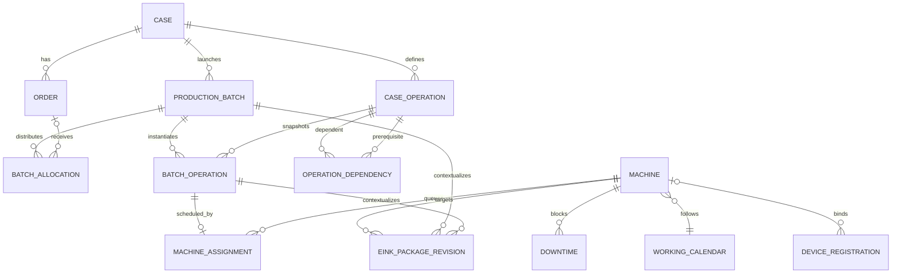

# Data Model

- **Status:** Logical model plus SQLite schema version 9; Case/Order/Batch/Machine/assignment/Edit Mode/E-Ink package-generation/read slices, Case Operation create/edit graph persistence/API, immutable Batch dependency snapshots, and derived Batch lifecycle are implemented
- **Authority:** Server-owned SQLite in MVP

This document separates source-required concepts from proposed implementation fields. Logical names use English `camelCase`; implemented SQL names are recorded separately and do not freeze future API JSON.

## 1. Modeling principles

- A Case is part master data, an Order is demand, a Production Batch is a production launch, and a Batch Operation is the schedulable unit.
- Only Batch Operations are assigned to Machines.
- Batch allocation is explicit; warehouse balance stays outside Meimad Planner.
- Route templates and concrete batch work are distinct.
- Planner input and derived schedule/conflict projections are distinct.
- SQLite, migration metadata, and transactions are owned exclusively by the Server.
- External engineering files are not database blobs. Store only the Case Working Folder path and controlled generated-cache references.
- E-Ink local checklist/notes are not server planning entities.

## 2. Conceptual relationships

Each Production Batch has one required Case and may allocate only Orders belonging to that same Case. SQLite cannot express this cross-table equality with a simple foreign key, so the Batch repository validates it inside the atomic creation transaction before inserting any row. A device may be unassigned while held as a spare; package access is derived from its current Machine binding and package authorization, not package ownership by the device.

## 3. Shared technical fields

The source does not specify IDs, concurrency, timestamps, or audit. Schema v1 implements opaque IDs, positive `version`, and UTC-text `created_at` / `updated_at` fields on every entity table. Case, Order, Machine, and Case Operation services increment `version` through optimistic updates; Batch creation initializes the Batch, allocations, and operation snapshots at version 1. Operation execution advances the affected operation version and atomically advances the Batch version when its derived lifecycle status changes. Equivalent update behavior for other entities remains unimplemented. Actor and archive fields remain proposed:

| Field | Purpose |
|---|---|
| `id` | Implemented: stable text identifier, except the singleton Edit Token and keyed Application Setting. |
| `version` | Implemented storage field; optimistic concurrency is implemented for mutable Case, Order, Machine, and Case Operation resources. |
| `createdAt`, `updatedAt` | Implemented as `created_at` / `updated_at` UTC text with creation defaults. |
| `createdBy`, `updatedBy` | Authenticated actor identifiers if human identity is approved. |
| `archivedAt` | Optional non-destructive retirement marker where lifecycle requires it. |

Whether a formal append-only audit log is required is TBD. Hard-delete/archive behavior beyond the current restrictive foreign-key baseline remains TBD before domain mutation APIs are implemented.

### 3.1 Implemented schema table map

| Entity | SQLite table | Key relationships / constraints in v1 |
|---|---|---|
| Case | `cases` | Root part master; stores an external Working Folder path. |
| Order | `orders` | Required Case; positive quantity. |
| Case Operation | `case_operations` | Required Case; unique route position/operation number per Case; optional self-referenced predecessor. |
| Production Batch | `production_batches` | Required Case; positive planned quantity. |
| Batch Allocation | `batch_allocations` | Required Batch; `order`, `stock`, or `scrap_allowance`; only Order allocations carry an Order ID. |
| Batch Operation | `batch_operations` | Required Batch and source Case Operation; unique route position/operation number per Batch. |
| Working Calendar | `working_calendars` | Calendar/time-zone storage envelope. |
| Machine | `machines` | Required Working Calendar; unique machine number. |
| Machine Assignment | `machine_assignments` | Required Batch Operation and Machine; one assignment per Batch Operation and one backlog position per Machine. |
| Downtime | `downtimes` | Required Machine; end must sort after start. |
| Edit Token | `edit_tokens` | Singleton row `id = 1`; one nullable holder and monotonically increasing generation. |
| Edit Transfer Request | `edit_requests` | Durable request/outcome; a partial unique index permits only one `pending` row. |
| Application Setting | `application_settings` | Text key/value storage envelope. |
| Device Registry | `device_registry` | `eink` or `tv`, always `read_only`; optional Machine binding and credential hash. |
| E-Ink Package Revision | `eink_package_revisions` | Required Batch Operation; unique revision per Operation; immutable Machine/Case/Batch/Operation snapshot after publication. |
| E-Ink Package File | `eink_package_files` | Required package revision; asset role, stable file ID, safe logical/storage-relative paths, length, media type, order, and SHA-256; no bytes/BLOB. |

All relationships use SQLite foreign keys. Planning relationships use restrictive deletion; deleting a Machine clears an optional device binding. Schema v1 adds relationship and backlog indexes. Case, Order, Batch, Machine, Machine Assignment, Single Edit Mode, and E-Ink device/package generation/read repositories/services/APIs are implemented through schema v9. Automatic scheduling, package approval/retention, downtime behavior, and cascade-delete behavior are not implemented.

Schema v2 adds Case-specific `customer`, `material_type`, `material_specification`, `raw_material_form`, `raw_material_dimensions`, and `notes` columns. Existing v1 `material` and `raw_stock` values are copied into the new specification/dimensions columns during upgrade. `preview_reference` stores only the optional Preview path; `working_folder_path` stores only the required external Case Working Folder path. The Case repository stores no file bytes and the table contains no BLOB column.

Schema v3 adds nullable Order `notes`. The original v1 physical `order_reference` column now backs logical/API `orderNumber`; the unused nullable `customer_reference` column is retained for migration compatibility and is not exposed by the implemented Order slice. A future approved rebuild may normalize these physical names, but an applied migration is never rewritten.

Schema v4 adds explicit Machine `axis_type`, `is_active`, and `display_enabled` columns and enforces at most one E-Ink device binding per Machine. The earlier `machine_type` physical column backs logical `processType`; `capabilities_json` stores the normalized string array. The legacy `status` column mirrors active/inactive for compatibility.

Schema v5 adds `edit_requests`. Final outcomes are retained as `transferred`, `rejected`, or `auto_transferred`; a partial unique index enforces at most one `pending` request. The request records the holder generation it was raised against, its deadline, decision time, and any granted generation. The token's `lease_expires_at` mirrors the pending decision deadline and is cleared on every final outcome.

Schema v6 adds `eink_package_revisions` and `eink_package_files`. Triggers reject update/delete after insertion, making the metadata an immutable published-read baseline. Package files remain under the configured Server-local package root; SQLite stores only normalized relative paths, byte lengths, media types, ordering, timestamps, and lowercase SHA-256 values. There is intentionally no BLOB column or device write-back table.

Schema v7 adds the package's publication-time Machine ID/number/name, Case/part identity/revision/customer, Production Batch/quantity, and Batch Operation number/name snapshots plus a constrained asset role (`preview`, `tool_table`, `nc`, `text`, `offsets`, `instructions`, or `other`). New packages populate all snapshot fields. Nullable columns preserve read compatibility with schema-v6 packages; those legacy rows expose `metadata: null`.

Schema v8 adds the optional Machine `picture_reference` path. The path remains external Server-readable metadata and SQLite stores no image bytes.

Schema v9 adds immutable dependency snapshots to `batch_operations`: dependency type, optional predecessor source Case Operation ID, and optional simultaneous-group key. Existing rows are backfilled from their source Case Operation relationships. New Batches copy these fields atomically with the existing scalar snapshots; the Timeline resolves the predecessor source ID to the corresponding operation inside that same Batch. The migration also normalizes legacy Production Batch lifecycle values into `waiting`, `in_production`, or `complete` from their related Batch Operation statuses; a Batch with no operations is `waiting`.

## 4. Core master and demand entities

### 4.1 Case

| Logical field | Requirement status | Notes |
|---|---|---|
| `caseId` | Implemented | Server-generated stable opaque ID. |
| `partNumber` | Required by product/prototypes | Permanent part identity. Uniqueness scope is TBD. |
| `revision` | Shown in prototype; semantics TBD | Clarify whether Case is per part or per part revision. |
| `name` | Implemented, required | Technical display name. |
| `customer` | Implemented, optional | Human/customer name. |
| `customerReference` | Implemented, optional | External/customer reference; exact semantics remain TBD. |
| `previewPath` | Implemented, optional | Absolute filesystem path only; no image bytes in SQLite. |
| `workingFolderPath` | Implemented, required | Absolute external filesystem path only. Existence is not required and the Server does not create it. |
| `materialType` | Implemented, optional | Broad material family/type. |
| `materialSpecification` | Implemented, optional | Grade/specification such as `7075-T6`. |
| `rawMaterialForm` | Implemented, optional | Form such as plate, bar, or casting. |
| `rawMaterialDimensions` | Implemented, optional | Descriptive dimensions. |
| `currentSetupTimeSeconds` | Implemented, read-only derived | Non-negative integer-second sum of all Case Operation setup values; null operation values contribute zero and an empty route returns `0`. |
| `currentCycleTimePerPartSeconds` | Implemented, read-only derived | Non-negative integer-second sum of all Case Operation cycle-per-part values; null operation values contribute zero and an empty route returns `0`. It is not projected elapsed duration. |
| `notes` | Implemented, optional | Plain text; maximum 8,000 characters. |

Derived `isActive` is not stored or editable. It is true when the Case has at least one Order with status `active` or one Production Batch with status `waiting` or `in_production`.

A Case may be created and persisted with no Orders or Operations. The Case service trims text, rejects missing Part Number/Name/Working Folder, requires absolute filesystem paths, and deliberately does not call the filesystem to prove a path exists. Original engineering files and external folders are never written by Case create/update. Legacy physical Case timing columns are retained for migration compatibility but are no longer mutation inputs or the source of the read projection.

### 4.2 Order

| Logical field | Requirement status | Notes |
|---|---|---|
| `orderId` | Implemented | Server-generated stable opaque ID. |
| `caseId` | Implemented, required | Immutable parent Case; a missing parent is rejected. |
| `orderNumber` | Implemented, required | Trimmed human Order number, maximum 200 characters. Uniqueness scope remains TBD. |
| `quantity` | Implemented, required | Positive 32-bit integer demand quantity; unit remains TBD. |
| `workFinishDate` | Implemented, required | ISO `YYYY-MM-DD` calendar date with no time or zone. Planning cutoff semantics remain TBD. |
| `status` | Implemented, required | Exact tokens `active`, `complete`, or `cancelled`; only `active` contributes active demand. |
| `notes` | Implemented, optional | Plain text; maximum 8,000 characters. |
| `version`, `createdAt`, `updatedAt` | Implemented | Optimistic positive version and locale-independent UTC timestamps. |

An Order is demand, not production. It has no Machine or Machine Assignment field and is never assigned to a Machine. Only a later Batch Operation can be scheduled. Order create/update requires the current Edit Mode generation inside the same SQLite write transaction; PATCH is optimistic. The parent cannot be changed by PATCH.

## 5. Production entities

### 5.1 Production Batch

| Logical field | Requirement status | Notes |
|---|---|---|
| `batchId` | Implemented | Server-generated stable opaque ID. |
| `caseId` | Implemented, required | One immutable route/part Case; every allocated Order must have this Case. |
| `batchNumber` | Implemented, required | Trimmed human identifier, unique within a Case, maximum 200 characters. |
| `status` | Implemented, Server-owned | Exact tokens `waiting`, `in_production`, or `complete`; derived and persisted from related Batch Operation statuses, never directly edited. |
| `plannedQuantity` | Implemented | Positive total Batch quantity; exactly equals Order allocations + stock + scrap allowance. |
| `routeRevision` | Present but currently `null` | No authoritative aggregate Case-route revision exists yet. |

A Batch may fulfill one Order, part of an Order, multiple same-Case Orders, stock, or stock only, and may include scrap allowance. It cannot span Cases. Creation is atomic with allocation rows and Case Operation scalar/dependency snapshots. A new Batch is `waiting`. A zero-operation Batch remains `waiting`; a non-empty Batch is `complete` only when all its operations are completed; otherwise it is `in_production` once any operation is in progress, suspended, or completed. Each operation execution change recomputes status in the same transaction; the Batch status/version changes only when that derived token changes.

### 5.2 Batch Allocation

| Logical field | Requirement status | Notes |
|---|---|---|
| `allocationId` | Implemented | Stable server-generated row ID. |
| `batchId` | Implemented, required | Parent Production Batch. |
| `allocationType` | Implemented | Exact API tokens `order`, `stock`, or `scrapAllowance`. |
| `orderId` | Implemented, conditional | Required only for `order`, forbidden otherwise, and must belong to the Batch Case. |
| `quantity` | Implemented | Positive 32-bit integer; omit zero-valued rows. Unit remains TBD. |

The implemented invariant is `plannedQuantity = sum(order allocations) + stock + scrapAllowance`. There must be at least one Order or stock row; scrap alone is invalid. Each Order appears at most once, with at most one stock row and one scrapAllowance row. Wide arithmetic prevents integer overflow from satisfying the equation accidentally. Allocation relative to an Order may be partial. Cross-Batch over-allocation, replacement/reallocation, completion, and cancellation behavior remain open.

## 6. Route and operation entities

### 6.1 Case Operation

| Logical field | Requirement status | Notes |
|---|---|---|
| `caseOperationId` | Implemented domain/create field | Stable Server-generated ID that does not change when route order changes. |
| `caseId` | Implemented domain/create field | Parent Case; every graph member must match the graph Case. |
| `operationNumber` | Implemented domain/create field | Positive and unique within a graph. |
| `routePosition` | Implemented immutable edit field | New operations append at `max + 1`; PATCH cannot change position and reordering remains TBD. |
| `name` | Implemented domain field | Required operation description. |
| `requiredMachineType` | Implemented optional field | Structural assignment matches Machine process type, axis type, or capability case-insensitively; conflict severity remains TBD. |
| `setupTimeSeconds` | Implemented optional field | Non-negative current operation-owned value; null contributes zero to the Case summary. |
| `cycleTimePerPartSeconds` | Implemented optional field | Non-negative current operation-owned value; null contributes zero to the Case summary; Timeline production-duration formula remains provisional. |
| `version`, timestamps | Implemented domain/edit fields | Positive optimistic version and non-decreasing Created/Updated instants. |

### 6.2 Operation Dependency

A separate dependency record is implemented in the domain because it expresses multiple links and simultaneous groups more safely than a single predecessor field.

| Logical field | Notes |
|---|---|
| `dependencyId` | Required stable ID, unique within the graph. |
| `fromCaseOperationId` | For `SEQUENTIAL`, the prerequisite; otherwise one member of the relationship. |
| `toCaseOperationId` | For `SEQUENTIAL`, the dependent; otherwise the other member. |
| `type` | `SEQUENTIAL`, `PARALLEL_CAPABLE`, `INDEPENDENT`, or `LOCKED_SIMULTANEOUS`. |
| `simultaneousGroupKey` | Required only for `LOCKED_SIMULTANEOUS`. |

Sequential edges create the only ordering graph. Parallel-capable and independent records impose no order; absence of a record also means no relationship. Locked-simultaneous records group members transitively, require equal start and finish, use the longest future member duration, and reserve shorter resources until group finish. The validator collapses each locked group before detecting sequential cycles, but performs no scheduling or duration calculation.

The implemented repository uses the schema-v1 `case_operations` dependency columns as a limited MVP shape: an operation has at most one referenced prior operation, and contract tokens are mapped to lowercase storage tokens. Create and optimistic PATCH rehydrate every stored row into the domain graph and validate operation uniqueness, references, dependency meanings, locked groups, and sequential acyclicity inside the same immediate transaction as the write. PATCH may change operation number, name, required Machine type, setup/cycle values, and the one-link dependency fields, but never `caseOperationId`, `caseId`, `routePosition`, or creation time. Existing Batch Operations remain unchanged because schema v9 stores their scalar and dependency snapshots. This does **not** implement arbitrary fan-in/out dependency persistence or route reordering.

### 6.3 Batch Operation

| Logical field | Requirement status | Notes |
|---|---|---|
| `batchOperationId` | Implemented on Batch creation | Stable schedulable ID. |
| `batchId` | Implemented, required | Parent Production Batch. |
| `sourceCaseOperationId` | Implemented | Trace to the snapshotted CaseOperation. |
| `sourceRouteRevision` | Proposed | Identifies copied definition. |
| `operationNumber`, `routePosition`, `name` | Implemented snapshots | Later CaseOperation edits do not propagate. |
| `requiredMachineType` | Implemented snapshot | Future assignment checks may consume it. |
| `setupTimeSeconds`, `cycleTimePerPartSeconds` | Implemented snapshots | Nullable route values used by the Timeline mapper; missing values produce a conflict. |
| `dependencyType` | Implemented schema-v9 snapshot | One of the four dependency tokens copied from the source Case Operation at Batch creation. |
| `predecessorSourceCaseOperationId` | Implemented schema-v9 snapshot | Optional immutable predecessor source ID; the Timeline resolves it to the corresponding operation within the same Batch. |
| `simultaneousGroupKey` | Implemented schema-v9 snapshot | Optional Locked-simultaneous group key copied at Batch creation. |
| `status` | Implemented lifecycle | `not_started` → `in_progress` → `suspended`/`completed`; `suspended` may return to `in_progress`. |

Implemented Batch Operation scalar and dependency snapshots do not change when the source Case Operation changes. Start, Suspend, and Finish are explicit active-editor commands. Only an assigned first-backlog operation may start or resume, and a Machine may have at most one `in_progress` operation. An in-progress assignment cannot move or be removed until it is suspended. Suspend preserves assignment and position and keeps the parent Batch `in_production`. Finish is allowed only from `in_progress`; it sets `completed`, deletes the active Machine Assignment, atomically compacts the remaining backlog, and recomputes the parent Batch lifecycle in that transaction. The Batch version advances if the derived status changes. Completed operations are excluded from the active board and cannot be reassigned. No start/finish timestamps or plan-versus-actual duration history are stored in this MVP slice. Aggregate `routeRevision` and arbitrary fan-in/out dependency persistence remain open.

## 7. Resource and schedule-input entities

### 7.1 Machine

| Logical field | Implementation status and notes |
|---|---|
| `machineId` | Implemented stable server-generated ID. |
| `number` | Implemented required human number; globally unique, maximum 200 characters. |
| `name` | Implemented required display name. |
| `processType` | Implemented required broad process token; physically `machine_type`. |
| `axisType` | Implemented optional axis/capability token. |
| `capabilities` | Implemented normalized unique string list, maximum 100 entries. |
| `workingCalendarId` | Implemented required reference to an existing Working Calendar created/listed through the Server API. |
| `isActive` | Implemented boolean. Inactive Machines reject new/moved assignments. |
| `displayEnabled` | Implemented boolean controlling whether operational displays should include the Machine. |
| `picturePath` | Implemented optional absolute external path in schema v8 (`picture_reference`). SQLite stores no image bytes; the Server streams PNG/JPEG/BMP/GIF content to the Windows client. |
| `deviceId` | Implemented read projection from the optional enabled E-Ink device binding. Active-editor binding/revocation/rotation is implemented through the device-registration API. |
| `backlogCount` | Implemented derived count, never manually stored. |

### 7.2 Working Calendar

Working Calendar storage, active-editor creation, read listing, and Machine reference validation are implemented. An ID is an opaque Server-generated value; users select a named Calendar and do not type IDs. A newly authored record stores `name`, `time_zone_id`, and a `calendar_json.weeklySchedule` containing lowercase workday tokens plus `shiftStartsAtLocal` and `shiftEndsAtLocal` in `HH:mm` form (`24:00` is permitted only as the end of day). The current rule requires at least one unique valid workday and one continuous shift with end later than start; overnight shifts are rejected. The timeline expands these local weekly windows for the requested horizon using the stored timezone. Existing explicit UTC `availability` documents remain readable. Breaks, holidays, dated exceptions, overtime, and calendar update/archive rules remain **Proposed**.

### 7.3 Machine Assignment

| Logical field | Implementation status and notes |
|---|---|
| `machineAssignmentId` | Implemented stable ID retained across moves. |
| `batchOperationId` | Implemented unique reference; the only assignable production unit. |
| `machineId` | Implemented target Machine. Orders cannot appear here. |
| `backlogPosition` | Implemented contiguous zero-based integer, explicitly chosen by the planner. |
| `manualConstraint` | Proposed future-friendly structure; do not add before scope is approved. |

Compatibility is structural: an active Machine is compatible when a Batch Operation's optional `requiredMachineType` equals the Machine process type, axis type, or one capability, using case-insensitive comparison. A missing required type permits any active Machine. The Windows Case Operation editor builds its dropdown from the union of those tokens across registered Machines, adds a blank Any option, and preserves a selected legacy token even if it is no longer advertised by a Machine. The dropdown is presentation assistance, not a new authoritative enum; the Server continues to validate the submitted token and assignments. Assignment, same-Machine move, cross-Machine move, and unassign are atomic; affected lists are normalized to positions `0..n-1`, and unrelated relative order is stable. Machine changes that would invalidate current assignments are rejected. Assignment commands do not calculate or persist timeline dates, no Machine is chosen automatically, and no other assignment is moved except for positional normalization explicitly caused by the command; the separate Timeline read calculates consequences on demand.

Deletion is deliberately restrictive. Cases must have no child Orders, Operations, or Batches. Case Operations cannot be referenced by another route row or Batch snapshot; successful deletion compacts route positions. Orders cannot be allocated. A Batch cannot have assignments or official packages; deleting an eligible Batch removes only its own allocation and BatchOperation rows. Machines cannot have assignments, downtime, device bindings, or official-package references. No deletion command touches an external Case folder, picture, engineering file, cache, or official package file.

### 7.4 Downtime

| Logical field | Notes |
|---|---|
| `downtimeId` | Stable ID. |
| `machineId` | Blocked Machine. |
| `startsAt`, `endsAt` | Planned unavailable interval. |
| `reason` | Maintenance or other explanation. |
| `status` | Proposed lifecycle; exact values TBD. |

Overlap behavior, recurrence, priority, partial availability, and edit-token requirements are TBD.

## 8. Edit coordination

### 8.1 Edit Token

The logical state has at most one holder.

| Logical field | Requirement status | Notes |
|---|---|---|
| `holderClientId` | Implemented | Development client identity; authentication binding remains TBD. |
| `holderUserId` | Implemented | Development user identity; authenticated derivation remains TBD. |
| `acquiredAt` | Implemented | UTC instant for the current holder. |
| `leaseExpiresAt` | Implemented | Pending transfer deadline, not a heartbeat lease. |
| `generation` | Implemented | Incremented on grant, transfer, and clear to reject stale writers. |

### 8.2 Edit Transfer Request

| Logical field | Notes |
|---|---|
| `requestId` | Stable request ID. |
| `requesterClientId`, `requesterUserId` | Requester identity. |
| `holderGeneration` | Implemented as `holder_generation_at_request`. |
| `requestedAt`, `decisionDeadline` | Implemented; default delta is 30 seconds and configuration accepts 1–3600 seconds. |
| `status` | Implemented: `pending`, `transferred`, `rejected`, `auto_transferred`. |
| `decidedAt`, `grantedGeneration` | Implemented final-outcome metadata. |

Token and request transitions are atomic. Exactly one request may be pending. A repeated request from that requester is idempotent; a different competing requester is rejected with `edit_request_pending` and may retry after the current request finishes. Cancellation and history-retention policy remain unresolved.

## 9. Derived projections

These records are calculated from authoritative input and may initially be transient:

- **Operation Timeline Item:** Batch Operation, Machine, projected start/finish, duration components, dependency group, source revision.
- **Machine Reservation:** Machine interval reserved by one operation or a locked-simultaneous group.
- **Conflict:** stable type/code, severity, affected IDs, human explanation, interval/context, and source plan revision.
- **Machine Board Projection:** Machine backlog plus current/next/status/freshness.
- **TV Projection:** compact per-Machine state and factory summary.
- **E-Ink Machine Projection:** assigned Machine, current work, next work, status metadata, version.

Conflict acknowledgement and history are not source-defined; do not add them without a decision.

### 9.2 Implemented TV Dashboard projection

The TV projection is transient and not persisted. It contains only active, display-enabled Machine identity, process type, first and second unfinished backlog Operations, current/upcoming downtime, calculated conflict summaries, and active-Order due-date urgency. It omits Working Folder paths, previews/packages, customer details, credentials, edit authority, and mutation links. “Current” provisionally means the first unfinished stored backlog item; urgency provisionally means Work Finish Date within the configured UTC cutoff (48 hours by default). Both definitions remain server-owned pending shop-floor execution and local-date decisions.

### 9.1 Implemented pure timeline model

The domain-only calculation model is transient and is not stored in SQLite. Its immutable inputs are:

- a half-open UTC calculation horizon;
- ordered Machine backlogs containing stable operation IDs and already-resolved non-negative setup/production durations;
- explicit half-open UTC availability windows per Machine;
- optional explicit half-open UTC setup-availability windows;
- planned Machine downtime intervals; and
- dependency records using Sequential, Parallel-capable, Independent, or Locked simultaneous semantics.

Its outputs are per-operation projected start/finish plus split setup, production, and reservation intervals; per-Machine setup/production/idle/reserved/downtime intervals; and deterministic conflicts with code, severity, affected operation IDs, affected Machine IDs, and explanation. Operation intervals carry Batch/part identity plus operation number and name for accessible presentation. Idle means supplied Machine-available time not occupied by calculated work/reservation; off-calendar time is not labeled idle. A configured setup calendar is an availability constraint, not a serialized shared-resource capacity model.

The engine converts supplied instants to UTC, merges overlapping availability, subtracts downtime, and may split work across windows. It never writes SQLite or mutates input collections. The application mapper expands weekly local Machine schedules using their stored timezone and also reads legacy explicit UTC `availability` arrays. If `timeline.setup_calendar_json` is present, it additionally constrains setup; if absent, setup uses each assigned Machine's availability and the attention conflict `setup_calendar_defaulted` identifies the fallback. It maps planned downtime, derives each operation's production duration provisionally as `ProductionBatch.planned_quantity × BatchOperation.cycle_seconds`, and maps dependency edges exclusively from the schema-v9 Batch Operation snapshots.

## 10. E-Ink server-side support

The following are logical support records, not planning authority:

### 10.1 Device Registration

- Implemented Device ID and human label.
- Optional assigned Machine; a partial unique index permits at most one enabled E-Ink device per Machine.
- Implemented read-only access level and enabled/revoked state.
- The Server generates a high-entropy `mp_eink_...` bearer token, stores only its SHA-256 hash, and returns plaintext only on creation or rotation.
- Active Windows Edit Mode authority is required to create, bind/unbind, enable/revoke, or rotate a registration; these changes are atomic with the authority check.
- Firmware/display profile and operational last-seen/battery/firmware fields remain absent. Telemetry requires a separate decision.

### 10.2 E-Ink Package Revision

- Implemented opaque package ID and caller-named textual revision, unique for one Batch Operation and immutable after insertion.
- Required publication-time Machine, Case/part, Production Batch, planned quantity, and Batch Operation snapshots plus optional tool-cart context.
- Files have a constrained asset role, stable ID, normalized non-traversing logical path, Server-local storage-relative path, media type, byte length, modified timestamp, display order, and lowercase SHA-256.
- The generator optionally copies an in-folder Case preview, copies allow-listed NC/text source files relative to the Case Working Folder, and emits canonical JSON tool-table/offset assets and UTF-8 official instructions. It never modifies source files and never accepts device-local checklist/comment state.
- Files are staged under a unique package directory. The Server validates Edit Mode before reading sources, then revalidates Edit Mode and the Case/Batch/Operation/assignment/Machine versions in the same transaction that publishes metadata. Failure removes staged output.
- The current device read service selects the latest published revision for the first unfinished assigned backlog Operation only when its publication Machine matches the current Machine, then exposes only that exact revision.

Package approval roles/UI, allowed-format expansion, retention/garbage collection, signatures, backup inclusion, and access to superseded revisions remain TBD. A correction is implemented as a distinct new immutable revision; there is no update/delete API.

## 11. Device-local model

Device-local data never enters server planning state.

- Configuration: Wi-Fi, server, device/Machine identity, credential, work-window cache.
- Device state: last verified versions, last successful update, battery state, and rendering position.
- Official active package: read-only and checksum-verified.
- Package history/cache: bounded by a retention policy.
- Local tool annotation: package revision, tool identity, installed mark, local status, comment.
- Local page annotation: package revision, page/file identity, short note.

New-revision migration/clearing, spare reassignment, encryption, battery-replacement persistence, and storage limits are TBD.

## 12. Invariants to enforce on the server

1. A Case has no demand quantity field acting as an Order substitute.
2. Every Order belongs to a valid Case.
3. Every Batch Allocation has a positive quantity and a target valid for its allocation type; Order targets belong to the Batch Case.
4. `plannedQuantity` equals Order allocations plus stock plus scrap allowance exactly; scrap cannot be the sole production purpose.
5. An Order is never assigned to a Machine.
6. A Machine Assignment references one Batch Operation and one valid Machine.
7. Dependency references remain inside the approved route scope and satisfy approved graph rules.
8. Locked-simultaneous members share projected start and finish, and every member Machine stays reserved for the longest duration.
9. Case timing totals equal the separate sums of current Case Operation setup and cycle values, with null treated as zero; these totals never replace dependency-aware Timeline calculation.
10. Production Batch status is `waiting`, `in_production`, or `complete` according to its Batch Operation statuses and changes atomically with execution.
11. A Batch Operation's schema-v9 dependency snapshot is immutable when its source Case Operation is edited.
12. There is at most one active editor generation.
13. A planning mutation with a stale or absent edit generation is rejected atomically.
14. The Server never changes backlog order or assignments merely to clear a conflict.
15. Working-folder-generated files remain under `_MeimadPlanner`; original engineering files are not modified.
16. Schema v7 package metadata is immutable after publication; corrections create a distinct revision and never overwrite an official package.
17. Device credentials can read only their assigned resource scope.
18. Device operational data cannot mutate or satisfy planning entities or conflicts.

## 13. Explicitly not modeled in MVP

- Warehouse inventory balance or ERP synchronization.
- Automatic scheduling/optimization state.
- Plan-versus-actual timing history.
- Full tool crib inventory/life.
- Customer Portal data.
- Tablet notes/checklist on the server.
- Official CNC-transfer state.

## 14. Migration rules

- Ordered server-owned migrations are implemented through version 9.
- Applied migration identity is recorded in `schema_migrations`; SQLite `user_version` records the active version and newer unknown versions are rejected.
- Each migration is applied transactionally; recovery policy for future non-transactional or failed production upgrades remains TBD.
- Back up before a risky migration and prove the backup can restore.
- Test fresh-create, upgrade from every supported prior version, rollback/recovery behavior, and corrupted/incompatible schema handling.
- Never make direct client-side schema changes.

Schema v9 and the implemented slices are the current persistence/domain contracts. Remaining blocking model decisions in [Implementation plan](implementation-plan.md#open-decisions) must be resolved before affected repositories and APIs are implemented; later changes require new migrations and must never rewrite an applied migration in a deployed system.
