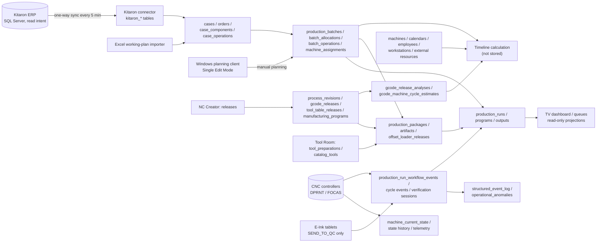
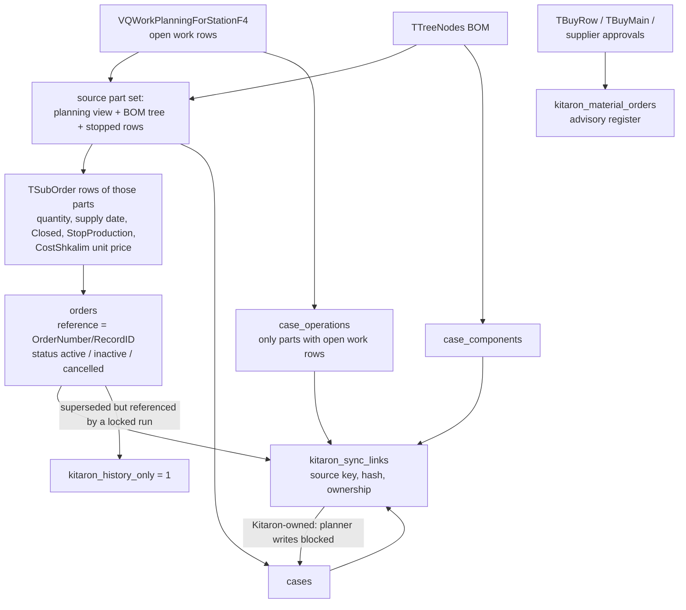
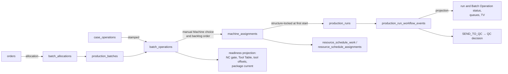
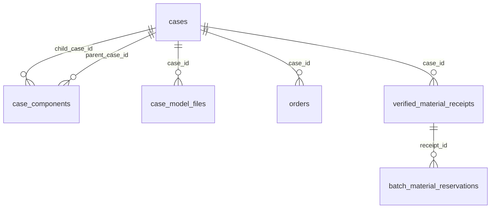
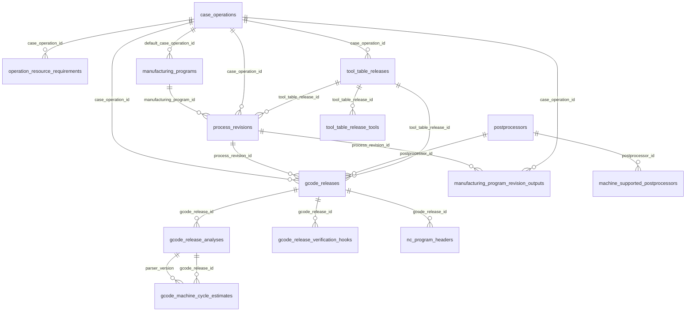
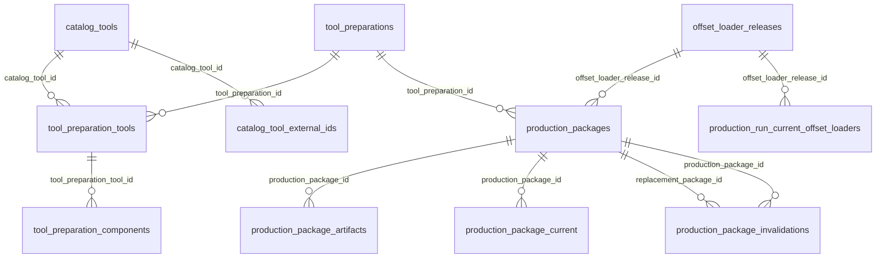

# Meimad Planner Server database: structure report

Generated on 2026-09-25 from the live production database (schema version 80, read-only inspection) and the ordered migrations under `server/Meimad.Planner.Server/Persistence`. It describes every table, its fields and purpose, how the data flows between domains, the relations, and how the database should and should not be used. The logical baseline stays in `docs/data-model.md`; this report is the physical view.

## 1. How to read this report

- The Server is the sole authority for planning data. Clients (Windows, TV, E-Ink) reach it only through the HTTP API on the factory LAN; nothing else opens the SQLite file.
- The file is `meimad-planner.db` under the Server's data folder, journal mode WAL, foreign keys on, one connection pool. Backups are Server-created, integrity-checked and restore-verified (Setup → Server maintenance).
- Schema changes are ordered, server-owned migrations recorded in `schema_migrations`; `PRAGMA user_version` mirrors the latest applied version. Never edit an installed database by hand.
- Ids are stable text ids (GUID-like or derived) and are the contract with the API. Timestamps are ISO-8601 UTC text (`2026-09-25T07:31:18.3054721+00:00`), dates are `YYYY-MM-DD`, durations are integer seconds, decimals are stored with invariant formatting.
- Tables marked **append-only** carry triggers that abort UPDATE and/or DELETE; those rows are evidence and must be corrected by adding a newer row, never by editing.
- Row counts are those of the live database at generation time; they help judge what is large or unused.

The database holds 99 tables, 2 views and 80 triggers (1,860,397 rows in total). The two views are `effective_batch_operation_nc_estimates` (the NC cycle estimate that applies to a Batch Operation on its Machine) and `production_run_cycle_attempt_timing` (attempt durations from the cycle events).

## 2. Domain map

| Domain | Tables | Rows | What it holds |
|---|---|---|---|
| [Cases, demand and material](#cases-demand-and-material) | 6 | 28,723 | The part master and the demand against it. |
| [Routes, processes and NC programming](#routes-processes-and-nc-programming) | 14 | 1,649 | The reusable route of a Case (Case Operations), the process revisions with their released G-code and Tool Table files, reusable Manufacturing Programs, and the Server's analyses of released NC programs. |
| [Planning: Batches, Batch Operations and Machine assignments](#planning-batches-batch-operations-and-machine-assignments) | 11 | 185 | The manual planning layer. |
| [Resources and calendars](#resources-and-calendars) | 16 | 167 | Machines, Machine Types, Working Calendars, holidays, employees with data-managed skills, generic Workstations and External Resources. |
| [Tool Room, tool catalog and Production Packages](#tool-room-tool-catalog-and-production-packages) | 11 | 209 | Tool Room measurements and the tool catalog feed the immutable, Machine-specific Production Package that the Setup queue exports or transfers. |
| [Production Runs and CNC execution](#production-runs-and-cnc-execution) | 12 | 596 | A Production Run is one concrete Machine session and the schedulable backlog unit. |
| [CNC connections and telemetry](#cnc-connections-and-telemetry) | 10 | 1,783,907 | The connection configuration per Machine and the high-volume observation tables. |
| [Devices: E-Ink tablets and TV](#devices-e-ink-tablets-and-tv) | 3 | 2 | Read-only consumers. |
| [Kitaron connector](#kitaron-connector) | 7 | 38,079 | One-way synchronization from the Kitaron ERP (SQL Server, read intent) into Cases, Orders, Case Operations, Case Components and the advisory material register. |
| [Coordination, settings and audit](#coordination-settings-and-audit) | 9 | 6,880 | Single Edit Mode, application settings, report scheduling, the structured planning-event log and the migration ledger. |

## 3. Data flows

### 3.1 End to end



### 3.2 Kitaron synchronization



Links are what make a record Kitaron-owned. A Case with a link rejects planner edits of the owned fields and legacy-import writes; an Order with a link is current demand only while the connector still sees its row. Batches referencing a superseded Order are kept as history when a Production Run of theirs is structure-locked; otherwise the connector removes them atomically before the Order.

### 3.3 Planning and execution lifecycle



Machine choice and backlog order are always manual (`machine_assignments`); the auxiliary resource prediction (`resource_schedule_*`) is automatic and deterministic and may be pinned. Statuses of runs are projected from immutable events, never edited directly.

### 3.4 NC release to Production Package to CNC

```mermaid
flowchart TD
    NC["canonical NC template<br/>[[MEIMAD:..."]] placeholders] --> GR["gcode_releases<br/>immutable, six-digit NC id, hash"]
    TT["tool table file"] --> TTR["tool_table_releases /<br/>tool_table_release_tools"]
    GR --> AN["gcode_release_analyses /<br/>nc_program_headers /<br/>verification hooks"]
    TTR --> TP["tool_preparations<br/>measured tools, versions"]
    CT["catalog_tools"] --> TP
    GR --> PP["production_packages"]
    TTR --> PP
    TP --> PP
    PP --> PA["production_package_artifacts<br/>runnable NC, Tool Table, Offset Loader,<br/>manifest, tool offsets"]
    PP --> OL["offset_loader_releases"]
    PP --> PC["production_package_current<br/>one current package per operation and Machine"]
    PC -->|configuration change| PI["production_package_invalidations"]
    OL --> VS["cnc_setup_verification_sessions<br/>ARMED → PENDING → SUCCEEDED"]
    PA -->|export or transfer| CNC[("CNC controller")]
    CNC -->|DPRNT events| WE["production_run_workflow_events /<br/>production_run_cycle_events"]
```

## 4. Tables by domain

### Cases, demand and material

The part master and the demand against it. A Case is the permanent part master (no production quantity by itself); Orders are demand under a Case; Kitaron owns the linked Cases and their Orders (see the connector domain).



References into other domains: `batch_material_reservations.production_batch_id` → `production_batches`; `case_model_files.case_operation_id` → `case_operations`.

#### `cases`

One part master per part number: name, revision, customer, Working Folder path (the only file-system reference stored), planning notes, criticality and lifecycle flags. Kitaron-linked Cases are read-only for planners except the fields the connector does not own. Rows: 6,375.
- `working_folder_path` is the root under which the NC viewer and the Tool Room write (`Gcode\...`, `_MeimadPlanner`); the database never stores drawings or NC files themselves.
- Indexes and unique constraints: 1 unique constraint declared in the table definition.

| Column | Type | Constraints | Default |
|---|---|---|---|
| `id` | TEXT | PK | — |
| `part_number` | TEXT | not null | — |
| `revision` | TEXT | — | — |
| `name` | TEXT | not null | — |
| `customer_reference` | TEXT | — | — |
| `technical_data_json` | TEXT | — | — |
| `material` | TEXT | — | — |
| `raw_stock` | TEXT | — | — |
| `working_folder_path` | TEXT | not null | — |
| `preview_reference` | TEXT | — | — |
| `current_setup_seconds` | INTEGER | — | — |
| `current_cycle_seconds` | INTEGER | — | — |
| `version` | INTEGER | not null | 1 |
| `created_at` | TEXT | not null | strftime('%Y-%m-%dT%H:%M:%fZ', 'now') |
| `updated_at` | TEXT | not null | strftime('%Y-%m-%dT%H:%M:%fZ', 'now') |
| `customer` | TEXT | — | — |
| `material_type` | TEXT | — | — |
| `material_specification` | TEXT | — | — |
| `raw_material_form` | TEXT | — | — |
| `raw_material_dimensions` | TEXT | — | — |
| `notes` | TEXT | — | — |

#### `case_components`

Bill-of-material edges between Cases (parent → child, quantity per parent, sort order, active flag). Imported from the Kitaron BOM tree; unique per parent/child pair. Rows: 2,067.
- Foreign keys: `child_case_id` → `cases.id` (on delete restrict); `parent_case_id` → `cases.id` (on delete restrict).
- Indexes and unique constraints: `ix_case_components_child`, `ix_case_components_parent`, 2 unique constraints declared in the table definition.

| Column | Type | Constraints | Default |
|---|---|---|---|
| `id` | TEXT | PK | — |
| `parent_case_id` | TEXT | not null | — |
| `child_case_id` | TEXT | not null | — |
| `quantity_per_parent` | REAL | not null | — |
| `sort_order` | INTEGER | not null | 0 |
| `notes` | TEXT | — | — |
| `is_active` | INTEGER | not null | 1 |
| `version` | INTEGER | not null | 1 |
| `created_at` | TEXT | not null | — |
| `updated_at` | TEXT | not null | — |

#### `case_model_files`

3D model / STEP references attached to a Case or a Case Operation for the model viewer (path below the Working Folder, hash, size). Rows: 8.
- Foreign keys: `case_operation_id` → `case_operations.id` (on delete set null); `case_id` → `cases.id` (on delete restrict).
- Indexes and unique constraints: `ix_case_model_files_operation`, `ix_case_model_files_case`, 1 unique constraint declared in the table definition.

| Column | Type | Constraints | Default |
|---|---|---|---|
| `id` | TEXT | PK, not null | — |
| `case_id` | TEXT | not null | — |
| `case_operation_id` | TEXT | — | — |
| `kind` | TEXT | not null | — |
| `format` | TEXT | not null | — |
| `file_path` | TEXT | not null | — |
| `label` | TEXT | not null | — |
| `is_primary` | INTEGER | not null | 0 |
| `sort_order` | INTEGER | not null | 0 |
| `version` | INTEGER | not null | 1 |
| `created_at` | TEXT | not null | — |
| `updated_at` | TEXT | not null | — |

#### `orders`

Customer demand under a Case: order reference (`<Kitaron order>/<RecordID>` for connector rows), quantity (outstanding demand), work finish date, planner status, Kitaron status, unit price in NIS, notes. `kitaron_history_only = 1` marks a superseded Kitaron row retained only because a locked Production Run refers to it. Rows: 20,234.
- `status` is the planner lifecycle (`active`, `in_production`, `complete`, `cancelled`); `kitaron_status` is the connector's projection (`active`, `inactive`, `cancelled`) and is null for orders the connector did not write.
- `price` is the unit sales price in NIS from Kitaron `TSubOrder.CostShkalim`; null means Kitaron carries no price.
- Foreign keys: `case_id` → `cases.id` (on delete restrict).
- Indexes and unique constraints: `ix_orders_case_id`, 1 unique constraint declared in the table definition.

| Column | Type | Constraints | Default |
|---|---|---|---|
| `id` | TEXT | PK | — |
| `case_id` | TEXT | not null | — |
| `order_reference` | TEXT | not null | — |
| `customer_reference` | TEXT | — | — |
| `quantity` | INTEGER | not null | — |
| `work_finish_date` | TEXT | not null | — |
| `status` | TEXT | not null | — |
| `version` | INTEGER | not null | 1 |
| `created_at` | TEXT | not null | strftime('%Y-%m-%dT%H:%M:%fZ', 'now') |
| `updated_at` | TEXT | not null | strftime('%Y-%m-%dT%H:%M:%fZ', 'now') |
| `notes` | TEXT | — | — |
| `price` | NUMERIC | — | — |
| `kitaron_status` | TEXT | — | — |
| `kitaron_history_only` | INTEGER | not null | 0 |

#### `verified_material_receipts`

Locally verified raw-material receipts for a Case (piece quantity, verifier, timestamp). Planning input only; ERP remains authoritative for stock. Rows: 23.
- Foreign keys: `case_id` → `cases.id` (on delete restrict).
- Indexes and unique constraints: `ix_verified_material_receipts_case_received`, 1 unique constraint declared in the table definition.

| Column | Type | Constraints | Default |
|---|---|---|---|
| `id` | TEXT | PK | — |
| `case_id` | TEXT | not null | — |
| `quantity` | INTEGER | not null | — |
| `unit` | TEXT | not null | 'piece' |
| `received_at` | TEXT | not null | — |
| `verified_at` | TEXT | not null | — |
| `verified_by` | TEXT | not null | — |
| `external_reference` | TEXT | — | — |
| `comment` | TEXT | — | — |
| `source` | TEXT | not null | 'LOCAL_VERIFIED' |
| `version` | INTEGER | not null | 1 |
| `created_at` | TEXT | not null | — |
| `updated_at` | TEXT | not null | — |

#### `batch_material_reservations`

Reservation of verified receipt pieces for a Production Batch of the same Case (unique receipt/Batch pair). Rows: 16.
- **Append-only**: triggers abort insert (`batch_material_reservation_batch_capacity_insert`, `batch_material_reservation_case_match_insert`, `batch_material_reservation_receipt_capacity_insert`).
- Foreign keys: `production_batch_id` → `production_batches.id` (on delete cascade); `receipt_id` → `verified_material_receipts.id` (on delete restrict).
- Indexes and unique constraints: `ix_batch_material_reservations_receipt`, `ix_batch_material_reservations_batch`, 2 unique constraints declared in the table definition.

| Column | Type | Constraints | Default |
|---|---|---|---|
| `id` | TEXT | PK | — |
| `receipt_id` | TEXT | not null | — |
| `production_batch_id` | TEXT | not null | — |
| `quantity` | INTEGER | not null | — |
| `reserved_at` | TEXT | not null | — |
| `reserved_by` | TEXT | not null | — |
| `comment` | TEXT | — | — |
| `version` | INTEGER | not null | 1 |
| `created_at` | TEXT | not null | — |
| `updated_at` | TEXT | not null | — |

### Routes, processes and NC programming

The reusable route of a Case (Case Operations), the process revisions with their released G-code and Tool Table files, reusable Manufacturing Programs, and the Server's analyses of released NC programs. Releases are immutable; the files live under the configured release root and are verified by length and SHA-256.



References into other domains: `case_operations.case_id` → `cases`; `case_operations.external_delay_calendar_id` → `working_calendars`; `gcode_machine_cycle_estimates.machine_id` → `machines`; `machine_supported_postprocessors.machine_id` → `machines`; `operation_resource_requirements.external_resource_id` → `external_resources`; `operation_resource_requirements.required_skill_id` → `skills`; `operation_resource_requirements.workstation_type_id` → `workstation_types`.

#### `case_operations`

One reusable route step of a Case: operation number, stable route position, name, required Machine Type, setup and cycle seconds, dependency type and predecessor, external-delay calendar, time model fields. Batch Operations are stamped from these. Rows: 397.
- **Append-only**: triggers abort insert (`case_operations_create_default_manufacturing_program`).
- Foreign keys: `predecessor_case_operation_id` → `case_operations.id` (on delete restrict); `case_id` → `cases.id` (on delete restrict); `external_delay_calendar_id` → `working_calendars.id` (on delete restrict).
- Indexes and unique constraints: `ix_case_operations_predecessor`, `ix_case_operations_case_route`, 3 unique constraints declared in the table definition.

| Column | Type | Constraints | Default |
|---|---|---|---|
| `id` | TEXT | PK | — |
| `case_id` | TEXT | not null | — |
| `operation_number` | INTEGER | not null | — |
| `route_position` | INTEGER | not null | — |
| `name` | TEXT | not null | — |
| `required_machine_type` | TEXT | — | — |
| `setup_seconds` | INTEGER | — | — |
| `cycle_seconds` | INTEGER | — | — |
| `dependency_type` | TEXT | not null | 'independent' |
| `predecessor_case_operation_id` | TEXT | — | — |
| `simultaneous_group_key` | TEXT | — | — |
| `version` | INTEGER | not null | 1 |
| `created_at` | TEXT | not null | strftime('%Y-%m-%dT%H:%M:%fZ', 'now') |
| `updated_at` | TEXT | not null | strftime('%Y-%m-%dT%H:%M:%fZ', 'now') |
| `qa_seconds` | INTEGER | not null | 0 |
| `load_unload_seconds` | INTEGER | not null | 0 |
| `load_unload_requires_worker` | INTEGER | not null | 0 |
| `automatic_loading` | INTEGER | not null | 0 |
| `load_unload_every_n_parts` | INTEGER | — | — |
| `day_shift_only` | INTEGER | not null | 0 |
| `has_external_delay` | INTEGER | not null | 0 |
| `external_delay_description` | TEXT | — | — |
| `external_delay_duration` | REAL | not null | 0 |
| `external_delay_duration_unit` | TEXT | not null | 'hours' |
| `external_delay_calendar_id` | TEXT | — | — |
| `external_delay_respect_master_calendar` | INTEGER | not null | 1 |

#### `operation_resource_requirements`

Auxiliary resource requirements of a Case Operation (skill, Workstation type, External Resource, quantity, sequence, predecessor requirement) used by the deterministic provisional allocator. Rows: 0.
- Foreign keys: `predecessor_requirement_id` → `operation_resource_requirements.id` (on delete restrict); `required_skill_id` → `skills.id` (on delete restrict); `external_resource_id` → `external_resources.id` (on delete restrict); `workstation_type_id` → `workstation_types.id` (on delete restrict); `case_operation_id` → `case_operations.id` (on delete restrict).
- Indexes and unique constraints: 2 unique constraints declared in the table definition.

| Column | Type | Constraints | Default |
|---|---|---|---|
| `id` | TEXT | PK | — |
| `case_operation_id` | TEXT | not null | — |
| `sequence_position` | INTEGER | not null | — |
| `resource_class` | TEXT | not null | — |
| `workstation_type_id` | TEXT | — | — |
| `external_resource_id` | TEXT | — | — |
| `required_capability` | TEXT | — | — |
| `required_skill_id` | TEXT | — | — |
| `capacity_required` | INTEGER | not null | 1 |
| `estimated_duration_seconds` | INTEGER | not null | — |
| `direction` | TEXT | not null | 'FORWARD' |
| `simultaneous_group_key` | TEXT | — | — |
| `predecessor_requirement_id` | TEXT | — | — |
| `is_active` | INTEGER | not null | 1 |
| `version` | INTEGER | not null | 1 |
| `created_at` | TEXT | not null | — |
| `updated_at` | TEXT | not null | — |

#### `process_revisions`

Immutable process revision of a Case Operation (number, change description, active flag, Tool Table release, optional Manufacturing Program). Rows: 27.
- **Append-only**: triggers abort insert (`process_revisions_program_immutable`, `process_revisions_tool_count_consistent`).
- Foreign keys: `tool_table_release_id` → `tool_table_releases.id` (on delete restrict); `case_operation_id` → `case_operations.id` (on delete restrict); `manufacturing_program_id` → `manufacturing_programs.id` (on delete restrict).
- Indexes and unique constraints: `ix_process_revisions_program_history`, `ux_process_revisions_active_program` (unique), `ix_process_revisions_operation_history`, 2 unique constraints declared in the table definition.

| Column | Type | Constraints | Default |
|---|---|---|---|
| `id` | TEXT | PK | — |
| `case_operation_id` | TEXT | not null | — |
| `revision_number` | INTEGER | not null | — |
| `is_active` | INTEGER | not null | — |
| `tool_table_release_id` | TEXT | not null | — |
| `created_at` | TEXT | not null | — |
| `created_by` | TEXT | not null | — |
| `change_description` | TEXT | not null | — |
| `version` | INTEGER | not null | 1 |
| `updated_at` | TEXT | not null | — |
| `manufacturing_program_id` | TEXT | — | — |

#### `gcode_releases`

Immutable released NC program of a process revision for one Postprocessor: original file name, stored path, size, SHA-256, release comment/actor, the Tool Table release it was made with, the six-digit NC identity. Rows: 36.
- **Append-only**: triggers abort delete, update (`gcode_releases_immutable_delete`, `gcode_releases_immutable_update`).
- Foreign keys: `tool_table_release_id` → `tool_table_releases.id` (on delete restrict); `postprocessor_id` → `postprocessors.id` (on delete restrict); `process_revision_id` → `process_revisions.id` (on delete restrict); `case_operation_id` → `case_operations.id` (on delete restrict).
- Indexes and unique constraints: `ix_gcode_releases_current_post`, `ix_gcode_releases_operation_history`, 3 unique constraints declared in the table definition.

| Column | Type | Constraints | Default |
|---|---|---|---|
| `id` | TEXT | PK | — |
| `case_operation_id` | TEXT | not null | — |
| `process_revision_id` | TEXT | not null | — |
| `postprocessor_id` | TEXT | not null | — |
| `post_specific_revision` | INTEGER | not null | — |
| `original_file_name` | TEXT | not null | — |
| `stored_relative_path` | TEXT | not null | — |
| `file_size` | INTEGER | not null | — |
| `file_hash` | TEXT | not null | — |
| `released_at` | TEXT | not null | — |
| `released_by` | TEXT | not null | — |
| `change_scope` | TEXT | not null | — |
| `release_comment` | TEXT | not null | — |
| `tool_table_release_id` | TEXT | not null | — |
| `created_at` | TEXT | not null | — |
| `updated_at` | TEXT | not null | — |

#### `tool_table_releases`

Immutable released Tool Table file of a Case Operation (revision number, file, hash, required tool count). Rows: 26.
- **Append-only**: triggers abort delete, update (`tool_table_releases_immutable_delete`, `tool_table_releases_immutable_update`).
- Foreign keys: `case_operation_id` → `case_operations.id` (on delete restrict).
- Indexes and unique constraints: `ix_tool_table_releases_operation`, 3 unique constraints declared in the table definition.

| Column | Type | Constraints | Default |
|---|---|---|---|
| `id` | TEXT | PK | — |
| `case_operation_id` | TEXT | not null | — |
| `revision_number` | INTEGER | not null | — |
| `original_file_name` | TEXT | not null | — |
| `stored_relative_path` | TEXT | not null | — |
| `file_size` | INTEGER | not null | — |
| `file_hash` | TEXT | not null | — |
| `released_at` | TEXT | not null | — |
| `released_by` | TEXT | not null | — |
| `release_comment` | TEXT | not null | — |
| `created_at` | TEXT | not null | — |
| `updated_at` | TEXT | not null | — |
| `required_tool_count` | INTEGER | — | — |

#### `tool_table_release_tools`

The parsed rows of a Tool Table release: row number, tool identifier, description, required/optional, magazine position, active flag. Rows: 191.
- **Append-only**: triggers abort delete, insert, update (`tool_table_release_tools_immutable_delete`, `tool_table_release_tools_immutable_update`, `tool_table_release_tools_no_late_insert`).
- Foreign keys: `tool_table_release_id` → `tool_table_releases.id` (on delete restrict).
- Indexes and unique constraints: `ix_tool_table_release_tools_release`, 2 unique constraints declared in the table definition.

| Column | Type | Constraints | Default |
|---|---|---|---|
| `id` | TEXT | PK | — |
| `tool_table_release_id` | TEXT | not null | — |
| `row_number` | INTEGER | not null | — |
| `tool_identifier` | TEXT | not null | — |
| `description` | TEXT | not null | — |
| `is_required` | INTEGER | not null | — |
| `requires_magazine_position` | INTEGER | not null | — |
| `is_active` | INTEGER | not null | — |
| `magazine_position` | TEXT | — | — |
| `created_at` | TEXT | not null | — |
| `updated_at` | TEXT | not null | — |

#### `manufacturing_programs`

Reusable approved recipe header (name, default Case Operation); its immutable revisions declare one or more Case Operation outputs. Rows: 397.
- Foreign keys: `default_case_operation_id` → `case_operations.id` (on delete cascade).
- Indexes and unique constraints: 2 unique constraints declared in the table definition.

| Column | Type | Constraints | Default |
|---|---|---|---|
| `id` | TEXT | PK | — |
| `name` | TEXT | not null | — |
| `default_case_operation_id` | TEXT | — | — |
| `version` | INTEGER | not null | 1 |
| `created_at` | TEXT | not null | — |
| `updated_at` | TEXT | not null | — |

#### `manufacturing_program_revision_outputs`

The Case Operation outputs (with quantity per cycle) that one program revision produces; multi-output work is atomic per NC cycle. Rows: 27.
- **Append-only**: triggers abort delete, update (`manufacturing_program_outputs_immutable_delete`, `manufacturing_program_outputs_immutable_update`).
- Foreign keys: `case_operation_id` → `case_operations.id` (on delete restrict); `process_revision_id` → `process_revisions.id` (on delete restrict).
- Indexes and unique constraints: `ix_manufacturing_program_outputs_operation`, 3 unique constraints declared in the table definition.

| Column | Type | Constraints | Default |
|---|---|---|---|
| `id` | TEXT | PK | — |
| `process_revision_id` | TEXT | not null | — |
| `case_operation_id` | TEXT | not null | — |
| `quantity_per_cycle` | INTEGER | not null | — |
| `display_order` | INTEGER | not null | — |
| `execution_metadata_json` | TEXT | not null | '{}' |
| `created_at` | TEXT | not null | — |

#### `gcode_release_analyses`

Server NC analysis of a release (parser version, machine-independent timing facts, warnings). Rows: 66.
- **Append-only**: triggers abort delete, update (`gcode_release_analyses_immutable_delete`, `gcode_release_analyses_immutable_update`).
- Foreign keys: `gcode_release_id` → `gcode_releases.id` (on delete restrict).
- Indexes and unique constraints: 1 unique constraint declared in the table definition.

| Column | Type | Constraints | Default |
|---|---|---|---|
| `gcode_release_id` | TEXT | PK, not null | — |
| `parser_version` | TEXT | PK, not null | — |
| `status` | TEXT | not null | — |
| `raw_feed_seconds` | REAL | not null | — |
| `rapid_distance_mm` | REAL | not null | — |
| `tool_change_count` | INTEGER | not null | — |
| `dwell_seconds` | REAL | not null | — |
| `detected_units` | TEXT | — | — |
| `warnings_json` | TEXT | not null | — |
| `unsupported_constructs_json` | TEXT | not null | — |
| `confidence` | TEXT | not null | — |
| `analyzed_at` | TEXT | not null | — |

#### `gcode_machine_cycle_estimates`

Per-Machine cycle estimate derived from an analysis (rapid rate, tool-change time, estimated seconds) — the basis of the effective NC estimate view. Rows: 385.
- Foreign keys: `machine_id` → `machines.id` (on delete cascade); `gcode_release_id` → `gcode_release_analyses.gcode_release_id` (on delete restrict); `parser_version` → `gcode_release_analyses.parser_version` (on delete restrict).
- Indexes and unique constraints: `ix_gcode_machine_cycle_estimates_machine`, 1 unique constraint declared in the table definition.

| Column | Type | Constraints | Default |
|---|---|---|---|
| `id` | TEXT | PK | — |
| `gcode_release_id` | TEXT | not null | — |
| `machine_id` | TEXT | not null | — |
| `parser_version` | TEXT | not null | — |
| `raw_feed_seconds` | REAL | not null | — |
| `rapid_distance_mm` | REAL | not null | — |
| `rapid_seconds` | REAL | — | — |
| `tool_change_count` | INTEGER | not null | — |
| `tool_change_seconds` | REAL | — | — |
| `dwell_seconds` | REAL | not null | — |
| `machine_rapid_rate_mm_per_min` | REAL | — | — |
| `machine_tool_change_time_seconds` | REAL | — | — |
| `machine_time_factor` | REAL | not null | — |
| `raw_cycle_seconds` | REAL | — | — |
| `estimated_cycle_seconds` | REAL | — | — |
| `warnings_json` | TEXT | not null | — |
| `confidence` | TEXT | not null | — |
| `calculated_at` | TEXT | not null | — |

#### `gcode_release_verification_hooks`

The verification hook block resolved for a release (dialect, program numbers, hash), recorded so packages can prove what they embedded. Rows: 34.
- **Append-only**: triggers abort delete, update (`gcode_release_verification_hooks_immutable_delete`, `gcode_release_verification_hooks_immutable_update`).
- Foreign keys: `gcode_release_id` → `gcode_releases.id` (on delete restrict).
- Indexes and unique constraints: 2 unique constraints declared in the table definition.

| Column | Type | Constraints | Default |
|---|---|---|---|
| `gcode_release_id` | TEXT | PK | — |
| `hook_version` | INTEGER | not null | — |
| `invocation_kind` | TEXT | not null | — |
| `invocation_number` | INTEGER | not null | — |
| `nc_identity_token` | INTEGER | not null | — |
| `line_number` | INTEGER | not null | — |
| `created_at` | TEXT | not null | — |
| `updated_at` | TEXT | not null | — |

#### `nc_program_headers`

Parsed canonical `[[MEIMAD:...]]` header facts of a release (part, operation, cycle markers) for validation and display. Rows: 34.
- **Append-only**: triggers abort delete, update (`nc_program_headers_immutable_delete`, `nc_program_headers_immutable_update`).
- Foreign keys: `gcode_release_id` → `gcode_releases.id` (on delete restrict).
- Indexes and unique constraints: 1 unique constraint declared in the table definition.

| Column | Type | Constraints | Default |
|---|---|---|---|
| `gcode_release_id` | TEXT | PK | — |
| `status` | TEXT | not null | — |
| `part_name` | TEXT | — | — |
| `case_number` | TEXT | — | — |
| `operation` | TEXT | — | — |
| `revision` | TEXT | — | — |
| `program_number` | TEXT | — | — |
| `raw_header` | TEXT | not null | — |
| `parser_version` | TEXT | not null | — |
| `parsed_at` | TEXT | not null | — |

#### `postprocessors`

Managed Postprocessor configurations (name, NC dialect, notes) that releases and Machines refer to. Rows: 12.
- Indexes and unique constraints: `ux_postprocessors_name` (unique), 1 unique constraint declared in the table definition.

| Column | Type | Constraints | Default |
|---|---|---|---|
| `id` | TEXT | PK | — |
| `name` | TEXT | not null | — |
| `description` | TEXT | — | — |
| `is_active` | INTEGER | not null | 1 |
| `version` | INTEGER | not null | 1 |
| `created_at` | TEXT | not null | strftime('%Y-%m-%dT%H:%M:%fZ', 'now') |
| `updated_at` | TEXT | not null | strftime('%Y-%m-%dT%H:%M:%fZ', 'now') |

#### `machine_supported_postprocessors`

Which Postprocessors a Machine accepts; a release is Machine-compatible only through this table. Rows: 17.
- Foreign keys: `postprocessor_id` → `postprocessors.id` (on delete restrict); `machine_id` → `machines.id` (on delete restrict).
- Indexes and unique constraints: `ix_machine_supported_postprocessors_postprocessor`, 1 unique constraint declared in the table definition.

| Column | Type | Constraints | Default |
|---|---|---|---|
| `machine_id` | TEXT | PK, not null | — |
| `postprocessor_id` | TEXT | PK, not null | — |
| `created_at` | TEXT | not null | strftime('%Y-%m-%dT%H:%M:%fZ', 'now') |
| `updated_at` | TEXT | not null | strftime('%Y-%m-%dT%H:%M:%fZ', 'now') |

### Planning: Batches, Batch Operations and Machine assignments

The manual planning layer. A Production Batch is an actual launch under a Case; Batch Operations are the concrete route obligations; Machine Assignments hold the manual Machine choice and backlog order. The Timeline is calculated from these tables and is never stored.

```mermaid
erDiagram
    production_batches ||--o{ batch_allocations : "production_batch_id"
    production_batches ||--o{ batch_operations : "production_batch_id"
    batch_operations ||--o{ batch_operation_material_readiness : "batch_operation_id"
    batch_operations ||--o{ machine_assignments : "batch_operation_id"
    batch_operations ||--o{ operation_pause_events : "batch_operation_id"
    machine_assignments ||--o{ resource_schedule_work : "anchor_machine_assignment_id"
    batch_operations ||--o{ resource_schedule_work : "batch_operation_id"
    resource_schedule_work ||--o{ resource_schedule_assignments : "schedule_work_id"
    resource_schedule_work ||--o{ external_resource_executions : "schedule_work_id"
    batch_operations ||--o{ tool_offset_readiness_records : "batch_operation_id"
    machine_assignment_overrides {{
    }}
```

References into other domains: `batch_allocations.order_id` → `orders`; `batch_operations.actual_machine_id` → `machines`; `batch_operations.external_delay_calendar_id` → `working_calendars`; `batch_operations.production_gcode_release_id` → `gcode_releases`; `batch_operations.production_process_revision_id` → `process_revisions`; `batch_operations.production_tool_table_release_id` → `tool_table_releases`; `batch_operations.source_case_operation_id` → `case_operations`; `external_resource_executions.external_resource_id` → `external_resources`; `machine_assignments.machine_id` → `machines`; `machine_assignments.production_run_id` → `production_runs`; `machine_assignments.selected_gcode_release_id` → `gcode_releases`; `production_batches.case_id` → `cases`; `resource_schedule_assignments.employee_resource_id` → `employee_resources`; `resource_schedule_assignments.external_resource_id` → `external_resources`; `resource_schedule_assignments.machine_id` → `machines`; `resource_schedule_assignments.workstation_id` → `workstations`; `resource_schedule_work.production_run_id` → `production_runs`; `resource_schedule_work.requirement_id` → `operation_resource_requirements`; `tool_offset_readiness_records.gcode_release_id` → `gcode_releases`; `tool_offset_readiness_records.machine_id` → `machines`; `tool_offset_readiness_records.process_revision_id` → `process_revisions`.

#### `production_batches`

A production launch under a Case: batch number, status, planned quantity. Deleting a Batch is blocked once a Production Run of one of its operations is structure-locked. Rows: 22.
- Foreign keys: `case_id` → `cases.id` (on delete restrict).
- Indexes and unique constraints: `ix_production_batches_case_id`, 2 unique constraints declared in the table definition.

| Column | Type | Constraints | Default |
|---|---|---|---|
| `id` | TEXT | PK | — |
| `case_id` | TEXT | not null | — |
| `batch_number` | TEXT | not null | — |
| `status` | TEXT | not null | — |
| `planned_quantity` | INTEGER | not null | — |
| `route_revision` | INTEGER | — | — |
| `version` | INTEGER | not null | 1 |
| `created_at` | TEXT | not null | strftime('%Y-%m-%dT%H:%M:%fZ', 'now') |
| `updated_at` | TEXT | not null | strftime('%Y-%m-%dT%H:%M:%fZ', 'now') |

#### `batch_allocations`

Explicit allocation of a Batch's quantity across selected Orders, stock and scrap allowance (`allocation_type`); Order allocations carry the Order id; derived-order allocations keep a stable key. Rows: 45.
- Foreign keys: `order_id` → `orders.id` (on delete restrict); `production_batch_id` → `production_batches.id` (on delete restrict).
- Indexes and unique constraints: `ix_batch_allocations_order_id`, `ix_batch_allocations_derived_order`, `ix_batch_allocations_batch`, 1 unique constraint declared in the table definition.

| Column | Type | Constraints | Default |
|---|---|---|---|
| `id` | TEXT | PK | — |
| `production_batch_id` | TEXT | not null | — |
| `allocation_type` | TEXT | not null | — |
| `order_id` | TEXT | — | — |
| `derived_order_key` | TEXT | — | — |
| `quantity` | INTEGER | not null | — |
| `version` | INTEGER | not null | 1 |
| `created_at` | TEXT | not null | strftime('%Y-%m-%dT%H:%M:%fZ', 'now') |
| `updated_at` | TEXT | not null | strftime('%Y-%m-%dT%H:%M:%fZ', 'now') |

#### `batch_operations`

The concrete route step of a Batch (stamped from its Case Operation): numbers, times, status, actual timestamps, the production-time selections (process revision, G-code release, Tool Table release) and the actual Machine. Thirty-six columns because it also carries the time-model and readiness snapshot fields. Rows: 49.
- Foreign keys: `source_case_operation_id` → `case_operations.id` (on delete restrict); `production_batch_id` → `production_batches.id` (on delete restrict); `production_tool_table_release_id` → `tool_table_releases.id` (on delete restrict); `production_gcode_release_id` → `gcode_releases.id` (on delete restrict); `production_process_revision_id` → `process_revisions.id` (on delete restrict); `external_delay_calendar_id` → `working_calendars.id` (on delete restrict); `actual_machine_id` → `machines.id` (on delete restrict).
- Indexes and unique constraints: `ix_batch_operations_production_release`, `ix_batch_operations_actual_machine_time`, `ix_batch_operations_predecessor_snapshot`, `ix_batch_operations_source`, `ix_batch_operations_batch_route`, 3 unique constraints declared in the table definition.

| Column | Type | Constraints | Default |
|---|---|---|---|
| `id` | TEXT | PK | — |
| `production_batch_id` | TEXT | not null | — |
| `source_case_operation_id` | TEXT | not null | — |
| `operation_number` | INTEGER | not null | — |
| `route_position` | INTEGER | not null | — |
| `name` | TEXT | not null | — |
| `required_machine_type` | TEXT | — | — |
| `setup_seconds` | INTEGER | — | — |
| `cycle_seconds` | INTEGER | — | — |
| `status` | TEXT | not null | — |
| `version` | INTEGER | not null | 1 |
| `created_at` | TEXT | not null | strftime('%Y-%m-%dT%H:%M:%fZ', 'now') |
| `updated_at` | TEXT | not null | strftime('%Y-%m-%dT%H:%M:%fZ', 'now') |
| `dependency_type` | TEXT | not null | 'independent' |
| `predecessor_source_case_operation_id` | TEXT | — | — |
| `simultaneous_group_key` | TEXT | — | — |
| `qa_seconds` | INTEGER | not null | 0 |
| `load_unload_seconds` | INTEGER | not null | 0 |
| `load_unload_requires_worker` | INTEGER | not null | 0 |
| `automatic_loading` | INTEGER | not null | 0 |
| `load_unload_every_n_parts` | INTEGER | — | — |
| `day_shift_only` | INTEGER | not null | 0 |
| `actual_start` | TEXT | — | — |
| `actual_end` | TEXT | — | — |
| `actual_machine_id` | TEXT | — | — |
| `has_external_delay` | INTEGER | not null | 0 |
| `external_delay_description` | TEXT | — | — |
| `external_delay_duration` | REAL | not null | 0 |
| `external_delay_duration_unit` | TEXT | not null | 'hours' |
| `external_delay_calendar_id` | TEXT | — | — |
| `external_delay_respect_master_calendar` | INTEGER | not null | 1 |
| `production_process_revision_id` | TEXT | — | — |
| `production_gcode_release_id` | TEXT | — | — |
| `production_tool_table_release_id` | TEXT | — | — |
| `production_gcode_file_hash` | TEXT | — | — |
| `production_tool_table_file_hash` | TEXT | — | — |

#### `batch_operation_material_readiness`

Per Batch Operation material-readiness confirmations recorded by planners (schema v39 reconciliation). Rows: 0.
- Foreign keys: `batch_operation_id` → `batch_operations.id` (on delete cascade).
- Indexes and unique constraints: 1 unique constraint declared in the table definition.

| Column | Type | Constraints | Default |
|---|---|---|---|
| `batch_operation_id` | TEXT | PK | — |
| `status` | TEXT | not null | — |
| `confirmed_at` | TEXT | — | — |
| `confirmed_by` | TEXT | — | — |
| `comment` | TEXT | — | — |
| `version` | INTEGER | not null | 1 |
| `created_at` | TEXT | not null | strftime('%Y-%m-%dT%H:%M:%fZ', 'now') |
| `updated_at` | TEXT | not null | — |

#### `machine_assignments`

The manual Machine anchor of a Batch Operation: Machine, backlog position, planning mode (`forward`, `backward`, `manual`), selected G-code release, linked Production Run, release timestamp for retained history rows. Rows: 37.
- **Append-only**: triggers abort insert, update (`machine_assignment_run_contains_legacy_operation`, `machine_assignment_run_required_update`, `machine_assignment_selected_release_matches_operation_insert`, `machine_assignment_selected_release_matches_operation_update`, `machine_assignment_wraps_legacy_operation`).
- Foreign keys: `production_run_id` → `production_runs.id` (on delete restrict); `selected_gcode_release_id` → `gcode_releases.id` (on delete restrict); `machine_id` → `machines.id` (on delete restrict); `batch_operation_id` → `batch_operations.id` (on delete restrict).
- Indexes and unique constraints: `ix_machine_assignments_batch_operation_compatibility`, `ix_machine_assignments_selected_gcode`, `ix_machine_assignments_machine_backlog`, 3 unique constraints declared in the table definition.

| Column | Type | Constraints | Default |
|---|---|---|---|
| `id` | TEXT | PK | — |
| `batch_operation_id` | TEXT | not null | — |
| `machine_id` | TEXT | not null | — |
| `backlog_position` | INTEGER | not null | — |
| `version` | INTEGER | not null | 1 |
| `created_at` | TEXT | not null | strftime('%Y-%m-%dT%H:%M:%fZ', 'now') |
| `updated_at` | TEXT | not null | strftime('%Y-%m-%dT%H:%M:%fZ', 'now') |
| `planning_mode` | TEXT | not null | 'manual' |
| `selected_gcode_release_id` | TEXT | — | — |
| `production_run_id` | TEXT | — | — |
| `released_at` | TEXT | — | — |
| `manual_priority` | INTEGER | — | — |

#### `machine_assignment_overrides`

Immutable audit snapshot of an explicitly confirmed cross-type assignment (reason, user, textual ids kept even if records vanish). Rows: 1.
- Indexes and unique constraints: `ix_machine_assignment_overrides_machine`, `ix_machine_assignment_overrides_operation`, 1 unique constraint declared in the table definition.

| Column | Type | Constraints | Default |
|---|---|---|---|
| `id` | TEXT | PK | — |
| `batch_operation_id` | TEXT | not null | — |
| `machine_id` | TEXT | not null | — |
| `required_machine_type` | TEXT | not null | — |
| `selected_machine_type` | TEXT | not null | — |
| `reason` | TEXT | not null | — |
| `confirmed_by_client_id` | TEXT | not null | — |
| `confirmed_by_user_id` | TEXT | not null | — |
| `confirmed_at` | TEXT | not null | — |
| `version` | INTEGER | not null | 1 |
| `created_at` | TEXT | not null | — |
| `updated_at` | TEXT | not null | — |

#### `operation_pause_events`

Pause/resume history of a Batch Operation with structured reasons; the actual-time model reads it. Rows: 1.
- Foreign keys: `batch_operation_id` → `batch_operations.id` (on delete restrict).
- Indexes and unique constraints: `ix_operation_pause_events_reporting`, `ux_operation_pause_events_active` (unique), 1 unique constraint declared in the table definition.

| Column | Type | Constraints | Default |
|---|---|---|---|
| `id` | TEXT | PK | — |
| `batch_operation_id` | TEXT | not null | — |
| `reason_type` | TEXT | not null | — |
| `problem_description` | TEXT | — | — |
| `tooling_item_description` | TEXT | — | — |
| `customer_contact_name` | TEXT | — | — |
| `request_description` | TEXT | — | — |
| `comment` | TEXT | — | — |
| `paused_by` | TEXT | not null | — |
| `pause_started_at` | TEXT | not null | — |
| `pause_ended_at` | TEXT | — | — |
| `status` | TEXT | not null | — |
| `version` | INTEGER | not null | 1 |
| `created_at` | TEXT | not null | — |
| `updated_at` | TEXT | not null | — |

#### `resource_schedule_work`

One schedulable work item of the provisional allocator per Batch Operation / Production Run requirement, anchored to a Machine Assignment, with dependency links. Rows: 0.
- Foreign keys: `anchor_machine_assignment_id` → `machine_assignments.id` (on delete restrict); `dependency_work_id` → `resource_schedule_work.id` (on delete restrict); `requirement_id` → `operation_resource_requirements.id` (on delete restrict); `batch_operation_id` → `batch_operations.id` (on delete restrict); `production_run_id` → `production_runs.id` (on delete restrict).
- Indexes and unique constraints: 1 unique constraint declared in the table definition.

| Column | Type | Constraints | Default |
|---|---|---|---|
| `id` | TEXT | PK | — |
| `production_run_id` | TEXT | — | — |
| `batch_operation_id` | TEXT | not null | — |
| `requirement_id` | TEXT | not null | — |
| `dependency_work_id` | TEXT | — | — |
| `anchor_machine_assignment_id` | TEXT | — | — |
| `requested_starts_at` | TEXT | — | — |
| `required_finishes_at` | TEXT | — | — |
| `required_delivery_at` | TEXT | — | — |
| `planned_duration_seconds` | INTEGER | not null | — |
| `state` | TEXT | not null | 'PROVISIONAL' |
| `version` | INTEGER | not null | 1 |
| `created_at` | TEXT | not null | — |
| `updated_at` | TEXT | not null | — |

#### `resource_schedule_assignments`

The deterministic provisional Employee / Workstation / External Resource assignment of a work item (superseded rows kept by `supersedes_assignment_id`; pinned overrides). Rows: 0.
- Foreign keys: `supersedes_assignment_id` → `resource_schedule_assignments.id` (on delete restrict); `external_resource_id` → `external_resources.id` (on delete restrict); `workstation_id` → `workstations.id` (on delete restrict); `employee_resource_id` → `employee_resources.id` (on delete restrict); `machine_id` → `machines.id` (on delete restrict); `schedule_work_id` → `resource_schedule_work.id` (on delete restrict).
- Indexes and unique constraints: `ix_resource_assignments_workstation_time`, `ix_resource_assignments_employee_time`, `ix_resource_assignments_work_time`, 1 unique constraint declared in the table definition.

| Column | Type | Constraints | Default |
|---|---|---|---|
| `id` | TEXT | PK | — |
| `schedule_work_id` | TEXT | not null | — |
| `resource_class` | TEXT | not null | — |
| `machine_id` | TEXT | — | — |
| `employee_resource_id` | TEXT | — | — |
| `workstation_id` | TEXT | — | — |
| `external_resource_id` | TEXT | — | — |
| `planned_starts_at` | TEXT | not null | — |
| `planned_ends_at` | TEXT | not null | — |
| `planned_duration_seconds` | INTEGER | not null | — |
| `is_pinned` | INTEGER | not null | 0 |
| `actual_resource_id` | TEXT | — | — |
| `actual_starts_at` | TEXT | — | — |
| `actual_ends_at` | TEXT | — | — |
| `actual_duration_seconds` | INTEGER | — | — |
| `assigned_by` | TEXT | not null | — |
| `assignment_reason` | TEXT | not null | — |
| `supersedes_assignment_id` | TEXT | — | — |
| `created_at` | TEXT | not null | — |

#### `external_resource_executions`

Recorded execution facts of External Resource work (sent/returned) against a schedule work item. Rows: 0.
- Foreign keys: `external_resource_id` → `external_resources.id` (on delete restrict); `schedule_work_id` → `resource_schedule_work.id` (on delete restrict).
- Indexes and unique constraints: 2 unique constraints declared in the table definition.

| Column | Type | Constraints | Default |
|---|---|---|---|
| `id` | TEXT | PK | — |
| `schedule_work_id` | TEXT | not null | — |
| `external_resource_id` | TEXT | not null | — |
| `planned_send_at` | TEXT | not null | — |
| `planned_return_at` | TEXT | not null | — |
| `vendor_promised_return_at` | TEXT | — | — |
| `actual_send_at` | TEXT | — | — |
| `actual_return_at` | TEXT | — | — |
| `created_at` | TEXT | not null | — |
| `updated_at` | TEXT | not null | — |

#### `tool_offset_readiness_records`

Physical confirmation that tool offsets were set for the exact Batch Operation / Machine / G-code release / process revision configuration (readiness input). Rows: 30.
- **Append-only**: triggers abort insert, update (`tool_offset_readiness_context_consistent`, `tool_offset_readiness_records_immutable_update`).
- Foreign keys: `gcode_release_id` → `gcode_releases.id` (on delete restrict); `process_revision_id` → `process_revisions.id` (on delete restrict); `machine_id` → `machines.id` (on delete restrict); `batch_operation_id` → `batch_operations.id` (on delete cascade).
- Indexes and unique constraints: `ix_tool_offset_readiness_context`, 1 unique constraint declared in the table definition.

| Column | Type | Constraints | Default |
|---|---|---|---|
| `id` | TEXT | PK | — |
| `batch_operation_id` | TEXT | not null | — |
| `machine_id` | TEXT | not null | — |
| `process_revision_id` | TEXT | not null | — |
| `gcode_release_id` | TEXT | — | — |
| `status` | TEXT | not null | — |
| `confirmed_at` | TEXT | — | — |
| `confirmed_by` | TEXT | — | — |
| `comment` | TEXT | — | — |
| `recorded_at` | TEXT | not null | — |
| `created_at` | TEXT | not null | strftime('%Y-%m-%dT%H:%M:%fZ', 'now') |
| `updated_at` | TEXT | not null | strftime('%Y-%m-%dT%H:%M:%fZ', 'now') |

### Resources and calendars

Machines, Machine Types, Working Calendars, holidays, employees with data-managed skills, generic Workstations and External Resources. Everything here is Setup master data edited under Edit Mode.

```mermaid
erDiagram
    working_calendars ||--o{ machines : "working_calendar_id"
    machine_types ||--o{ machines : "machine_type_id"
    machines ||--o{ machine_package_capabilities : "machine_id"
    working_calendars ||--o{ setup_calendar_settings : "working_calendar_id"
    working_calendars ||--o{ employee_resources : "assigned_calendar_id"
    employee_resources ||--o{ employee_calendar_exceptions : "resource_id"
    skills ||--o{ employee_skills : "skill_id"
    employee_resources ||--o{ employee_skills : "employee_resource_id"
    employee_resources ||--o{ employee_work_measurements : "employee_resource_id"
    working_calendars ||--o{ workstations : "working_calendar_id"
    workstation_types ||--o{ workstations : "workstation_type_id"
    working_calendars ||--o{ external_resources : "working_calendar_id"
    machines ||--o{ downtimes : "machine_id"
    israeli_holidays {{
    }}
    israeli_holiday_sync_state {{
    }}
```

#### `machines`

A Machine: number, name, type, Working Calendar, active flag, execution timings, NC dialect, NC viewer machine, cutter-offset kind, CNC identity (fixed IP and MAC), picture. Rows: 16.
- Foreign keys: `working_calendar_id` → `working_calendars.id` (on delete restrict); `machine_type_id` → `machine_types.id` (on delete restrict).
- Indexes and unique constraints: `ix_machines_machine_type_id`, `ix_machines_calendar_id`, 2 unique constraints declared in the table definition.

| Column | Type | Constraints | Default |
|---|---|---|---|
| `id` | TEXT | PK | — |
| `number` | TEXT | not null | — |
| `name` | TEXT | not null | — |
| `machine_type` | TEXT | not null | — |
| `capabilities_json` | TEXT | not null | '[]' |
| `working_calendar_id` | TEXT | not null | — |
| `display_configuration_json` | TEXT | not null | '{}' |
| `status` | TEXT | not null | — |
| `version` | INTEGER | not null | 1 |
| `created_at` | TEXT | not null | strftime('%Y-%m-%dT%H:%M:%fZ', 'now') |
| `updated_at` | TEXT | not null | strftime('%Y-%m-%dT%H:%M:%fZ', 'now') |
| `axis_type` | TEXT | — | — |
| `is_active` | INTEGER | not null | 1 |
| `display_enabled` | INTEGER | not null | 0 |
| `picture_reference` | TEXT | — | — |
| `machine_type_id` | TEXT | — | — |
| `respect_master_calendar` | INTEGER | not null | 1 |
| `execution_mode` | TEXT | not null | 'MANUAL' |
| `usable_tool_positions` | INTEGER | — | — |
| `rapid_rate_mm_per_min` | REAL | — | — |
| `tool_change_time_seconds` | REAL | — | — |
| `machine_time_factor` | REAL | not null | 1.0 |
| `nc_dialect` | TEXT | not null | 'HAAS_NGC' |
| `nc_viewer_machine` | TEXT | — | — |
| `tool_diameter_offset_kind` | TEXT | not null | 'RADIUS' |

#### `machine_types`

Reusable Machine Type with normalized capability tokens; a Machine links to one type and a route step requires one. Rows: 5.
- Indexes and unique constraints: `ux_machine_types_name_nocase` (unique), 1 unique constraint declared in the table definition.

| Column | Type | Constraints | Default |
|---|---|---|---|
| `id` | TEXT | PK | — |
| `name` | TEXT | not null | — |
| `capabilities_json` | TEXT | not null | '[]' |
| `version` | INTEGER | not null | 1 |
| `created_at` | TEXT | not null | strftime('%Y-%m-%dT%H:%M:%fZ', 'now') |
| `updated_at` | TEXT | not null | strftime('%Y-%m-%dT%H:%M:%fZ', 'now') |

#### `machine_package_capabilities`

Explicit Machine capabilities that gate package modes (for example `MANUAL_DUMMY_TOOL_OFFSETS`). Rows: 3.
- Foreign keys: `machine_id` → `machines.id` (on delete cascade).
- Indexes and unique constraints: 1 unique constraint declared in the table definition.

| Column | Type | Constraints | Default |
|---|---|---|---|
| `machine_id` | TEXT | PK | — |
| `allow_manual_dummy_tool_offsets` | INTEGER | not null | 0 |
| `updated_at` | TEXT | not null | — |
| `updated_by` | TEXT | not null | — |

#### `working_calendars`

Calendar storage envelope: name, time zone, recurring weekly work/break windows and dated exceptions as JSON, holiday policy. Rows: 8.
- Indexes and unique constraints: 1 unique constraint declared in the table definition.

| Column | Type | Constraints | Default |
|---|---|---|---|
| `id` | TEXT | PK | — |
| `name` | TEXT | not null | — |
| `time_zone_id` | TEXT | not null | — |
| `calendar_json` | TEXT | not null | '{}' |
| `version` | INTEGER | not null | 1 |
| `created_at` | TEXT | not null | strftime('%Y-%m-%dT%H:%M:%fZ', 'now') |
| `updated_at` | TEXT | not null | strftime('%Y-%m-%dT%H:%M:%fZ', 'now') |

#### `setup_calendar_settings`

Singleton: the dedicated Setup Calendar selection. Rows: 1.
- Foreign keys: `working_calendar_id` → `working_calendars.id` (on delete restrict).

| Column | Type | Constraints | Default |
|---|---|---|---|
| `id` | INTEGER | PK | — |
| `working_calendar_id` | TEXT | — | — |
| `legacy_fallback_enabled` | INTEGER | not null | 1 |
| `version` | INTEGER | not null | 1 |
| `created_at` | TEXT | not null | strftime('%Y-%m-%dT%H:%M:%fZ', 'now') |
| `updated_at` | TEXT | not null | strftime('%Y-%m-%dT%H:%M:%fZ', 'now') |

#### `israeli_holidays`

Cached/manual Israeli holiday dates with the working policy (non-working, working, partial) that opted-in calendars apply. Rows: 99.
- Indexes and unique constraints: `ux_israeli_holidays_external_id` (unique), `ux_israeli_holidays_date` (unique), 1 unique constraint declared in the table definition.

| Column | Type | Constraints | Default |
|---|---|---|---|
| `id` | TEXT | PK | — |
| `holiday_date` | TEXT | not null | — |
| `name` | TEXT | not null | — |
| `version` | INTEGER | not null | 1 |
| `created_at` | TEXT | not null | strftime('%Y-%m-%dT%H:%M:%fZ', 'now') |
| `updated_at` | TEXT | not null | strftime('%Y-%m-%dT%H:%M:%fZ', 'now') |
| `holiday_status` | TEXT | not null | 'non_working' |
| `starts_at_local` | TEXT | — | — |
| `ends_at_local` | TEXT | — | — |
| `source` | TEXT | not null | 'manual' |
| `external_id` | TEXT | — | — |
| `is_manual_override` | INTEGER | not null | 1 |

#### `israeli_holiday_sync_state`

Last Hebcal refresh state of the holiday cache. Rows: 1.

| Column | Type | Constraints | Default |
|---|---|---|---|
| `id` | INTEGER | PK | — |
| `provider` | TEXT | not null | — |
| `last_attempt_at` | TEXT | — | — |
| `last_success_at` | TEXT | — | — |
| `last_error` | TEXT | — | — |
| `from_year` | INTEGER | — | — |
| `to_year` | INTEGER | — | — |

#### `employee_resources`

Employees/resources: number, name, role, Machine qualifications (`skills_json` holds Machine ids), assigned Working Calendar, photo path, notes, active flag. Rows: 18.
- Foreign keys: `assigned_calendar_id` → `working_calendars.id` (on delete restrict).
- Indexes and unique constraints: `ux_employee_resources_number_nocase` (unique), 1 unique constraint declared in the table definition.

| Column | Type | Constraints | Default |
|---|---|---|---|
| `id` | TEXT | PK | — |
| `employee_number` | TEXT | not null | — |
| `name` | TEXT | not null | — |
| `resource_type` | TEXT | not null | — |
| `email` | TEXT | — | — |
| `is_active` | INTEGER | not null | 1 |
| `version` | INTEGER | not null | 1 |
| `created_at` | TEXT | not null | strftime('%Y-%m-%dT%H:%M:%fZ', 'now') |
| `updated_at` | TEXT | not null | strftime('%Y-%m-%dT%H:%M:%fZ', 'now') |
| `first_name` | TEXT | not null | '' |
| `last_name` | TEXT | not null | '' |
| `skills_json` | TEXT | not null | '[]' |
| `assigned_calendar_id` | TEXT | — | — |
| `photo_path` | TEXT | — | — |
| `notes` | TEXT | — | — |
| `respect_master_calendar` | INTEGER | not null | 1 |
| `tool_load_seconds_per_tool` | REAL | not null | 60 |
| `fixture_assembly_seconds` | REAL | — | — |
| `first_part_running_speed_percent` | REAL | not null | 66.6666666667 |

#### `employee_calendar_exceptions`

Dated vacation/sick/personal/unavailable intervals of an employee (full or partial day). Rows: 0.
- Foreign keys: `resource_id` → `employee_resources.id` (on delete cascade).
- Indexes and unique constraints: `ix_employee_calendar_exceptions_resource_date`, 1 unique constraint declared in the table definition.

| Column | Type | Constraints | Default |
|---|---|---|---|
| `id` | TEXT | PK | — |
| `resource_id` | TEXT | not null | — |
| `exception_date` | TEXT | not null | — |
| `exception_type` | TEXT | not null | — |
| `is_full_day` | INTEGER | not null | — |
| `starts_at_local` | TEXT | — | — |
| `ends_at_local` | TEXT | — | — |
| `note` | TEXT | — | — |
| `version` | INTEGER | not null | 1 |
| `created_at` | TEXT | not null | — |
| `updated_at` | TEXT | not null | — |

#### `skills`

Data-managed Skill catalog (name, description, active). Rows: 4.
- Indexes and unique constraints: 2 unique constraints declared in the table definition.

| Column | Type | Constraints | Default |
|---|---|---|---|
| `id` | TEXT | PK | — |
| `name` | TEXT | not null | — |
| `description` | TEXT | — | — |
| `is_active` | INTEGER | not null | 1 |
| `version` | INTEGER | not null | 1 |
| `created_at` | TEXT | not null | — |
| `updated_at` | TEXT | not null | — |

#### `employee_skills`

Employee ↔ Skill links. Rows: 3.
- Foreign keys: `skill_id` → `skills.id` (on delete restrict); `employee_resource_id` → `employee_resources.id` (on delete cascade).
- Indexes and unique constraints: 1 unique constraint declared in the table definition.

| Column | Type | Constraints | Default |
|---|---|---|---|
| `employee_resource_id` | TEXT | PK, not null | — |
| `skill_id` | TEXT | PK, not null | — |
| `assigned_at` | TEXT | not null | — |
| `assigned_by` | TEXT | not null | — |

#### `employee_work_measurements`

Planned versus actual seconds per employee and date for the efficiency report (reporting input only). Rows: 0.
- Foreign keys: `employee_resource_id` → `employee_resources.id` (on delete restrict).
- Indexes and unique constraints: `ix_employee_work_measurements_week`, 1 unique constraint declared in the table definition.

| Column | Type | Constraints | Default |
|---|---|---|---|
| `id` | TEXT | PK | — |
| `employee_resource_id` | TEXT | not null | — |
| `work_date` | TEXT | not null | — |
| `planned_seconds` | INTEGER | not null | — |
| `actual_seconds` | INTEGER | not null | — |
| `source_reference` | TEXT | — | — |
| `notes` | TEXT | — | — |
| `recorded_by` | TEXT | not null | — |
| `recorded_at` | TEXT | not null | — |

#### `workstation_types`

Generic Workstation types with capabilities. Rows: 3.
- Indexes and unique constraints: 2 unique constraints declared in the table definition.

| Column | Type | Constraints | Default |
|---|---|---|---|
| `id` | TEXT | PK | — |
| `name` | TEXT | not null | — |
| `description` | TEXT | — | — |
| `property_schema_json` | TEXT | not null | '{}' |
| `is_active` | INTEGER | not null | 1 |
| `version` | INTEGER | not null | 1 |
| `created_at` | TEXT | not null | — |
| `updated_at` | TEXT | not null | — |

#### `workstations`

Generic internal Workstations with capacity, capabilities and a Working Calendar. Rows: 3.
- Foreign keys: `working_calendar_id` → `working_calendars.id` (on delete restrict); `workstation_type_id` → `workstation_types.id` (on delete restrict).
- Indexes and unique constraints: `ix_workstations_type_active`, 2 unique constraints declared in the table definition.

| Column | Type | Constraints | Default |
|---|---|---|---|
| `id` | TEXT | PK | — |
| `name` | TEXT | not null | — |
| `workstation_type_id` | TEXT | not null | — |
| `working_calendar_id` | TEXT | not null | — |
| `capacity` | INTEGER | not null | 1 |
| `capabilities_json` | TEXT | not null | '[]' |
| `properties_json` | TEXT | not null | '{}' |
| `is_active` | INTEGER | not null | 1 |
| `version` | INTEGER | not null | 1 |
| `created_at` | TEXT | not null | — |
| `updated_at` | TEXT | not null | — |

#### `external_resources`

External Resources (subcontract services) with promised lead time and safety buffer; no invented supplier capacity. Rows: 0.
- Foreign keys: `working_calendar_id` → `working_calendars.id` (on delete restrict).
- Indexes and unique constraints: 2 unique constraints declared in the table definition.

| Column | Type | Constraints | Default |
|---|---|---|---|
| `id` | TEXT | PK | — |
| `name` | TEXT | not null | — |
| `supplier_name` | TEXT | — | — |
| `promised_lead_time_minutes` | INTEGER | not null | — |
| `safety_buffer_minutes` | INTEGER | not null | 0 |
| `lead_time_semantics` | TEXT | not null | 'CALENDAR_TIME' |
| `working_calendar_id` | TEXT | — | — |
| `properties_json` | TEXT | not null | '{}' |
| `is_active` | INTEGER | not null | 1 |
| `version` | INTEGER | not null | 1 |
| `created_at` | TEXT | not null | — |
| `updated_at` | TEXT | not null | — |

#### `downtimes`

Planned maintenance and breakdown windows of a Machine (open-ended breakdowns until restored). Rows: 3.
- Foreign keys: `machine_id` → `machines.id` (on delete restrict).
- Indexes and unique constraints: `ix_downtimes_active_breakdown`, `ix_downtimes_machine_start`, 1 unique constraint declared in the table definition.

| Column | Type | Constraints | Default |
|---|---|---|---|
| `id` | TEXT | PK | — |
| `machine_id` | TEXT | not null | — |
| `downtime_type` | TEXT | not null | 'planned_maintenance' |
| `starts_at` | TEXT | not null | — |
| `ends_at` | TEXT | — | — |
| `reason` | TEXT | not null | — |
| `planned_by` | TEXT | — | 'Unspecified' |
| `repair_note` | TEXT | — | — |
| `reported_by` | TEXT | — | — |
| `status` | TEXT | not null | — |
| `version` | INTEGER | not null | 1 |
| `created_at` | TEXT | not null | strftime('%Y-%m-%dT%H:%M:%fZ', 'now') |
| `updated_at` | TEXT | not null | strftime('%Y-%m-%dT%H:%M:%fZ', 'now') |

### Tool Room, tool catalog and Production Packages

Tool Room measurements and the tool catalog feed the immutable, Machine-specific Production Package that the Setup queue exports or transfers.



References into other domains: `offset_loader_releases.machine_id` → `machines`; `offset_loader_releases.nc_release_id` → `gcode_releases`; `offset_loader_releases.production_run_id` → `production_runs`; `offset_loader_releases.tool_table_release_id` → `tool_table_releases`; `production_package_current.batch_operation_id` → `batch_operations`; `production_package_current.machine_id` → `machines`; `production_packages.batch_operation_id` → `batch_operations`; `production_packages.gcode_release_id` → `gcode_releases`; `production_packages.machine_assignment_id` → `machine_assignments`; `production_packages.machine_id` → `machines`; `production_packages.production_run_id` → `production_runs`; `production_packages.tool_table_release_id` → `tool_table_releases`; `production_run_current_offset_loaders.machine_id` → `machines`; `production_run_current_offset_loaders.production_run_id` → `production_runs`; `tool_preparations.batch_operation_id` → `batch_operations`; `tool_preparations.machine_id` → `machines`; `tool_preparations.tool_table_release_id` → `tool_table_releases`.

#### `tool_preparations`

Append-only version of the Tool Room's measured tools for a Batch Operation on its assigned Machine and Tool Table release (saving client/user, comment, SHA-256 content hash). Rows: 15.
- **Append-only**: triggers abort delete, update (`tool_preparations_immutable_delete`, `tool_preparations_immutable_update`).
- Foreign keys: `tool_table_release_id` → `tool_table_releases.id` (on delete restrict); `machine_id` → `machines.id` (on delete restrict); `batch_operation_id` → `batch_operations.id` (on delete cascade).
- Indexes and unique constraints: `ix_tool_preparations_context`, 2 unique constraints declared in the table definition.

| Column | Type | Constraints | Default |
|---|---|---|---|
| `id` | TEXT | PK | — |
| `batch_operation_id` | TEXT | not null | — |
| `machine_id` | TEXT | not null | — |
| `tool_table_release_id` | TEXT | not null | — |
| `version_number` | INTEGER | not null | — |
| `saved_at` | TEXT | not null | — |
| `saved_by` | TEXT | not null | — |
| `comment` | TEXT | — | — |
| `content_hash` | TEXT | not null | — |
| `created_at` | TEXT | not null | strftime('%Y-%m-%dT%H:%M:%fZ', 'now') |

#### `tool_preparation_tools`

One measured released tool per version: offset number, measured length and diameter, tool type, hand, dimensions JSON, notes, optional catalog tool link. Rows: 93.
- **Append-only**: triggers abort update (`tool_preparation_tools_immutable_update`).
- Foreign keys: `catalog_tool_id` → `catalog_tools.id` (on delete restrict); `tool_preparation_id` → `tool_preparations.id` (on delete cascade).
- Indexes and unique constraints: `ix_tool_preparation_tools_catalog_tool`, 3 unique constraints declared in the table definition.

| Column | Type | Constraints | Default |
|---|---|---|---|
| `id` | TEXT | PK | — |
| `tool_preparation_id` | TEXT | not null | — |
| `row_number` | INTEGER | not null | — |
| `tool_identifier` | TEXT | not null | — |
| `offset_number` | INTEGER | — | — |
| `measured_length` | REAL | — | — |
| `measured_diameter` | REAL | — | — |
| `shape_type` | TEXT | not null | — |
| `shape_json` | TEXT | not null | — |
| `notes` | TEXT | — | — |
| `hand` | TEXT | — | — |
| `catalog_tool_id` | TEXT | — | — |

#### `tool_preparation_components`

Assembled components of a measured tool from holder to cutting edge (type, name, catalog number, length, diameter). Rows: 7.
- **Append-only**: triggers abort update (`tool_preparation_components_immutable_update`).
- Foreign keys: `tool_preparation_tool_id` → `tool_preparation_tools.id` (on delete cascade).
- Indexes and unique constraints: 2 unique constraints declared in the table definition.

| Column | Type | Constraints | Default |
|---|---|---|---|
| `id` | TEXT | PK | — |
| `tool_preparation_tool_id` | TEXT | not null | — |
| `sequence` | INTEGER | not null | — |
| `component_type` | TEXT | not null | — |
| `name` | TEXT | not null | — |
| `catalog_number` | TEXT | — | — |
| `length` | REAL | — | — |
| `diameter` | REAL | — | — |
| `notes` | TEXT | — | — |

#### `catalog_tools`

The factory tool catalog: never-reused internal number and code (`MT-00001`), name, type, hand, dimensions and attributes JSON, active flag, optimistic version. A description of tools, not an inventory. Rows: 0.
- Indexes and unique constraints: `ix_catalog_tools_name`, 3 unique constraints declared in the table definition.

| Column | Type | Constraints | Default |
|---|---|---|---|
| `id` | TEXT | PK | — |
| `internal_number` | INTEGER | not null | — |
| `internal_code` | TEXT | not null | — |
| `name` | TEXT | not null | — |
| `tool_type` | TEXT | not null | — |
| `hand` | TEXT | — | — |
| `description` | TEXT | — | — |
| `shape_json` | TEXT | not null | — |
| `attributes_json` | TEXT | not null | — |
| `is_active` | INTEGER | not null | 1 |
| `version` | INTEGER | not null | — |
| `created_at` | TEXT | not null | — |
| `updated_at` | TEXT | not null | — |
| `updated_by` | TEXT | not null | — |

#### `catalog_tool_external_ids`

Ids of a catalog tool in other systems (supplier, ERP, CAM, presetter); unique per tool, system and value. Rows: 0.
- Foreign keys: `catalog_tool_id` → `catalog_tools.id` (on delete cascade).
- Indexes and unique constraints: `ix_catalog_tool_external_ids_value`, 2 unique constraints declared in the table definition.

| Column | Type | Constraints | Default |
|---|---|---|---|
| `id` | TEXT | PK | — |
| `catalog_tool_id` | TEXT | not null | — |
| `system` | TEXT | not null | — |
| `value` | TEXT | not null | — |

#### `production_packages`

Immutable Production Package header: Batch Operation, Machine, assignment, Production Run, the exact G-code / Tool Table / Offset Loader / tool preparation it embedded, verification mode, offset input mode, creator, supersession. Rows: 16.
- **Append-only**: triggers abort delete, update (`production_packages_immutable_delete`, `production_packages_immutable_update`).
- Foreign keys: `supersedes_package_id` → `production_packages.id` (on delete restrict); `offset_loader_release_id` → `offset_loader_releases.id` (on delete restrict); `tool_table_release_id` → `tool_table_releases.id` (on delete restrict); `gcode_release_id` → `gcode_releases.id` (on delete restrict); `machine_id` → `machines.id` (on delete restrict); `machine_assignment_id` → `machine_assignments.id` (on delete restrict); `production_run_id` → `production_runs.id` (on delete restrict); `batch_operation_id` → `batch_operations.id` (on delete restrict); `tool_preparation_id` → `tool_preparations.id` (on delete restrict).
- Indexes and unique constraints: `ux_production_packages_package_number` (unique), `ix_production_packages_operation_time`, 2 unique constraints declared in the table definition.

| Column | Type | Constraints | Default |
|---|---|---|---|
| `id` | TEXT | PK | — |
| `batch_operation_id` | TEXT | not null | — |
| `production_run_id` | TEXT | — | — |
| `machine_assignment_id` | TEXT | not null | — |
| `machine_id` | TEXT | not null | — |
| `gcode_release_id` | TEXT | — | — |
| `tool_table_release_id` | TEXT | not null | — |
| `offset_loader_release_id` | TEXT | — | — |
| `execution_mode` | TEXT | not null | — |
| `verification_enabled` | INTEGER | not null | — |
| `verification_configuration_version` | INTEGER | — | — |
| `verification_macro_version` | INTEGER | — | — |
| `manifest_relative_path` | TEXT | not null | — |
| `manifest_hash` | TEXT | not null | — |
| `created_at` | TEXT | not null | — |
| `created_by` | TEXT | not null | — |
| `supersedes_package_id` | TEXT | — | — |
| `tool_offset_mode` | TEXT | not null | 'MEASURED' |
| `package_number` | INTEGER | — | — |
| `tool_preparation_id` | TEXT | — | — |

#### `production_package_artifacts`

The files of a package (runnable NC, Tool Table, Offset Loader, manual setup material, manifest, tool offsets JSON, tool-offset program) with stored path, size and SHA-256. Immutable. Rows: 56.
- **Append-only**: triggers abort delete, update (`production_package_artifacts_immutable_delete`, `production_package_artifacts_immutable_update`).
- Foreign keys: `production_package_id` → `production_packages.id` (on delete restrict).
- Indexes and unique constraints: 3 unique constraints declared in the table definition.

| Column | Type | Constraints | Default |
|---|---|---|---|
| `id` | TEXT | PK | — |
| `production_package_id` | TEXT | not null | — |
| `artifact_type` | TEXT | not null | — |
| `logical_path` | TEXT | not null | — |
| `stored_relative_path` | TEXT | not null | — |
| `file_size` | INTEGER | not null | — |
| `file_hash` | TEXT | not null | — |
| `source_release_id` | TEXT | — | — |

#### `production_package_current`

Pointer to the one current valid package per Batch Operation and Machine. Rows: 7.
- **Append-only**: triggers abort insert, update (`production_package_current_consistent_insert`, `production_package_current_consistent_update`).
- Foreign keys: `production_package_id` → `production_packages.id` (on delete restrict); `machine_id` → `machines.id` (on delete restrict); `batch_operation_id` → `batch_operations.id` (on delete restrict).
- Indexes and unique constraints: 2 unique constraints declared in the table definition.

| Column | Type | Constraints | Default |
|---|---|---|---|
| `batch_operation_id` | TEXT | PK | — |
| `machine_id` | TEXT | not null | — |
| `production_package_id` | TEXT | not null | — |
| `activated_at` | TEXT | not null | — |

#### `production_package_invalidations`

Why and when a package stopped being current (configuration change, replacement package). Rows: 9.
- **Append-only**: triggers abort delete, update (`production_package_invalidations_immutable_delete`, `production_package_invalidations_immutable_update`).
- Foreign keys: `replacement_package_id` → `production_packages.id` (on delete restrict); `production_package_id` → `production_packages.id` (on delete restrict).
- Indexes and unique constraints: 2 unique constraints declared in the table definition.

| Column | Type | Constraints | Default |
|---|---|---|---|
| `id` | TEXT | PK | — |
| `production_package_id` | TEXT | not null | — |
| `replacement_package_id` | TEXT | — | — |
| `reason` | TEXT | not null | — |
| `invalidated_at` | TEXT | not null | — |

#### `offset_loader_releases`

Immutable package-specific Offset Loader program releases (Machine, NC release, Tool Table release, Production Run, release token, hash). Rows: 3.
- **Append-only**: triggers abort delete, update (`offset_loader_releases_immutable_delete`, `offset_loader_releases_immutable_update`).
- Foreign keys: `tool_table_release_id` → `tool_table_releases.id` (on delete restrict); `nc_release_id` → `gcode_releases.id` (on delete restrict); `machine_id` → `machines.id` (on delete restrict); `production_run_id` → `production_runs.id` (on delete restrict).
- Indexes and unique constraints: `ix_offset_loader_releases_run_time`, 2 unique constraints declared in the table definition.

| Column | Type | Constraints | Default |
|---|---|---|---|
| `id` | TEXT | PK | — |
| `production_run_id` | TEXT | not null | — |
| `machine_id` | TEXT | not null | — |
| `nc_release_id` | TEXT | not null | — |
| `tool_table_release_id` | TEXT | not null | — |
| `verification_release_token` | INTEGER | not null | — |
| `artifact_hash` | TEXT | — | — |
| `created_at` | TEXT | not null | — |
| `created_by` | TEXT | not null | — |
| `metadata_json` | TEXT | not null | '{}' |

#### `production_run_current_offset_loaders`

The Offset Loader release currently armed/valid for a Production Run on a Machine. Rows: 3.
- **Append-only**: triggers abort insert, update (`production_run_current_offset_loader_consistent_insert`, `production_run_current_offset_loader_consistent_update`).
- Foreign keys: `offset_loader_release_id` → `offset_loader_releases.id` (on delete restrict); `machine_id` → `machines.id` (on delete restrict); `production_run_id` → `production_runs.id` (on delete restrict).
- Indexes and unique constraints: 2 unique constraints declared in the table definition.

| Column | Type | Constraints | Default |
|---|---|---|---|
| `production_run_id` | TEXT | PK | — |
| `machine_id` | TEXT | not null | — |
| `offset_loader_release_id` | TEXT | not null | — |
| `selected_at` | TEXT | not null | — |
| `selected_by` | TEXT | not null | — |
| `version` | INTEGER | not null | — |

### Production Runs and CNC execution

A Production Run is one concrete Machine session and the schedulable backlog unit. Its workflow is projected from immutable events; cycle observations are idempotent; verification state follows `OFFSET_LOADER_COMPLETED → ARMED → PENDING → SUCCEEDED`.

```mermaid
erDiagram
    production_runs ||--o{ production_run_programs : "production_run_id"
    production_run_programs ||--o{ production_run_outputs : "production_run_program_id"
    production_runs ||--o{ production_run_workflow_events : "production_run_id"
    production_run_workflow_events ||--o{ production_run_workflow_anomalies : "workflow_event_id"
    production_runs ||--o{ production_run_workflow_anomalies : "production_run_id"
    production_run_programs ||--o{ production_run_cycle_events : "production_run_program_id"
    production_runs ||--o{ production_run_cycle_events : "production_run_id"
    production_run_workflow_events ||--o{ production_run_cycle_attempts : "start_workflow_event_id"
    production_run_programs ||--o{ production_run_cycle_attempts : "production_run_program_id"
    production_runs ||--o{ production_run_cycle_attempts : "production_run_id"
    production_run_workflow_events ||--o{ production_run_cycle_attempt_outcomes : "outcome_workflow_event_id"
    production_run_cycle_attempts ||--o{ production_run_cycle_attempt_outcomes : "attempt_id"
    production_run_workflow_events ||--o{ production_run_session_closures : "closure_workflow_event_id"
    production_run_workflow_events ||--o{ production_run_session_closures : "triggering_workflow_event_id"
    production_runs ||--o{ production_run_session_closures : "triggering_production_run_id"
    production_runs ||--o{ production_run_session_closures : "production_run_id"
    production_run_workflow_events ||--o{ cnc_setup_verification_sessions : "resolution_workflow_event_id"
    production_run_workflow_events ||--o{ cnc_setup_verification_sessions : "pending_workflow_event_id"
    production_run_workflow_events ||--o{ cnc_setup_verification_sessions : "source_workflow_event_id"
    production_runs ||--o{ cnc_setup_verification_sessions : "production_run_id"
    production_run_workflow_events ||--o{ operational_anomalies : "workflow_event_id"
    production_runs ||--o{ operational_anomalies : "production_run_id"
    cnc_verification_settings {{
    }}
```

References into other domains: `cnc_setup_verification_sessions.machine_id` → `machines`; `cnc_setup_verification_sessions.nc_release_id` → `gcode_releases`; `cnc_setup_verification_sessions.offset_loader_release_id` → `offset_loader_releases`; `cnc_verification_settings.machine_id` → `machines`; `operational_anomalies.machine_id` → `machines`; `operational_anomalies.tablet_device_id` → `device_registry`; `production_run_cycle_attempts.machine_id` → `machines`; `production_run_outputs.batch_operation_id` → `batch_operations`; `production_run_outputs.revision_output_id` → `manufacturing_program_revision_outputs`; `production_run_programs.manufacturing_program_id` → `manufacturing_programs`; `production_run_programs.process_revision_id` → `process_revisions`; `production_run_programs.production_gcode_release_id` → `gcode_releases`; `production_run_programs.production_process_revision_id` → `process_revisions`; `production_run_programs.production_tool_table_release_id` → `tool_table_releases`; `production_run_programs.selected_gcode_release_id` → `gcode_releases`; `production_run_session_closures.machine_id` → `machines`; `production_run_workflow_anomalies.machine_id` → `machines`; `production_run_workflow_events.machine_id` → `machines`; `production_run_workflow_events.nc_release_id` → `gcode_releases`; `production_run_workflow_events.tablet_device_id` → `device_registry`; `production_runs.legacy_batch_operation_id` → `batch_operations`.

#### `production_runs`

Run header: status, shared setup seconds, setup snapshot JSON, `structure_locked_at` (set when the first program starts; the structure is then immutable), legacy Batch Operation for single-operation work. Rows: 47.
- Foreign keys: `legacy_batch_operation_id` → `batch_operations.id` (on delete restrict).
- Indexes and unique constraints: `ux_production_runs_run_number` (unique), 2 unique constraints declared in the table definition.

| Column | Type | Constraints | Default |
|---|---|---|---|
| `id` | TEXT | PK | — |
| `status` | TEXT | not null | — |
| `shared_setup_seconds` | INTEGER | not null | 0 |
| `setup_snapshot_json` | TEXT | not null | '{}' |
| `structure_locked_at` | TEXT | — | — |
| `legacy_batch_operation_id` | TEXT | — | — |
| `version` | INTEGER | not null | 1 |
| `created_at` | TEXT | not null | strftime('%Y-%m-%dT%H:%M:%fZ', 'now') |
| `updated_at` | TEXT | not null | strftime('%Y-%m-%dT%H:%M:%fZ', 'now') |
| `run_number` | INTEGER | — | — |

#### `production_run_programs`

The Manufacturing Program revisions a run executes, with the production-time G-code / Tool Table / process revision selections. Rows: 47.
- **Append-only**: triggers abort delete, insert, update (`production_run_structure_locked_program_delete`, `production_run_structure_locked_program_insert`, `production_run_structure_locked_program_update`).
- Foreign keys: `production_tool_table_release_id` → `tool_table_releases.id` (on delete restrict); `production_gcode_release_id` → `gcode_releases.id` (on delete restrict); `production_process_revision_id` → `process_revisions.id` (on delete restrict); `selected_gcode_release_id` → `gcode_releases.id` (on delete restrict); `process_revision_id` → `process_revisions.id` (on delete restrict); `manufacturing_program_id` → `manufacturing_programs.id` (on delete restrict); `production_run_id` → `production_runs.id` (on delete restrict).
- Indexes and unique constraints: `ix_production_run_programs_program`, 2 unique constraints declared in the table definition.

| Column | Type | Constraints | Default |
|---|---|---|---|
| `id` | TEXT | PK | — |
| `production_run_id` | TEXT | not null | — |
| `manufacturing_program_id` | TEXT | not null | — |
| `process_revision_id` | TEXT | — | — |
| `selected_gcode_release_id` | TEXT | — | — |
| `sequence_position` | INTEGER | not null | — |
| `target_cycle_count` | INTEGER | not null | — |
| `completed_cycle_count` | INTEGER | not null | 0 |
| `status` | TEXT | not null | — |
| `cycle_seconds_snapshot` | REAL | — | — |
| `production_process_revision_id` | TEXT | — | — |
| `production_gcode_release_id` | TEXT | — | — |
| `production_tool_table_release_id` | TEXT | — | — |
| `production_gcode_file_hash` | TEXT | — | — |
| `production_tool_table_file_hash` | TEXT | — | — |
| `legacy_unmanaged` | INTEGER | not null | 0 |
| `version` | INTEGER | not null | 1 |
| `created_at` | TEXT | not null | — |
| `updated_at` | TEXT | not null | — |

#### `production_run_outputs`

The Batch Operation outputs of each run program (quantity per cycle), the basis of atomic multi-output counting. Rows: 47.
- **Append-only**: triggers abort delete, insert, update (`production_run_output_no_overallocation_insert`, `production_run_output_target_matches_cycles_insert`, `production_run_structure_locked_output_delete`, `production_run_structure_locked_output_update`).
- Foreign keys: `revision_output_id` → `manufacturing_program_revision_outputs.id` (on delete restrict); `batch_operation_id` → `batch_operations.id` (on delete restrict); `production_run_program_id` → `production_run_programs.id` (on delete restrict).
- Indexes and unique constraints: `ix_production_run_outputs_batch_operation`, 2 unique constraints declared in the table definition.

| Column | Type | Constraints | Default |
|---|---|---|---|
| `id` | TEXT | PK | — |
| `production_run_program_id` | TEXT | not null | — |
| `batch_operation_id` | TEXT | not null | — |
| `revision_output_id` | TEXT | — | — |
| `quantity_per_cycle` | INTEGER | not null | — |
| `target_quantity` | INTEGER | not null | — |
| `produced_quantity` | INTEGER | not null | 0 |
| `status` | TEXT | not null | 'ALLOCATED' |
| `version` | INTEGER | not null | 1 |
| `created_at` | TEXT | not null | — |
| `updated_at` | TEXT | not null | — |

#### `production_run_workflow_events`

Append-only operational events of a run (start, pause, `SEND_TO_QC`, QC decisions, finish...) with Machine, NC release, tablet device and sequence evidence. Workflow state is projected from this table. Rows: 150.
- **Append-only**: triggers abort delete, insert, update (`operational_anomaly_from_workflow_event`, `production_run_cycle_attempt_from_start`, `production_run_cycle_attempt_interrupted`, `production_run_workflow_events_immutable_delete`, `production_run_workflow_events_immutable_update`).
- Foreign keys: `tablet_device_id` → `device_registry.id` (on delete restrict); `nc_release_id` → `gcode_releases.id` (on delete restrict); `machine_id` → `machines.id` (on delete restrict); `production_run_id` → `production_runs.id` (on delete restrict).
- Indexes and unique constraints: `ix_production_run_workflow_events_machine_time`, `ix_production_run_workflow_events_run_time`, `ux_production_run_workflow_event_source` (unique), 1 unique constraint declared in the table definition.

| Column | Type | Constraints | Default |
|---|---|---|---|
| `id` | TEXT | PK | — |
| `production_run_id` | TEXT | not null | — |
| `machine_id` | TEXT | not null | — |
| `event_type` | TEXT | not null | — |
| `source` | TEXT | not null | — |
| `source_event_id` | TEXT | — | — |
| `source_sequence` | INTEGER | — | — |
| `server_received_at` | TEXT | not null | — |
| `machine_timestamp` | TEXT | — | — |
| `nc_release_id` | TEXT | — | — |
| `offset_loader_release_id` | TEXT | — | — |
| `tablet_device_id` | TEXT | — | — |
| `user_id` | TEXT | — | — |
| `metadata_json` | TEXT | not null | '{}' |

#### `production_run_workflow_anomalies`

Retained anomalies of the event stream (duplicate, gap, reset, wrap, out-of-order sequence numbers); evidence only, never authority. Rows: 7.
- **Append-only**: triggers abort delete, insert, update (`operational_anomaly_from_workflow_anomaly`, `production_run_workflow_anomalies_immutable_delete`, `production_run_workflow_anomalies_immutable_update`).
- Foreign keys: `workflow_event_id` → `production_run_workflow_events.id` (on delete restrict); `machine_id` → `machines.id` (on delete restrict); `production_run_id` → `production_runs.id` (on delete restrict).
- Indexes and unique constraints: `ix_production_run_workflow_anomalies_machine_time`, 2 unique constraints declared in the table definition.

| Column | Type | Constraints | Default |
|---|---|---|---|
| `id` | TEXT | PK | — |
| `production_run_id` | TEXT | not null | — |
| `machine_id` | TEXT | not null | — |
| `source` | TEXT | not null | — |
| `source_event_id` | TEXT | not null | — |
| `anomaly_type` | TEXT | not null | — |
| `previous_sequence` | INTEGER | — | — |
| `expected_sequence` | INTEGER | — | — |
| `received_sequence` | INTEGER | not null | — |
| `workflow_event_id` | TEXT | not null | — |
| `detected_at` | TEXT | not null | — |
| `details_json` | TEXT | not null | '{}' |

#### `production_run_cycle_events`

Raw idempotent `CYCLE_START`/`CYCLE_END` observations per run program. Rows: 46.
- **Append-only**: triggers abort insert (`production_run_cycle_attempt_completed`).
- Foreign keys: `production_run_program_id` → `production_run_programs.id` (on delete restrict); `production_run_id` → `production_runs.id` (on delete restrict).
- Indexes and unique constraints: `ix_production_run_cycle_events_program`, 2 unique constraints declared in the table definition.

| Column | Type | Constraints | Default |
|---|---|---|---|
| `id` | TEXT | PK | — |
| `production_run_id` | TEXT | not null | — |
| `production_run_program_id` | TEXT | not null | — |
| `source` | TEXT | not null | — |
| `source_event_id` | TEXT | not null | — |
| `observed_at` | TEXT | not null | — |
| `completed_cycle_count` | INTEGER | not null | — |
| `created_at` | TEXT | not null | — |
| `updated_at` | TEXT | not null | — |

#### `production_run_cycle_attempts`

One physical cycle attempt (start event, Machine, program) derived from the observations. Rows: 46.
- **Append-only**: triggers abort delete, update (`production_run_cycle_attempts_immutable_delete`, `production_run_cycle_attempts_immutable_update`).
- Foreign keys: `start_workflow_event_id` → `production_run_workflow_events.id` (on delete restrict); `machine_id` → `machines.id` (on delete restrict); `production_run_program_id` → `production_run_programs.id` (on delete restrict); `production_run_id` → `production_runs.id` (on delete restrict).
- Indexes and unique constraints: `ix_production_run_cycle_attempts_machine_start`, `ix_production_run_cycle_attempts_run_start`, 2 unique constraints declared in the table definition.

| Column | Type | Constraints | Default |
|---|---|---|---|
| `id` | TEXT | PK | — |
| `production_run_id` | TEXT | not null | — |
| `production_run_program_id` | TEXT | — | — |
| `machine_id` | TEXT | not null | — |
| `start_workflow_event_id` | TEXT | not null | — |
| `start_source` | TEXT | not null | — |
| `start_source_event_id` | TEXT | not null | — |
| `start_source_sequence` | INTEGER | not null | — |
| `start_server_received_at` | TEXT | not null | — |
| `start_machine_timestamp` | TEXT | — | — |
| `created_at` | TEXT | not null | — |

#### `production_run_cycle_attempt_outcomes`

The outcome of an attempt (completed, aborted, ...) with the workflow event that decided it. Rows: 46.
- **Append-only**: triggers abort delete, update (`production_run_cycle_attempt_outcomes_immutable_delete`, `production_run_cycle_attempt_outcomes_immutable_update`).
- Foreign keys: `outcome_workflow_event_id` → `production_run_workflow_events.id` (on delete restrict); `attempt_id` → `production_run_cycle_attempts.id` (on delete restrict).
- Indexes and unique constraints: `ix_production_run_cycle_attempt_outcomes_state_time`, 2 unique constraints declared in the table definition.

| Column | Type | Constraints | Default |
|---|---|---|---|
| `attempt_id` | TEXT | PK | — |
| `completion_state` | TEXT | not null | — |
| `outcome_workflow_event_id` | TEXT | not null | — |
| `boundary_source` | TEXT | not null | — |
| `boundary_source_event_id` | TEXT | not null | — |
| `boundary_source_sequence` | INTEGER | not null | — |
| `end_server_received_at` | TEXT | not null | — |
| `end_machine_timestamp` | TEXT | — | — |
| `created_at` | TEXT | not null | — |

#### `production_run_session_closures`

How a Machine session ended (triggering run/event, closure event), so the next run on the Machine starts from a known state. Rows: 2.
- **Append-only**: triggers abort delete, update (`production_run_session_closures_immutable_delete`, `production_run_session_closures_immutable_update`).
- Foreign keys: `closure_workflow_event_id` → `production_run_workflow_events.id` (on delete restrict); `triggering_workflow_event_id` → `production_run_workflow_events.id` (on delete restrict); `triggering_production_run_id` → `production_runs.id` (on delete restrict); `machine_id` → `machines.id` (on delete restrict); `production_run_id` → `production_runs.id` (on delete restrict).
- Indexes and unique constraints: `ix_production_run_session_closures_machine_time`, 3 unique constraints declared in the table definition.

| Column | Type | Constraints | Default |
|---|---|---|---|
| `id` | TEXT | PK | — |
| `production_run_id` | TEXT | not null | — |
| `machine_id` | TEXT | not null | — |
| `triggering_production_run_id` | TEXT | not null | — |
| `triggering_workflow_event_id` | TEXT | not null | — |
| `closure_workflow_event_id` | TEXT | not null | — |
| `observed_end_at` | TEXT | — | — |
| `effective_end_at` | TEXT | — | — |
| `end_time_inferred` | INTEGER | not null | — |
| `inference_basis_json` | TEXT | not null | '{}' |
| `closed_at` | TEXT | not null | — |

#### `cnc_setup_verification_sessions`

The challenge/response setup verification sessions per run and Machine (armed, pending, succeeded, failed) bound to the exact NC and Offset Loader releases. Rows: 21.
- **Append-only**: triggers abort delete, insert (`cnc_setup_verification_sessions_context_immutable`, `cnc_setup_verification_sessions_no_delete`, `cnc_setup_verification_sessions_transition_guard`, `operational_anomaly_from_expired_verification`).
- Foreign keys: `resolution_workflow_event_id` → `production_run_workflow_events.id` (on delete restrict); `pending_workflow_event_id` → `production_run_workflow_events.id` (on delete restrict); `source_workflow_event_id` → `production_run_workflow_events.id` (on delete restrict); `offset_loader_release_id` → `offset_loader_releases.id` (on delete restrict); `nc_release_id` → `gcode_releases.id` (on delete restrict); `machine_id` → `machines.id` (on delete restrict); `production_run_id` → `production_runs.id` (on delete restrict).
- Indexes and unique constraints: `ux_cnc_setup_verification_sessions_live_machine` (unique), `ix_cnc_setup_verification_sessions_context`, 4 unique constraints declared in the table definition.

| Column | Type | Constraints | Default |
|---|---|---|---|
| `id` | TEXT | PK | — |
| `production_run_id` | TEXT | not null | — |
| `machine_id` | TEXT | not null | — |
| `nc_release_id` | TEXT | not null | — |
| `offset_loader_release_id` | TEXT | not null | — |
| `nonce` | INTEGER | not null | — |
| `macro_version` | INTEGER | not null | — |
| `response_code_digits` | INTEGER | not null | — |
| `state` | TEXT | not null | — |
| `created_at` | TEXT | not null | — |
| `pending_started_at` | TEXT | — | — |
| `expires_at` | TEXT | — | — |
| `resolved_at` | TEXT | — | — |
| `source_workflow_event_id` | TEXT | not null | — |
| `pending_workflow_event_id` | TEXT | — | — |
| `resolution_workflow_event_id` | TEXT | — | — |

#### `cnc_verification_settings`

Per-Machine verification configuration: program numbers, macro variables, macro version, response digits, timeout, enabled flag. Rows: 3.
- **Append-only**: triggers abort insert, update (`cnc_verification_settings_v6_mappings_insert`, `cnc_verification_settings_v6_mappings_update`).
- Foreign keys: `machine_id` → `machines.id` (on delete cascade).
- Indexes and unique constraints: 1 unique constraint declared in the table definition.

| Column | Type | Constraints | Default |
|---|---|---|---|
| `machine_id` | TEXT | PK | — |
| `dprint_transport` | TEXT | not null | — |
| `dprint_port` | INTEGER | not null | — |
| `challenge_program_number` | INTEGER | not null | — |
| `verify_program_number` | INTEGER | not null | — |
| `custom_gcode_alias` | INTEGER | — | — |
| `nonce_variable` | INTEGER | not null | — |
| `response_variable` | INTEGER | not null | — |
| `verification_state_variable` | INTEGER | not null | — |
| `release_token_variable` | INTEGER | not null | — |
| `expected_macro_version` | INTEGER | not null | — |
| `response_code_digits` | INTEGER | not null | — |
| `verification_timeout_seconds` | INTEGER | not null | — |
| `enabled` | INTEGER | not null | — |
| `version` | INTEGER | not null | — |
| `created_at` | TEXT | not null | — |
| `updated_at` | TEXT | not null | — |
| `finalize_program_number` | INTEGER | — | — |
| `event_sequence_variable` | INTEGER | — | — |

#### `operational_anomalies`

The operational anomaly ledger (unexpected tablet or CNC events, unresolved identities) with the related run, Machine, device and event. Rows: 134.
- **Append-only**: triggers abort delete, update (`operational_anomalies_immutable_delete`, `operational_anomalies_immutable_update`).
- Foreign keys: `workflow_event_id` → `production_run_workflow_events.id` (on delete restrict); `tablet_device_id` → `device_registry.id` (on delete restrict); `production_run_id` → `production_runs.id` (on delete restrict); `machine_id` → `machines.id` (on delete restrict).
- Indexes and unique constraints: `ix_operational_anomalies_type_time`, `ix_operational_anomalies_run_time`, `ix_operational_anomalies_machine_time`, 2 unique constraints declared in the table definition.

| Column | Type | Constraints | Default |
|---|---|---|---|
| `id` | TEXT | PK | — |
| `anomaly_type` | TEXT | not null | — |
| `machine_id` | TEXT | — | — |
| `production_run_id` | TEXT | — | — |
| `tablet_device_id` | TEXT | — | — |
| `source` | TEXT | not null | — |
| `source_event_id` | TEXT | — | — |
| `workflow_event_id` | TEXT | — | — |
| `detected_at` | TEXT | not null | — |
| `details_json` | TEXT | not null | '{}' |
| `dedupe_key` | TEXT | not null | — |

### CNC connections and telemetry

The connection configuration per Machine and the high-volume observation tables. These tables are the largest in the database and are the only collections the maintenance page may purge.

```mermaid
erDiagram
    machine_connections ||--o{ machine_current_state : "connection_id"
    machine_connections ||--o{ machine_state_history : "connection_id"
    machine_connections ||--o{ machine_connection_events : "connection_id"
    machine_connections ||--o{ machine_telemetry_raw : "connection_id"
    haas_bench_sessions ||--o{ haas_bench_state_intervals : "bench_id"
    haas_bench_sessions ||--o{ haas_events : "bench_id"
    haas_connection_settings {{
    }}
    haas_machine_snapshots {{
    }}
```

References into other domains: `haas_bench_sessions.batch_operation_id` → `batch_operations`; `haas_bench_sessions.machine_id` → `machines`; `haas_connection_settings.machine_id` → `machines`; `haas_events.machine_id` → `machines`; `haas_machine_snapshots.machine_id` → `machines`; `machine_connection_events.machine_id` → `machines`; `machine_connections.machine_id` → `machines`; `machine_current_state.machine_id` → `machines`; `machine_state_history.machine_id` → `machines`; `machine_telemetry_raw.machine_id` → `machines`.

#### `machine_connections`

One enabled CNC connection per Machine: platform (Haas NGC, FANUC FOCAS, Mazak, Okuma), DPRNT source (TCP, file, FTP), addresses, polling settings, configuration JSON. Rows: 8.
- Foreign keys: `machine_id` → `machines.id` (on delete cascade).
- Indexes and unique constraints: `ux_machine_connections_primary_machine` (unique), 1 unique constraint declared in the table definition.

| Column | Type | Constraints | Default |
|---|---|---|---|
| `id` | TEXT | PK | — |
| `machine_id` | TEXT | not null | — |
| `adapter_type` | TEXT | not null | — |
| `enabled` | INTEGER | not null | 0 |
| `connection_status` | TEXT | not null | 'DISABLED' |
| `last_connection_attempt_at` | TEXT | — | — |
| `last_connected_at` | TEXT | — | — |
| `last_disconnected_at` | TEXT | — | — |
| `last_successful_poll_at` | TEXT | — | — |
| `polling_interval_ms` | INTEGER | not null | — |
| `connection_timeout_ms` | INTEGER | not null | — |
| `maximum_reconnect_backoff_ms` | INTEGER | not null | 30000 |
| `allow_read` | INTEGER | not null | 1 |
| `allow_write` | INTEGER | not null | 0 |
| `configuration_json` | TEXT | not null | — |
| `username_secret_id` | TEXT | — | — |
| `password_secret_id` | TEXT | — | — |
| `raw_telemetry_retention_days` | INTEGER | not null | 14 |
| `version` | INTEGER | not null | 1 |
| `created_at` | TEXT | not null | — |
| `updated_at` | TEXT | not null | — |

#### `machine_current_state`

The latest normalized state per Machine (mode, execution, program, part counts, alarms, last contact). Rows: 8.
- Foreign keys: `connection_id` → `machine_connections.id` (on delete cascade); `machine_id` → `machines.id` (on delete cascade).
- Indexes and unique constraints: 1 unique constraint declared in the table definition.

| Column | Type | Constraints | Default |
|---|---|---|---|
| `machine_id` | TEXT | PK | — |
| `connection_id` | TEXT | not null | — |
| `adapter_type` | TEXT | not null | — |
| `observed_at` | TEXT | not null | — |
| `connection_status` | TEXT | not null | — |
| `last_seen_at` | TEXT | — | — |
| `machine_state` | TEXT | — | — |
| `program_number` | TEXT | — | — |
| `program_number_read_at` | TEXT | — | — |
| `part_name` | TEXT | — | — |
| `part_name_read_at` | TEXT | — | — |
| `part_name_stale` | INTEGER | not null | 0 |
| `header_source_path` | TEXT | — | — |
| `header_read_at` | TEXT | — | — |
| `part_counter` | INTEGER | — | — |
| `part_counter_read_at` | TEXT | — | — |
| `spindle_running` | INTEGER | — | — |
| `spindle_rpm` | REAL | — | — |
| `feed_rate` | REAL | — | — |
| `active_alarm_count` | INTEGER | — | — |
| `component_health_json` | TEXT | not null | — |
| `capability_health_json` | TEXT | not null | — |
| `snapshot_json` | TEXT | not null | — |
| `last_error` | TEXT | — | — |
| `version` | INTEGER | not null | — |

#### `machine_state_history`

Normalized Machine state transitions over time (purgeable diagnostic collection). Rows: 7,787.
- Foreign keys: `connection_id` → `machine_connections.id` (on delete restrict); `machine_id` → `machines.id` (on delete restrict).
- Indexes and unique constraints: `ix_machine_state_history_machine_time`, 1 unique constraint declared in the table definition.

| Column | Type | Constraints | Default |
|---|---|---|---|
| `id` | TEXT | PK | — |
| `machine_id` | TEXT | not null | — |
| `connection_id` | TEXT | not null | — |
| `observed_at` | TEXT | not null | — |
| `change_kind` | TEXT | not null | — |
| `snapshot_json` | TEXT | not null | — |

#### `machine_connection_events`

Connection lifecycle events per Machine and connection (connect, disconnect, error); purgeable. Rows: 829,781.
- Foreign keys: `machine_id` → `machines.id` (on delete restrict); `connection_id` → `machine_connections.id` (on delete restrict).
- Indexes and unique constraints: `ix_machine_connection_events_machine_time`, 1 unique constraint declared in the table definition.

| Column | Type | Constraints | Default |
|---|---|---|---|
| `id` | TEXT | PK | — |
| `connection_id` | TEXT | not null | — |
| `machine_id` | TEXT | not null | — |
| `event_type` | TEXT | not null | — |
| `occurred_at` | TEXT | not null | — |
| `detail_json` | TEXT | not null | — |

#### `machine_telemetry_raw`

Raw telemetry samples as received (timestamp, connection, payload); the largest table; purgeable. Rows: 945,674.
- Foreign keys: `machine_id` → `machines.id` (on delete cascade); `connection_id` → `machine_connections.id` (on delete cascade).
- Indexes and unique constraints: `ix_machine_telemetry_raw_machine_time`, 1 unique constraint declared in the table definition.

| Column | Type | Constraints | Default |
|---|---|---|---|
| `id` | TEXT | PK | — |
| `connection_id` | TEXT | not null | — |
| `machine_id` | TEXT | not null | — |
| `adapter_type` | TEXT | not null | — |
| `observed_at` | TEXT | not null | — |
| `operation` | TEXT | not null | — |
| `raw_payload` | TEXT | not null | — |

#### `haas_connection_settings`

Haas-specific connection parameters kept from the first integration (DPRNT port, macro settings). Rows: 6.
- Foreign keys: `machine_id` → `machines.id` (on delete cascade).
- Indexes and unique constraints: `ux_haas_connection_settings_enabled_host` (unique), `ux_haas_connection_settings_mac` (unique), 1 unique constraint declared in the table definition.

| Column | Type | Constraints | Default |
|---|---|---|---|
| `machine_id` | TEXT | PK | — |
| `host` | TEXT | not null | — |
| `mdc_port` | INTEGER | not null | — |
| `mtconnect_port` | INTEGER | not null | — |
| `dprnt_port` | INTEGER | not null | 8080 |
| `local_net_share_enabled` | INTEGER | not null | — |
| `local_net_share_path` | TEXT | — | — |
| `credentials_reference` | TEXT | — | — |
| `part_counter_source` | TEXT | not null | — |
| `polling_interval_ms` | INTEGER | not null | — |
| `connection_timeout_ms` | INTEGER | not null | — |
| `stable_program_polls` | INTEGER | not null | — |
| `header_line_limit` | INTEGER | not null | — |
| `header_byte_limit` | INTEGER | not null | — |
| `header_part_patterns_json` | TEXT | not null | — |
| `enabled` | INTEGER | not null | — |
| `version` | INTEGER | not null | — |
| `created_at` | TEXT | not null | — |
| `updated_at` | TEXT | not null | — |
| `mac_address` | TEXT | — | — |

#### `haas_bench_sessions`

Commissioning bench sessions of the Haas integration (Machine, Batch Operation, timestamps). Rows: 1.
- Foreign keys: `machine_id` → `machines.id` (on delete restrict); `batch_operation_id` → `batch_operations.id` (on delete restrict).
- Indexes and unique constraints: `ux_haas_bench_sessions_active_machine` (unique), 1 unique constraint declared in the table definition.

| Column | Type | Constraints | Default |
|---|---|---|---|
| `id` | TEXT | PK | — |
| `batch_operation_id` | TEXT | not null | — |
| `machine_id` | TEXT | not null | — |
| `state` | TEXT | not null | — |
| `auto_start_source` | TEXT | not null | — |
| `machine_program_number` | TEXT | not null | — |
| `machine_part_name` | TEXT | not null | — |
| `setup_started_at` | TEXT | not null | — |
| `setup_ended_at` | TEXT | — | — |
| `production_started_at` | TEXT | — | — |
| `part_counting_enabled` | INTEGER | not null | 0 |
| `part_counter_baseline` | INTEGER | — | — |
| `previous_part_counter` | INTEGER | — | — |
| `produced_quantity` | INTEGER | not null | 0 |
| `completed_at` | TEXT | — | — |
| `version` | INTEGER | not null | 1 |
| `created_at` | TEXT | not null | — |
| `updated_at` | TEXT | not null | — |

#### `haas_bench_state_intervals`

State intervals observed during a bench session. Rows: 6.
- Foreign keys: `bench_id` → `haas_bench_sessions.id` (on delete restrict).
- Indexes and unique constraints: `ux_haas_bench_intervals_open` (unique), 1 unique constraint declared in the table definition.

| Column | Type | Constraints | Default |
|---|---|---|---|
| `id` | TEXT | PK | — |
| `bench_id` | TEXT | not null | — |
| `state` | TEXT | not null | — |
| `started_at` | TEXT | not null | — |
| `ended_at` | TEXT | — | — |
| `source` | TEXT | not null | — |

#### `haas_events`

Raw Haas events captured during bench sessions. Rows: 628.
- **Append-only**: triggers abort delete, update (`haas_events_immutable_delete`, `haas_events_immutable_update`).
- Foreign keys: `bench_id` → `haas_bench_sessions.id` (on delete restrict); `machine_id` → `machines.id` (on delete restrict).
- Indexes and unique constraints: `ix_haas_events_machine_time`, 2 unique constraints declared in the table definition.

| Column | Type | Constraints | Default |
|---|---|---|---|
| `id` | TEXT | PK | — |
| `event_type` | TEXT | not null | — |
| `machine_id` | TEXT | not null | — |
| `bench_id` | TEXT | — | — |
| `occurred_at` | TEXT | not null | — |
| `payload_json` | TEXT | not null | — |
| `dedupe_key` | TEXT | not null | — |

#### `haas_machine_snapshots`

Point-in-time snapshots of a Haas Machine's variables during commissioning. Rows: 8.
- Foreign keys: `machine_id` → `machines.id` (on delete cascade).
- Indexes and unique constraints: 1 unique constraint declared in the table definition.

| Column | Type | Constraints | Default |
|---|---|---|---|
| `machine_id` | TEXT | PK | — |
| `observed_at` | TEXT | not null | — |
| `connectivity_state` | TEXT | not null | — |
| `machine_status` | TEXT | — | — |
| `program_number` | TEXT | — | — |
| `machine_header_part_name` | TEXT | — | — |
| `machine_header_source_path` | TEXT | — | — |
| `header_read_at` | TEXT | — | — |
| `part_counter` | INTEGER | — | — |
| `raw_mdc_status` | TEXT | — | — |
| `last_error` | TEXT | — | — |
| `last_seen_at` | TEXT | — | — |
| `version` | INTEGER | not null | — |

### Devices: E-Ink tablets and TV

Read-only consumers. Tablets are identified by `TabletID` only, download the resources the Server resolves for them and may send only `SEND_TO_QC`.

```mermaid
erDiagram
    eink_package_revisions ||--o{ eink_package_files : "package_revision_id"
    device_registry {{
    }}
```

References into other domains: `device_registry.machine_id` → `machines`; `eink_package_revisions.batch_operation_id` → `batch_operations`; `eink_package_revisions.case_id` → `cases`; `eink_package_revisions.machine_id` → `machines`; `eink_package_revisions.production_batch_id` → `production_batches`.

#### `device_registry`

Registered E-Ink tablets and TV displays: kind, always `read_only`, optional Machine binding, TabletID / MAC discovery metadata, last-contact firmware, battery, IP and RSSI. Rows: 2.
- Foreign keys: `machine_id` → `machines.id` (on delete set null).
- Indexes and unique constraints: `ux_device_registry_eink_hardware_id` (unique), `ux_device_registry_eink_tablet_id` (unique), `ux_device_registry_eink_machine` (unique), `ix_device_registry_type_enabled`, `ix_device_registry_machine_id`, 2 unique constraints declared in the table definition.

| Column | Type | Constraints | Default |
|---|---|---|---|
| `id` | TEXT | PK | — |
| `device_type` | TEXT | not null | — |
| `device_name` | TEXT | not null | — |
| `machine_id` | TEXT | — | — |
| `credential_hash` | TEXT | — | — |
| `access_mode` | TEXT | not null | 'read_only' |
| `is_enabled` | INTEGER | not null | 1 |
| `last_seen_at` | TEXT | — | — |
| `metadata_json` | TEXT | not null | '{}' |
| `version` | INTEGER | not null | 1 |
| `created_at` | TEXT | not null | strftime('%Y-%m-%dT%H:%M:%fZ', 'now') |
| `updated_at` | TEXT | not null | strftime('%Y-%m-%dT%H:%M:%fZ', 'now') |
| `tablet_id` | TEXT | — | — |
| `hardware_id` | TEXT | — | — |
| `firmware_version` | TEXT | — | — |
| `battery_voltage` | REAL | — | — |
| `battery_percent` | INTEGER | — | — |
| `last_server_contact_at` | TEXT | — | — |
| `wifi_ip_address` | TEXT | — | — |
| `wifi_rssi` | INTEGER | — | — |

#### `eink_package_revisions`

Immutable published tablet package revision per Batch Operation with the Machine/Case/Batch/Operation snapshot. Rows: 0.
- **Append-only**: triggers abort delete, update (`eink_package_revisions_immutable_delete`, `eink_package_revisions_immutable_update`).
- Foreign keys: `batch_operation_id` → `batch_operations.id` (on delete restrict); `production_batch_id` → `production_batches.id` (on delete restrict); `case_id` → `cases.id` (on delete restrict); `machine_id` → `machines.id` (on delete restrict).
- Indexes and unique constraints: `ix_eink_package_revisions_batch`, `ix_eink_package_revisions_machine_published`, `ix_eink_package_revisions_operation_published`, 2 unique constraints declared in the table definition.

| Column | Type | Constraints | Default |
|---|---|---|---|
| `id` | TEXT | PK | — |
| `batch_operation_id` | TEXT | not null | — |
| `revision` | TEXT | not null | — |
| `tool_cart_id` | TEXT | — | — |
| `published_at` | TEXT | not null | — |
| `created_at` | TEXT | not null | strftime('%Y-%m-%dT%H:%M:%fZ', 'now') |
| `updated_at` | TEXT | not null | strftime('%Y-%m-%dT%H:%M:%fZ', 'now') |
| `machine_id` | TEXT | — | — |
| `machine_number` | TEXT | — | — |
| `machine_name` | TEXT | — | — |
| `case_id` | TEXT | — | — |
| `part_number` | TEXT | — | — |
| `part_name` | TEXT | — | — |
| `part_revision` | TEXT | — | — |
| `customer` | TEXT | — | — |
| `production_batch_id` | TEXT | — | — |
| `batch_number` | TEXT | — | — |
| `planned_quantity` | INTEGER | — | — |
| `operation_number` | INTEGER | — | — |
| `operation_name` | TEXT | — | — |
| `setup_worker_id` | TEXT | — | — |
| `setup_worker_first_name` | TEXT | — | — |
| `setup_worker_last_name` | TEXT | — | — |
| `setup_worker_photo_file_id` | TEXT | — | — |
| `planned_setup_starts_at` | TEXT | — | — |
| `planned_setup_ends_at` | TEXT | — | — |
| `job_tools_json` | TEXT | not null | '[]' |
| `expected_machine_tools_json` | TEXT | not null | '[]' |
| `local_checklist_items_json` | TEXT | not null | '[]' |

#### `eink_package_files`

Files of a package revision: role, logical and storage paths, length, media type, order, SHA-256 (no bytes stored). Rows: 0.
- **Append-only**: triggers abort delete, update (`eink_package_files_immutable_delete`, `eink_package_files_immutable_update`).
- Foreign keys: `package_revision_id` → `eink_package_revisions.id` (on delete restrict).
- Indexes and unique constraints: `ix_eink_package_files_revision`, 3 unique constraints declared in the table definition.

| Column | Type | Constraints | Default |
|---|---|---|---|
| `id` | TEXT | PK | — |
| `package_revision_id` | TEXT | not null | — |
| `logical_path` | TEXT | not null | — |
| `storage_relative_path` | TEXT | not null | — |
| `media_type` | TEXT | not null | — |
| `byte_length` | INTEGER | not null | — |
| `sha256` | TEXT | not null | — |
| `modified_at` | TEXT | not null | — |
| `display_order` | INTEGER | not null | 0 |
| `created_at` | TEXT | not null | strftime('%Y-%m-%dT%H:%M:%fZ', 'now') |
| `updated_at` | TEXT | not null | strftime('%Y-%m-%dT%H:%M:%fZ', 'now') |
| `asset_type` | TEXT | not null | 'other' |

### Kitaron connector

One-way synchronization from the Kitaron ERP (SQL Server, read intent) into Cases, Orders, Case Operations, Case Components and the advisory material register. Link rows make the imported records Kitaron-owned.

```mermaid
erDiagram
    kitaron_connection_settings {{
    }}
    kitaron_mapping_settings {{
    }}
    kitaron_sync_state {{
    }}
    kitaron_sync_links {{
    }}
    kitaron_suppressed_operations {{
    }}
    kitaron_material_orders {{
    }}
    legacy_working_plan_imports {{
    }}
```

#### `kitaron_connection_settings`

Singleton: SQL Server host, database, planning view, user, encrypted password, enabled flag, refresh interval, last test result. Rows: 1.

| Column | Type | Constraints | Default |
|---|---|---|---|
| `id` | INTEGER | PK | — |
| `server_host` | TEXT | not null | — |
| `server_port` | INTEGER | not null | — |
| `database_name` | TEXT | not null | — |
| `view_schema` | TEXT | not null | — |
| `view_name` | TEXT | not null | — |
| `username` | TEXT | not null | — |
| `protected_password` | TEXT | — | — |
| `enabled` | INTEGER | not null | 0 |
| `refresh_interval_seconds` | INTEGER | not null | 300 |
| `last_test_status` | TEXT | not null | 'not_tested' |
| `last_test_at` | TEXT | — | — |
| `last_test_message` | TEXT | — | — |
| `last_test_column_count` | INTEGER | — | — |
| `version` | INTEGER | not null | 1 |
| `created_at` | TEXT | not null | strftime('%Y-%m-%dT%H:%M:%fZ', 'now') |
| `updated_at` | TEXT | not null | strftime('%Y-%m-%dT%H:%M:%fZ', 'now') |

#### `kitaron_mapping_settings`

Singleton: the versioned field mapping (`mappings_json`), detected source columns, model mode and status (draft / ready). Rows: 1.

| Column | Type | Constraints | Default |
|---|---|---|---|
| `id` | INTEGER | PK | — |
| `model_mode` | TEXT | not null | 'domain_aligned' |
| `mapping_status` | TEXT | not null | 'draft' |
| `mappings_json` | TEXT | not null | '[]' |
| `detected_columns_json` | TEXT | not null | '[]' |
| `notes` | TEXT | — | — |
| `version` | INTEGER | not null | 1 |
| `created_at` | TEXT | not null | strftime('%Y-%m-%dT%H:%M:%fZ', 'now') |
| `updated_at` | TEXT | not null | strftime('%Y-%m-%dT%H:%M:%fZ', 'now') |

#### `kitaron_sync_state`

Singleton: the last synchronization status, counts and message. Rows: 1.

| Column | Type | Constraints | Default |
|---|---|---|---|
| `id` | INTEGER | PK | — |
| `sync_status` | TEXT | not null | 'never_run' |
| `message` | TEXT | — | — |
| `last_started_at` | TEXT | — | — |
| `last_completed_at` | TEXT | — | — |
| `source_rows` | INTEGER | not null | 0 |
| `cases_created` | INTEGER | not null | 0 |
| `cases_updated` | INTEGER | not null | 0 |
| `cases_matched` | INTEGER | not null | 0 |
| `orders_created` | INTEGER | not null | 0 |
| `orders_updated` | INTEGER | not null | 0 |
| `orders_matched` | INTEGER | not null | 0 |
| `operations_created` | INTEGER | not null | 0 |
| `operations_updated` | INTEGER | not null | 0 |
| `operations_matched` | INTEGER | not null | 0 |
| `warning_count` | INTEGER | not null | 0 |
| `mapping_version` | INTEGER | — | — |
| `version` | INTEGER | not null | 1 |
| `created_at` | TEXT | not null | strftime('%Y-%m-%dT%H:%M:%fZ', 'now') |
| `updated_at` | TEXT | not null | strftime('%Y-%m-%dT%H:%M:%fZ', 'now') |
| `components_created` | INTEGER | not null | 0 |
| `components_updated` | INTEGER | not null | 0 |
| `components_matched` | INTEGER | not null | 0 |

#### `kitaron_sync_links`

Source identity of every imported record (`source_entity`, `source_key`, target id, ownership, source hash, first/last seen). The key of an Order link is `<part>\u001f<TSubOrder.RecordID>`. Rows: 29,001.
- Indexes and unique constraints: `ix_kitaron_sync_links_target`, 2 unique constraints declared in the table definition.

| Column | Type | Constraints | Default |
|---|---|---|---|
| `source_entity` | TEXT | PK, not null | — |
| `source_key` | TEXT | PK, not null | — |
| `target_id` | TEXT | not null | — |
| `owns_target` | INTEGER | not null | — |
| `source_hash` | TEXT | not null | — |
| `first_seen_at` | TEXT | not null | — |
| `last_seen_at` | TEXT | not null | — |

#### `kitaron_suppressed_operations`

Route operations a planner deleted on purpose; the connector keeps them out until the operation number exists again. Rows: 0.
- Indexes and unique constraints: `ix_kitaron_suppressed_operations_case`, 1 unique constraint declared in the table definition.

| Column | Type | Constraints | Default |
|---|---|---|---|
| `source_key` | TEXT | PK, not null | — |
| `case_id` | TEXT | not null | — |
| `operation_number` | INTEGER | not null | — |
| `name` | TEXT | not null | — |
| `suppressed_at` | TEXT | not null | — |

#### `kitaron_material_orders`

Advisory register of Kitaron raw-material purchase lines with received quantities and the latest supplier delivery approval (never planning authority). Rows: 9,073.
- Indexes and unique constraints: `ix_kitaron_material_orders_material_active`, `ix_kitaron_material_orders_purchase_order`, 1 unique constraint declared in the table definition.

| Column | Type | Constraints | Default |
|---|---|---|---|
| `source_key` | TEXT | PK | — |
| `purchase_order_number` | TEXT | not null | — |
| `line_number` | TEXT | not null | — |
| `material_number` | TEXT | not null | — |
| `description` | TEXT | — | — |
| `supplier` | TEXT | — | — |
| `ordered_quantity` | REAL | not null | — |
| `received_quantity` | REAL | — | — |
| `unit` | TEXT | — | — |
| `requested_delivery_date` | TEXT | — | — |
| `approved_delivery_date` | TEXT | — | — |
| `approved_quantity` | REAL | — | — |
| `approval_note` | TEXT | — | — |
| `status` | TEXT | — | — |
| `closed` | INTEGER | not null | — |
| `active` | INTEGER | not null | 1 |
| `source_hash` | TEXT | not null | — |
| `first_imported_at` | TEXT | not null | — |
| `last_imported_at` | TEXT | not null | — |
| `updated_at` | TEXT | not null | — |

#### `legacy_working_plan_imports`

Receipts of the temporary Excel working-plan importer (workbook and approved-request hashes, replay response). Rows: 2.
- Indexes and unique constraints: `ix_legacy_working_plan_imports_workbook`, `ix_legacy_working_plan_imports_committed_at`, 2 unique constraints declared in the table definition.

| Column | Type | Constraints | Default |
|---|---|---|---|
| `id` | TEXT | PK | — |
| `workbook_sha256` | TEXT | not null | — |
| `approved_request_sha256` | TEXT | not null | — |
| `response_json` | TEXT | not null | — |
| `committed_by_client_id` | TEXT | not null | — |
| `committed_by_user_id` | TEXT | not null | — |
| `committed_at` | TEXT | not null | — |

### Coordination, settings and audit

Single Edit Mode, application settings, report scheduling, the structured planning-event log and the migration ledger.

```mermaid
erDiagram
    edit_tokens {{
    }}
    edit_requests {{
    }}
    application_settings {{
    }}
    report_email_settings {{
    }}
    weekly_material_report_deliveries {{
    }}
    weekly_employee_efficiency_deliveries {{
    }}
    structured_event_log {{
    }}
    client_portal_customers {{
    }}
    schema_migrations {{
    }}
```

#### `edit_tokens`

Singleton: the current Edit Mode holder (client, user, generation, acquired/heartbeat timestamps). Rows: 1.

| Column | Type | Constraints | Default |
|---|---|---|---|
| `id` | INTEGER | PK | — |
| `holder_client_id` | TEXT | — | — |
| `holder_user_id` | TEXT | — | — |
| `generation` | INTEGER | not null | 0 |
| `acquired_at` | TEXT | — | — |
| `lease_expires_at` | TEXT | — | — |
| `version` | INTEGER | not null | 1 |
| `created_at` | TEXT | not null | strftime('%Y-%m-%dT%H:%M:%fZ', 'now') |
| `updated_at` | TEXT | not null | strftime('%Y-%m-%dT%H:%M:%fZ', 'now') |

#### `edit_requests`

Edit transfer requests and their outcomes (pending, released, rejected, timed out); at most one pending row. Rows: 12.
- Indexes and unique constraints: `ix_edit_requests_requester`, `ux_edit_requests_single_pending` (unique), 1 unique constraint declared in the table definition.

| Column | Type | Constraints | Default |
|---|---|---|---|
| `id` | TEXT | PK | — |
| `requester_client_id` | TEXT | not null | — |
| `requester_user_id` | TEXT | not null | — |
| `holder_generation_at_request` | INTEGER | not null | — |
| `status` | TEXT | not null | — |
| `requested_at` | TEXT | not null | — |
| `decision_deadline` | TEXT | not null | — |
| `decided_at` | TEXT | — | — |
| `granted_generation` | INTEGER | — | — |
| `version` | INTEGER | not null | 1 |
| `created_at` | TEXT | not null | — |
| `updated_at` | TEXT | not null | — |

#### `application_settings`

Generic key/value settings envelope. Rows: 1.
- Indexes and unique constraints: 1 unique constraint declared in the table definition.

| Column | Type | Constraints | Default |
|---|---|---|---|
| `key` | TEXT | PK | — |
| `value` | TEXT | not null | — |
| `version` | INTEGER | not null | 1 |
| `created_at` | TEXT | not null | strftime('%Y-%m-%dT%H:%M:%fZ', 'now') |
| `updated_at` | TEXT | not null | strftime('%Y-%m-%dT%H:%M:%fZ', 'now') |

#### `report_email_settings`

Singleton: SMTP sender/relay and the weekly material and employee-efficiency report schedules (no SMTP password stored). Rows: 1.

| Column | Type | Constraints | Default |
|---|---|---|---|
| `id` | INTEGER | PK | — |
| `sender_address` | TEXT | — | — |
| `recipients_json` | TEXT | not null | '[]' |
| `smtp_host` | TEXT | — | — |
| `smtp_port` | INTEGER | — | — |
| `use_ssl` | INTEGER | not null | 1 |
| `daily_report_enabled` | INTEGER | not null | 0 |
| `daily_report_time_local` | TEXT | — | — |
| `time_zone_id` | TEXT | — | — |
| `version` | INTEGER | not null | 1 |
| `created_at` | TEXT | not null | strftime('%Y-%m-%dT%H:%M:%fZ', 'now') |
| `updated_at` | TEXT | not null | strftime('%Y-%m-%dT%H:%M:%fZ', 'now') |
| `weekly_material_report_enabled` | INTEGER | not null | 0 |
| `weekly_material_report_send_day` | TEXT | not null | 'thursday' |
| `weekly_material_report_time_local` | TEXT | not null | '08:00' |
| `weekly_employee_efficiency_enabled` | INTEGER | not null | 0 |
| `weekly_employee_efficiency_send_day` | TEXT | not null | 'sunday' |
| `weekly_employee_efficiency_time_local` | TEXT | not null | '08:00' |

#### `weekly_material_report_deliveries`

Automatic-send markers per target week for the weekly material report. Rows: 0.
- Indexes and unique constraints: 1 unique constraint declared in the table definition.

| Column | Type | Constraints | Default |
|---|---|---|---|
| `period_key` | TEXT | PK | — |
| `sent_at` | TEXT | not null | — |
| `recipient_count` | INTEGER | not null | — |

#### `weekly_employee_efficiency_deliveries`

Automatic-send markers per target week for the employee-efficiency report. Rows: 0.
- Indexes and unique constraints: 1 unique constraint declared in the table definition.

| Column | Type | Constraints | Default |
|---|---|---|---|
| `period_key` | TEXT | PK | — |
| `sent_at` | TEXT | not null | — |
| `recipient_count` | INTEGER | not null | — |

#### `structured_event_log`

Append-only planning decision/detection stream (type, time, user, related ids, reason, before/after JSON): the evidence for Timeline conflicts, overrides, starts and finishes. Rows: 6,784.
- Indexes and unique constraints: `ux_structured_event_log_key` (unique), `ix_structured_event_log_type`, `ix_structured_event_log_time`, 1 unique constraint declared in the table definition.

| Column | Type | Constraints | Default |
|---|---|---|---|
| `id` | TEXT | PK | — |
| `event_type` | TEXT | not null | — |
| `occurred_at` | TEXT | not null | — |
| `user_id` | TEXT | not null | — |
| `related_entity_ids_json` | TEXT | not null | — |
| `reason_code` | TEXT | — | — |
| `comment` | TEXT | — | — |
| `before_data_json` | TEXT | — | — |
| `after_data_json` | TEXT | — | — |
| `event_key` | TEXT | — | — |

#### `client_portal_customers`

Customers pushed to the separate read-only customer portal (customer id mapping). Rows: 1.
- Indexes and unique constraints: `ux_client_portal_customers_name` (unique), 1 unique constraint declared in the table definition.

| Column | Type | Constraints | Default |
|---|---|---|---|
| `customer_id` | TEXT | PK | — |
| `customer_name` | TEXT | not null | — |
| `created_at` | TEXT | not null | — |
| `updated_at` | TEXT | not null | — |

#### `schema_migrations`

The migration ledger (version, name, applied time); `PRAGMA user_version` mirrors the latest version. Rows: 80.

| Column | Type | Constraints | Default |
|---|---|---|---|
| `version` | INTEGER | PK | — |
| `name` | TEXT | not null | — |
| `applied_at` | TEXT | not null | strftime('%Y-%m-%dT%H:%M:%fZ', 'now') |

## 5. Relations at a glance

The complete foreign-key list of the live schema, grouped by referenced table. `RESTRICT`/`NO ACTION` keeps history intact; `CASCADE` is used only where the child has no meaning without its parent (files of a package, components of a measured tool, external ids of a catalog tool).

- `batch_operations` ← `batch_operation_material_readiness.batch_operation_id` (cascade), `eink_package_revisions.batch_operation_id` (restrict), `haas_bench_sessions.batch_operation_id` (restrict), `machine_assignments.batch_operation_id` (restrict), `operation_pause_events.batch_operation_id` (restrict), `production_package_current.batch_operation_id` (restrict), `production_packages.batch_operation_id` (restrict), `production_run_outputs.batch_operation_id` (restrict), `production_runs.legacy_batch_operation_id` (restrict), `resource_schedule_work.batch_operation_id` (restrict), `tool_offset_readiness_records.batch_operation_id` (cascade), `tool_preparations.batch_operation_id` (cascade)
- `case_operations` ← `batch_operations.source_case_operation_id` (restrict), `case_model_files.case_operation_id` (set null), `case_operations.predecessor_case_operation_id` (restrict), `gcode_releases.case_operation_id` (restrict), `manufacturing_program_revision_outputs.case_operation_id` (restrict), `manufacturing_programs.default_case_operation_id` (cascade), `operation_resource_requirements.case_operation_id` (restrict), `process_revisions.case_operation_id` (restrict), `tool_table_releases.case_operation_id` (restrict)
- `cases` ← `case_components.child_case_id` (restrict), `case_components.parent_case_id` (restrict), `case_model_files.case_id` (restrict), `case_operations.case_id` (restrict), `eink_package_revisions.case_id` (restrict), `orders.case_id` (restrict), `production_batches.case_id` (restrict), `verified_material_receipts.case_id` (restrict)
- `catalog_tools` ← `catalog_tool_external_ids.catalog_tool_id` (cascade), `tool_preparation_tools.catalog_tool_id` (restrict)
- `device_registry` ← `operational_anomalies.tablet_device_id` (restrict), `production_run_workflow_events.tablet_device_id` (restrict)
- `eink_package_revisions` ← `eink_package_files.package_revision_id` (restrict)
- `employee_resources` ← `employee_calendar_exceptions.resource_id` (cascade), `employee_skills.employee_resource_id` (cascade), `employee_work_measurements.employee_resource_id` (restrict), `resource_schedule_assignments.employee_resource_id` (restrict)
- `external_resources` ← `external_resource_executions.external_resource_id` (restrict), `operation_resource_requirements.external_resource_id` (restrict), `resource_schedule_assignments.external_resource_id` (restrict)
- `gcode_release_analyses` ← `gcode_machine_cycle_estimates.gcode_release_id` (restrict), `gcode_machine_cycle_estimates.parser_version` (restrict)
- `gcode_releases` ← `batch_operations.production_gcode_release_id` (restrict), `cnc_setup_verification_sessions.nc_release_id` (restrict), `gcode_release_analyses.gcode_release_id` (restrict), `gcode_release_verification_hooks.gcode_release_id` (restrict), `machine_assignments.selected_gcode_release_id` (restrict), `nc_program_headers.gcode_release_id` (restrict), `offset_loader_releases.nc_release_id` (restrict), `production_packages.gcode_release_id` (restrict), `production_run_programs.production_gcode_release_id` (restrict), `production_run_programs.selected_gcode_release_id` (restrict), `production_run_workflow_events.nc_release_id` (restrict), `tool_offset_readiness_records.gcode_release_id` (restrict)
- `haas_bench_sessions` ← `haas_bench_state_intervals.bench_id` (restrict), `haas_events.bench_id` (restrict)
- `machine_assignments` ← `production_packages.machine_assignment_id` (restrict), `resource_schedule_work.anchor_machine_assignment_id` (restrict)
- `machine_connections` ← `machine_connection_events.connection_id` (restrict), `machine_current_state.connection_id` (cascade), `machine_state_history.connection_id` (restrict), `machine_telemetry_raw.connection_id` (cascade)
- `machine_types` ← `machines.machine_type_id` (restrict)
- `machines` ← `batch_operations.actual_machine_id` (restrict), `cnc_setup_verification_sessions.machine_id` (restrict), `cnc_verification_settings.machine_id` (cascade), `device_registry.machine_id` (set null), `downtimes.machine_id` (restrict), `eink_package_revisions.machine_id` (restrict), `gcode_machine_cycle_estimates.machine_id` (cascade), `haas_bench_sessions.machine_id` (restrict), `haas_connection_settings.machine_id` (cascade), `haas_events.machine_id` (restrict), `haas_machine_snapshots.machine_id` (cascade), `machine_assignments.machine_id` (restrict), `machine_connection_events.machine_id` (restrict), `machine_connections.machine_id` (cascade), `machine_current_state.machine_id` (cascade), `machine_package_capabilities.machine_id` (cascade), `machine_state_history.machine_id` (restrict), `machine_supported_postprocessors.machine_id` (restrict), `machine_telemetry_raw.machine_id` (cascade), `offset_loader_releases.machine_id` (restrict), `operational_anomalies.machine_id` (restrict), `production_package_current.machine_id` (restrict), `production_packages.machine_id` (restrict), `production_run_current_offset_loaders.machine_id` (restrict), `production_run_cycle_attempts.machine_id` (restrict), `production_run_session_closures.machine_id` (restrict), `production_run_workflow_anomalies.machine_id` (restrict), `production_run_workflow_events.machine_id` (restrict), `resource_schedule_assignments.machine_id` (restrict), `tool_offset_readiness_records.machine_id` (restrict), `tool_preparations.machine_id` (restrict)
- `manufacturing_program_revision_outputs` ← `production_run_outputs.revision_output_id` (restrict)
- `manufacturing_programs` ← `process_revisions.manufacturing_program_id` (restrict), `production_run_programs.manufacturing_program_id` (restrict)
- `offset_loader_releases` ← `cnc_setup_verification_sessions.offset_loader_release_id` (restrict), `production_packages.offset_loader_release_id` (restrict), `production_run_current_offset_loaders.offset_loader_release_id` (restrict)
- `operation_resource_requirements` ← `operation_resource_requirements.predecessor_requirement_id` (restrict), `resource_schedule_work.requirement_id` (restrict)
- `orders` ← `batch_allocations.order_id` (restrict)
- `postprocessors` ← `gcode_releases.postprocessor_id` (restrict), `machine_supported_postprocessors.postprocessor_id` (restrict)
- `process_revisions` ← `batch_operations.production_process_revision_id` (restrict), `gcode_releases.process_revision_id` (restrict), `manufacturing_program_revision_outputs.process_revision_id` (restrict), `production_run_programs.process_revision_id` (restrict), `production_run_programs.production_process_revision_id` (restrict), `tool_offset_readiness_records.process_revision_id` (restrict)
- `production_batches` ← `batch_allocations.production_batch_id` (restrict), `batch_material_reservations.production_batch_id` (cascade), `batch_operations.production_batch_id` (restrict), `eink_package_revisions.production_batch_id` (restrict)
- `production_packages` ← `production_package_artifacts.production_package_id` (restrict), `production_package_current.production_package_id` (restrict), `production_package_invalidations.production_package_id` (restrict), `production_package_invalidations.replacement_package_id` (restrict), `production_packages.supersedes_package_id` (restrict)
- `production_run_cycle_attempts` ← `production_run_cycle_attempt_outcomes.attempt_id` (restrict)
- `production_run_programs` ← `production_run_cycle_attempts.production_run_program_id` (restrict), `production_run_cycle_events.production_run_program_id` (restrict), `production_run_outputs.production_run_program_id` (restrict)
- `production_run_workflow_events` ← `cnc_setup_verification_sessions.pending_workflow_event_id` (restrict), `cnc_setup_verification_sessions.resolution_workflow_event_id` (restrict), `cnc_setup_verification_sessions.source_workflow_event_id` (restrict), `operational_anomalies.workflow_event_id` (restrict), `production_run_cycle_attempt_outcomes.outcome_workflow_event_id` (restrict), `production_run_cycle_attempts.start_workflow_event_id` (restrict), `production_run_session_closures.closure_workflow_event_id` (restrict), `production_run_session_closures.triggering_workflow_event_id` (restrict), `production_run_workflow_anomalies.workflow_event_id` (restrict)
- `production_runs` ← `cnc_setup_verification_sessions.production_run_id` (restrict), `machine_assignments.production_run_id` (restrict), `offset_loader_releases.production_run_id` (restrict), `operational_anomalies.production_run_id` (restrict), `production_packages.production_run_id` (restrict), `production_run_current_offset_loaders.production_run_id` (restrict), `production_run_cycle_attempts.production_run_id` (restrict), `production_run_cycle_events.production_run_id` (restrict), `production_run_programs.production_run_id` (restrict), `production_run_session_closures.production_run_id` (restrict), `production_run_session_closures.triggering_production_run_id` (restrict), `production_run_workflow_anomalies.production_run_id` (restrict), `production_run_workflow_events.production_run_id` (restrict), `resource_schedule_work.production_run_id` (restrict)
- `resource_schedule_assignments` ← `resource_schedule_assignments.supersedes_assignment_id` (restrict)
- `resource_schedule_work` ← `external_resource_executions.schedule_work_id` (restrict), `resource_schedule_assignments.schedule_work_id` (restrict), `resource_schedule_work.dependency_work_id` (restrict)
- `skills` ← `employee_skills.skill_id` (restrict), `operation_resource_requirements.required_skill_id` (restrict)
- `tool_preparation_tools` ← `tool_preparation_components.tool_preparation_tool_id` (cascade)
- `tool_preparations` ← `production_packages.tool_preparation_id` (restrict), `tool_preparation_tools.tool_preparation_id` (cascade)
- `tool_table_releases` ← `batch_operations.production_tool_table_release_id` (restrict), `gcode_releases.tool_table_release_id` (restrict), `offset_loader_releases.tool_table_release_id` (restrict), `process_revisions.tool_table_release_id` (restrict), `production_packages.tool_table_release_id` (restrict), `production_run_programs.production_tool_table_release_id` (restrict), `tool_preparations.tool_table_release_id` (restrict), `tool_table_release_tools.tool_table_release_id` (restrict)
- `verified_material_receipts` ← `batch_material_reservations.receipt_id` (restrict)
- `working_calendars` ← `batch_operations.external_delay_calendar_id` (restrict), `case_operations.external_delay_calendar_id` (restrict), `employee_resources.assigned_calendar_id` (restrict), `external_resources.working_calendar_id` (restrict), `machines.working_calendar_id` (restrict), `setup_calendar_settings.working_calendar_id` (restrict), `workstations.working_calendar_id` (restrict)
- `workstation_types` ← `operation_resource_requirements.workstation_type_id` (restrict), `workstations.workstation_type_id` (restrict)
- `workstations` ← `resource_schedule_assignments.workstation_id` (restrict)

## 6. Recommendations of use

### 6.1 Where facts are born and who may change them

| Fact | Authority | Change it through | Never |
|---|---|---|---|
| Part master, demand, BOM, route steps of Kitaron parts | Kitaron (via the connector) | Kitaron itself; the connector refreshes within 5 minutes | Edit the linked rows in Meimad; the Server refuses it |
| Manual Cases, Orders, route steps | Planner in Edit Mode | Windows client (Cases tab) | SQL updates |
| Batches, allocations, Machine assignment and backlog order | Planner in Edit Mode | Planning Board / Case tab | Automatic reordering of any kind |
| NC and Tool Table releases, process revisions | NC Creator | Release G-code form / NC viewer release | Editing or deleting a release; make a new one |
| Measured tools, tool catalog | Tool Room (identity headers, no Edit Mode) | Tool Room window, Tool Catalog tab | Editing a saved preparation version |
| Production Packages, Offset Loaders | Server (atomic build) | Create Production Package | Editing artifacts; create again after a configuration change |
| Run workflow, cycle counts, QC | CNC events, tablets (`SEND_TO_QC`), QC queue | Events only | Editing status columns; the state is projected |
| Machines, calendars, employees, resources | Setup (Edit Mode) | Setup tab | Reusing a Machine id or number |

### 6.2 Reading the data

- Use the HTTP API for anything a client or a report needs; the endpoints already apply the projection rules (statuses from events, readiness, current packages).
- For ad-hoc analysis open a Server-made backup, or the live file strictly read-only (`Mode=ReadOnly`), never a copy under a second Server instance: hosted services would talk to Kitaron, the CNC controllers and the mail relay.
- Timeline, readiness, preparation queues and the TV dashboard are calculations; there is no table to query for them.
- Join Kitaron-imported rows to their source through `kitaron_sync_links` (`source_entity`, `source_key`); the Order key is `<part>` + U+001F + `<TSubOrder.RecordID>` and the Order reference `<OrderNumber>/<RecordID>` shows the same RecordID.

### 6.3 Growth and retention

The largest tables today: `machine_telemetry_raw` (945,674), `machine_connection_events` (829,781), `kitaron_sync_links` (29,001), `orders` (20,234), `kitaron_material_orders` (9,073), `machine_state_history` (7,787).

- `machine_telemetry_raw`, `machine_state_history` and `machine_connection_events` are the only collections the maintenance page may purge (half-open UTC range, chosen types). Purge them periodically; nothing else reads them for authority.
- `structured_event_log`, workflow events, cycle events, anomalies, package artifacts and preparation versions are evidence: keep them; disk is cheap and they explain every decision.
- `kitaron_sync_links` grows with the part and order population (one row per imported record) and is small compared with telemetry.
- Run the Server backup regularly and keep the installer's `meimad-planner.db.pre-v<version>.bak` copies until the next upgrade proved good.

### 6.4 Conventions to keep when extending the schema

- One migration per change, appended at the end of the ordered list; a table rebuild that other tables reference disables foreign-key enforcement around its transaction and checks integrity before commit (see schema v79 and v80).
- New evidence tables get immutability triggers; new master tables get an optimistic `version` column and `created_at`/`updated_at`.
- Keep enumerations as text with a `CHECK (... IN (...))` constraint and mirror the list in the Server domain class and the API contract; a client never invents a value.
- Store file references as paths below a configured root plus size and SHA-256; never file bytes.
- Document every schema change in `docs/data-model.md`, the API contract and the implementation plan in the same commit.

