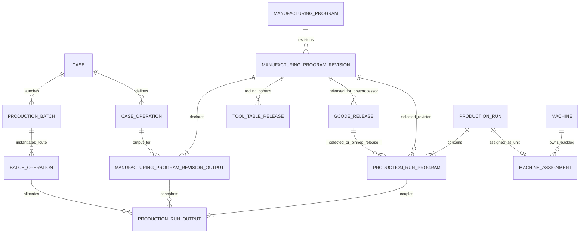

# Production Run and multi-output Manufacturing Program architecture

**Status:** Accepted by the product owner on 2026-08-23. This document is the authoritative Task 1 architecture gate for the sequential implementation tasks.

## 1. Purpose and terminology

A **Manufacturing Program** is a reusable, approved manufacturing recipe. A **Production Run** is one concrete physical bench/session occupying one Machine. They are deliberately separate: revising an engineering recipe does not rewrite a planned or historical run, and allocating a Batch quantity does not create new engineering facts.

| Term | Authority and responsibility |
|---|---|
| `Case` | Permanent part master. It carries no production quantity. |
| `CaseOperation` | Reusable route step for one Case and the dependency identity referenced by a program output. |
| `ProductionBatch` | One production launch for exactly one Case. |
| `BatchOperation` | Concrete route obligation for one Production Batch. It owns required, allocated, produced, and dependency quantities, but is no longer itself a Machine backlog item. |
| `ManufacturingProgram` | Reusable program definition, potentially producing outputs for several Cases/Case Operations. |
| `ManufacturingProgramRevision` | Immutable manufacturing recipe revision. It owns the output recipe and program-level timing/tool context. Exactly one revision may be active per Manufacturing Program. |
| `ManufacturingProgramRevisionOutput` | Immutable declared output: stable ID, Case Operation, positive integer `quantityPerCycle`, and stable display order. |
| `GCodeRelease` | Immutable NC artifact for exactly one Manufacturing Program revision and Postprocessor. Its hash, parser result, cycle estimate, author, time, path, and comment remain immutable. |
| `ProductionRun` | Concrete physical Machine session and schedulable backlog unit. It snapshots shared setup policy and contains one or more program streams. |
| `ProductionRunProgram` | One independently completing NC stream in a run. It selects one Manufacturing Program revision and one effective release where managed G-code is required. |
| `ProductionRunOutput` | Explicit allocation from a revision output to a compatible Batch Operation, with snapshotted quantity per cycle and target quantity. |
| `MachineAssignment` | Assignment of exactly one Production Run to one Machine/backlog position/planning mode. It never directly assigns an Order, Production Batch, or Batch Operation. |

## 2. Aggregate boundaries



The Manufacturing Program aggregate owns engineering recipe composition. A released revision is immutable; changing outputs, quantities per cycle, tool requirements, or immutable execution metadata creates a new revision. The Production Run aggregate owns planning allocation and execution progress. Before Start it may select revisions/releases and edit allocations; after the first program starts its composition is immutable.

## 3. Quantity model

All quantities are integers. Floating-point quantity arithmetic and automatic rounding are forbidden.

For a Batch Operation:

- `requiredQuantity` is the parent Production Batch planned quantity for that concrete route obligation. A future explicit operation-yield model would require a separate approved migration; this design does not invent one.
- `plannedRunOutputAllocation` is the sum of `targetQuantity` over non-cancelled Production Run Outputs referencing the Batch Operation.
- `producedQuantity` is the append-only sum credited by completed program cycles, including production retained by completed or explicitly aborted runs.
- `remainingUnallocatedQuantity = requiredQuantity - producedQuantity - activeAllocatedUnproducedQuantity`.
- `remainingUnproducedQuantity = requiredQuantity - producedQuantity`.
- `activeAllocatedUnproducedQuantity` is the sum of `targetQuantity - producedQuantity` for outputs whose run is not `CANCELLED`, `ABORTED`, or `COMPLETED`.

The transactional invariant is:

```text
0 <= producedQuantity <= requiredQuantity
0 <= activeAllocatedUnproducedQuantity
producedQuantity + activeAllocatedUnproducedQuantity <= requiredQuantity
```

Cancelling a not-started run releases its complete target allocation. Aborting a started run preserves all produced quantities and releases only each output's unproduced remainder. Completing a run preserves its output rows and cycle events as production history; completed quantities are not counted as active allocations. No row is deleted to “undo” production.

The Server locks/serializes every affected Batch Operation allocation set in the same SQLite write transaction that creates, edits, cancels, aborts, or advances a run. Optimistic versions protect the caller from stale edits; database constraints and Server validation protect against concurrent over-allocation.

## 4. Program cycles and production rounds

For every output in one Production Run Program:

```text
requiredCycles = targetQuantity / quantityPerCycle
targetQuantity > 0
quantityPerCycle > 0
targetQuantity % quantityPerCycle == 0
```

All outputs coupled to the same program must calculate exactly the same `requiredCycles`. One recorded program cycle atomically increments `completedCycles` once and credits every output by its snapshotted `quantityPerCycle`. There is no output-only increment, disable, skip, or completion command after Start.

Different Production Run Programs have independent target-cycle counts. Within a production round, incomplete programs execute once in ascending immutable `sequencePosition`. A program at its target is excluded from later rounds. The run completes only when every program is complete. An attempt to execute a completed program or exceed any output target is rejected.

Projection uses arithmetic, not occurrence expansion:

- `remainingCycles = targetCycles - completedCycles` per program.
- `remainingExecutions = sum(remainingCycles)` across programs.
- program runtime is `remainingCycles * effectiveCycleSeconds` plus its remaining prove-out/load-unload policy.
- round-compressed phases are derived from the sorted program sequence and the finite set of program completion round numbers.
- at most `programCount + 1` round bands and bounded detail phases are materialized, regardless of quantity.

Occurrence-level detail has a default and maximum materialization limit of 10,000 occurrences per request, matching the existing Timeline safety scale. Above that fixed limit, the Server returns structured conflict `timeline_materialization_limit` and the compressed projection; it never allocates an unbounded list. Changing that limit is a later explicit configuration/versioning decision, not a prerequisite for this model.

## 5. Scheduling and dependencies

Production Run is the backlog unit because one fixture/tooling context and one operator bench can produce several Batch Operations without releasing the Machine between outputs. A Machine assignment therefore owns `productionRunId`, backlog position, planning mode, version, timestamps, and any explicit compatibility override.

Dragging one unallocated Batch Operation through the compatibility workflow atomically creates a one-program/one-output run for the explicitly requested remaining allocation and assigns it. Idempotency is keyed by the client command ID. No dialog or extra choice is required when there is exactly one unambiguous default program revision/release; ambiguity is returned for explicit selection rather than silently resolved.

Move, reorder, cross-Machine move, planning-mode change, undo, and redo operate on the whole run. Undo/redo records exact before/after Machine, backlog position, planning mode, and versions; it does not recalculate a preferred position. A run occupies one Machine continuously from shared setup start until every program completes or the run is explicitly aborted.

Each Production Run Output is forecast-complete when its parent program reaches `targetCycles`, not when the entire run ends. Dependencies are evaluated against the specific Batch Operation output completion:

- Sequential successors may start after their required predecessor output completes.
- Parallel-capable and independent meanings remain unchanged.
- Locked-simultaneous links remain start/end locked; a participating run reserves its Machine through the locked group end.
- A downstream operation on another Machine may be forecast after its upstream output completes even while other programs continue in the source run.
- A downstream operation queued on the same Machine cannot overlap the still-active run's continuous occupancy.

Conflicts explain impossible dependency/resource combinations and never mutate assignment order.

## 6. Setup, timing, and worker policy

Timing is snapshotted explicitly so combined runs never silently use a sum, maximum, or first-selected legacy value.

| Time | Ownership and policy |
|---|---|
| Shared fixture assembly | One explicit `ProductionRun.sharedFixtureSetupSeconds` snapshot, charged once. For a one-output compatibility run it copies the legacy operation fixture/setup value. For a combined run the planner must confirm an explicit value. |
| Tool loading | One run-level snapshot derived from the approved union tool table and selected setup worker's tool-load skill. It is charged once before program execution. Conflicts block readiness. |
| First-piece prove-out | A per-ProductionRunProgram snapshot, charged once before that program's production cycles. The employee first-part speed percentage applies to that program's base NC cycle estimate. |
| QA after setup | Per program, immediately after its prove-out and before its first credited production cycle. An explicit zero is allowed; absence is `UNVERIFIED`, not zero. |
| Load/unload | Per program execution cycle using a per-program snapshot; it follows that program's cadence and is not multiplied by the number of outputs. |
| Machine occupancy | Continuous across all shared setup, prove-out, QA, load/unload, and program cycles. |

Shared fixture assembly and tool loading require one eligible `setup_worker`; first-piece prove-out requires the Machine operator plus the eligible setup worker; QA requires one eligible `qa_worker`; load/unload requires the Machine operator, with any additional regular-worker requirement stored explicitly. Worker intervals use existing calendars and remain explanatory constraints, not auto-assignment.

For grouped outputs with different legacy timing fields, the UI may show all source values as suggestions but Save is blocked until the planner confirms explicit run-level shared setup and program-level prove-out/QA/load-unload snapshots. Equal values may be prefilled but still become explicit snapshots. The Server never chooses sum, maximum, minimum, or first-selected values. Existing one-output wrapping copies the sole legacy values to preserve behavior.

NC estimates are named **per program execution cycle**. Timing precedence is: pinned release estimate after Start; selected release estimate before Start; immutable revision estimate if explicitly approved; otherwise unavailable. Manual entry is an explicit program snapshot with source/audit metadata, not an inferred fallback.

## 7. Tooling, releases, offsets, and readiness

For the Machine session, tool capacity is evaluated from the union of tools required by all enabled, incomplete programs. The same normalized tool identity is counted once only when its immutable geometry/holder requirements are compatible. Reused identifiers with conflicting geometry, offsets, or pocket requirements are conflicts, not deduplications. Two required tools claiming the same fixed magazine position also create a blocking conflict. The system reports identifiers, positions, required union capacity, and Machine capacity without modifying releases or the Machine.

Offset confirmation belongs to the exact `(productionRunProgramId, machineId, manufacturingProgramRevisionId, gCodeReleaseId)` context. A later revision/release or Machine change makes an earlier confirmation `OUTDATED`; history is retained.

Material readiness remains output-specific and comes only from verified receipts plus explicit reservations on each output's Production Batch. Run-level input cannot override it. Dependency readiness is also output-specific. Overall run readiness is ready only when every incomplete program and every required output is ready.

Every managed program requires a Postprocessor compatible with the assigned Machine and an explicitly selected release when zero or multiple compatible current releases exist. A unique compatible release may be shown as an effective candidate before Start, but it is not persisted silently; Start pins its exact ID/hash. MANUAL Machines may execute a deliberately unmanaged one-program run without G-code/tool readiness, but material, dependency, allocation, and explicit timing checks still apply. CNC_GCODE Machines never treat legacy unmanaged work as managed-ready.

## 8. G-code ownership and compatibility migration

Current Case-Operation-owned `process_revisions`, tool-table releases, G-code releases, parser results, estimates, and production pins are generalized without rewriting history:

1. Schema v45 creates Manufacturing Program identity/output tables and adds the program relationship to existing revision history.
2. Each existing managed Case Operation receives one deterministic default Manufacturing Program.
3. Existing process revision IDs remain unchanged and become Manufacturing Program revision IDs through the generalized relationship; active flags and revision numbers remain unchanged.
4. One revision-output row is added for the original Case Operation with `quantityPerCycle = 1` and display order zero.
5. Existing tool-table and G-code release IDs, FKs to revision IDs, postprocessors, files, hashes, paths, users, times, comments, parser results, and estimates remain unchanged.
6. Existing production pins retain their exact release/revision identity and are moved to the migrated Production Run Program in Task 3.
7. Legacy package files are not promoted into releases and no active revision/release is invented.

The Case Operation G-code API remains a façade over that Case Operation's deterministic default single-output Manufacturing Program. Program-centric APIs are authoritative for combined programs.

## 9. Lifecycle

```mermaid
stateDiagram-v2
    [*] --> DRAFT
    DRAFT --> PLANNED: valid composition saved
    PLANNED --> IN_PROGRESS: Start revalidates READY; structure pins
    IN_PROGRESS --> SUSPENDED: explicit pause
    SUSPENDED --> IN_PROGRESS: resume
    IN_PROGRESS --> COMPLETED: all programs complete
    DRAFT --> CANCELLED: cancel/delete before start
    PLANNED --> CANCELLED: cancel before start
    IN_PROGRESS --> ABORTED: explicit audited abort
    SUSPENDED --> ABORTED: explicit audited abort
    COMPLETED --> [*]
    CANCELLED --> [*]
    ABORTED --> [*]
```



Persisted Production Run statuses are `DRAFT`, `PLANNED`, `IN_PROGRESS`, `SUSPENDED`, `COMPLETED`, `CANCELLED`, and `ABORTED`. `READY` is a current derived readiness result, never a persisted lifecycle state: Start re-evaluates it transactionally. Production Run Programs transition `PLANNED -> ACTIVE <-> SUSPENDED -> COMPLETED`; a not-started program follows its parent to `CANCELLED`, and an incomplete started program follows an abort to `ABORTED`. A program completes only at exact target cycles. Production Run Outputs have `ALLOCATED`, `IN_PRODUCTION`, `COMPLETED`, `RELEASED`, or `ABORTED_REMAINDER_RELEASED`; their quantities advance only with parent program cycles.

A Batch Operation is `not_started` while produced quantity is zero, `in_progress` after its first credited output quantity, `suspended` only when every active allocating stream is suspended and unfinished, and `completed` exactly when produced quantity reaches required quantity. Partial allocation alone does not change execution status. Production Batch and Order statuses remain Server-derived from their concrete Batch Operations/Batches; a partial run cannot complete a parent early.

Structure (programs, sequence, outputs, revision/release selection, quantity per cycle, target quantities, and setup snapshots) becomes immutable when the first program starts. An explicit execution correction is permitted only while the run is suspended, under Single Edit Mode, with expected versions and a mandatory reason. It changes completed cycles atomically for every coupled output within `[0,target]`, appends compensating audit events, and never deletes prior cycle events.

## 10. API, concurrency, and read models

Authoritative routes:

- `/api/v1/manufacturing-programs` and `/{programId}/revisions`, outputs, tool-table releases, G-code releases, and history.
- `/api/v1/production-runs` for list/create/detail and `/{runId}` for versioned composition/cancellation.
- `/{runId}/programs`, sequence, output allocations, release selection, assignment, move/reorder/unassign, readiness, start/suspend/resume/cycle/abort/correction, and audit history.
- `/api/v1/batch-operations/unallocated` for required, produced, allocated, remaining-unallocated, and remaining-unproduced quantities.

Every planning mutation requires current Single Edit Mode authority, a command/idempotency ID, and expected aggregate/assignment versions. Stale versions return `412`; missing authority returns the existing edit-authority error; invariant failures return `422` with stable codes, affected IDs, and quantities. CNC-originated cycle observations use a distinct dedupe identity and do not require a Windows edit token.

Compatibility façades remain for Case Operation catalog/release and “assign Batch Operation.” The latter creates exactly one default run atomically and returns both run and assignment identity. It never combines outputs or silently chooses an ambiguous release.

Structured append-only events include run/program/output IDs plus affected Batch Operation, Batch, Case, Machine, revision, release, user/client, quantities, versions, timestamps, and reason as applicable. Required event families are RunCreated, RunCompositionChanged, AllocationChanged, ProgramSelectionChanged, RunAssigned/Moved/Reordered/Unassigned, CompatibilityOverrideConfirmed, RunStarted/Suspended/Resumed/Cancelled/Aborted/Completed, ProgramCycleCompleted/ProgramCompleted, and ExecutionCorrected.

Schema v49 adds a distinct append-only operational workflow stream for setup verification, QC, cycle/session observations, and `SEND_TO_QC`. Server receipt time is authoritative; Machine time and source sequence are evidence, not replacements for it. The persistent CNC Setup/Production mode variable is removed and cannot move a run between workflow states. Protected temporary variables may later participate only in a commissioned verification handshake and are never the durable workflow projection.

Schema v50 adds Offset Loader release identity without changing Production Run composition or approved NC files. Each release pins the Run, Machine, approved G-code release, exact tool-table release, and numeric verification token; a separate current pointer supersedes but never rewrites history. Strict DPRINT ingestion can record a current `OFFSET_LOADER_COMPLETED` event and sequence anomaly evidence, but it does not yet create a verification session or assert that the protected macro identified the active NC program.

Schema v51 implements the selected generic-hook fallback. Each new approved G-code release must carry one first-block hook with a globally unique six-digit NC identity; the immutable mapping is separate release metadata, and the Server never modifies NC bytes. Historical releases retain no inferred identity. Current Offset Loader DPRINT resolution also requires that the release hook invocation match the target Machine's enabled protected-verification configuration. This supplies explicit release identity evidence but does not claim the protected Haas macro, response calculation, or machining interlock has passed physical commissioning.

Task 18 connects post-QC Haas `CYCLE_START`/`CYCLE_END` evidence to this execution architecture without adding a counter model. The Server resolves one assigned active Run Program and validates any supplied Run/program identity. Only a same-source, immediately consecutive END for the open START is a completed cycle. Its immutable workflow event, schema-v47 dedupe record, every coupled output increment, aggregate statuses, and structured audit commit in one transaction. Machine part counters remain diagnostic. Task 19/schema v56 records START/START as an explicit interrupted attempt before opening the new START, and retains orphan or nonconsecutive END events with typed anomalies. Neither path mutates completed quantity.

Read models:

- Planning Board returns run cards in Machine backlogs and Batch Operations with remaining unallocated quantity in the pool.
- Timeline returns one continuous run occupancy plus bounded shared/program/output completion phases.
- TV returns the current run, active program, coupled outputs, program/run progress, picture, and Machine telemetry; it remains read-only.
- E-Ink packages identify the run and active program and include all relevant output Cases. Package/planning content remains read-only; the separate approved `SEND_TO_QC` operational event may change only the tablet workflow projection to `IN_QC` for the Server-resolved run.
- Haas/CNC resolution maps normalized active program identity to exactly one pinned Production Run Program; unknown/ambiguous/completed matches explain and do not mutate quantities.

## 11. Assignment and history migration (Task 3)

Schema v46 performs a table-rebuild migration inside one Server-owned transaction:

- Every existing assigned Batch Operation becomes a deterministic one-program/one-output Production Run with `quantityPerCycle = 1`, target equal to the operation required quantity, and completed cycles equal to its preserved produced quantity. Its remaining run quantity therefore equals its former remaining obligation.
- Run/program/output IDs are deterministic from the existing assignment ID so retry/recovery cannot duplicate them.
- The Machine assignment ID, Machine ID, backlog position, planning mode, compatibility override, version, created/updated timestamps are preserved where valid; its FK changes to `production_run_id`.
- Waiting, in-progress, suspended, and completed states, actual timestamps, produced quantity, pause history, production pins, and execution events map to the corresponding run/program/output without being reset.
- Completed assignments become completed historical runs with exact produced target; they do not create active allocation.
- Existing assigned work with inconsistent historical quantity is quarantined by migration failure with a diagnostic report; it is never rounded or silently repaired.
- Unassigned Batch Operations remain unallocated pool work and receive no invented run.
- Existing backlog positions are copied verbatim per Machine; migration never compacts or reorders them.
- Foreign-key and allocation integrity are checked before commit; failure rolls back the entire migration. Repeat startup observes recorded migrations and makes no further changes.

Production pins move from assignment scope to the one migrated Production Run Program while preserving revision/release IDs and hashes. Existing G-code/tool history remains owned by the generalized revision and is not duplicated.

## 12. Impact map and implementation sequence

| Area | Primary affected components |
|---|---|
| Server domain/application | `ProductionBatches`, `MachineAssignmentService`, `ProductionReadinessService`, `TimelineProjectionService`, `BenchAutomationService`; new ManufacturingProgram/ProductionRun aggregates, cycle planner, services, and audit events. |
| Persistence/migration | `DatabaseMigrator`, `SqliteMachineAssignmentRepository`, G-code/readiness repositories; v45/v46+ migrations, assignment rebuild, generalized revision ownership, run repositories, backup/restore and FK checks. |
| Windows client | `MachinePlanningBoardViewModel/View`, Timeline view models/views, Case Workspace release façade; new Production Run dialog and Manufacturing Program workspace, localization/accessibility. |
| Timeline | `ITimelineSourceRepository`, `SqliteTimelineSourceRepository`, `TimelineProjectionService`, dependency completion points, compressed phases, worker/setup/readiness projections and rendering tests. |
| Readiness | `ProductionReadinessService`, contextual readiness repository/audit, run/program/output hierarchy, tool union/conflicts, exact release/offset contexts, material/dependency components and Start transaction. |
| G-code | `GCodeService`, process/release persistence, NC parser/estimate/download endpoints; program-centric catalog/revisions/outputs/releases, compatibility façade and hash verification. |
| Haas/CNC | `CncConnectionManager`, `HaasNgcAdapter`, `BenchAutomationService`, Haas monitor/events; run-program matching, exact-cycle dedupe, reconnect/reset/out-of-order safety and no automatic next selection. |
| E-Ink | E-Ink package service/API/simulator read models include run/program/output and revision identity; credentials remain unable to mutate planning. |
| TV | TV dashboard repository/service/web client show current run, active program, coupled outputs, and program/run progress through read-only projections. |
| Tests | Production Batch, assignment, migration, API/auth/concurrency/idempotency, Planning Board, Timeline/dependencies/performance, readiness/G-code/CNC, E-Ink/TV, backup/restore and Windows presentation suites. |

Tasks remain sequential: architecture acceptance; Manufacturing Programs; Production Run persistence/migration; pure cycle planner; APIs; readiness; execution; Planning Board/Timeline; Windows dialog; CNC stabilization. No later task is implemented opportunistically.

## 13. Decisions requiring acceptance

Acceptance of this document approves these explicit choices: Batch Operation required quantity remains parent Batch planned quantity; cancelled is pre-start only and abort releases only unproduced remainder; combined legacy timing requires explicit snapshots; tool capacity uses the conflict-checked union; offset confirmation is run-program exact; output dependencies release at program completion; Machine occupancy remains continuous until run completion; explicit suspended-only audited execution correction is allowed; and existing revision/release IDs are preserved rather than recreated.
